# Shadowblade — Die Klinge von Nachtfall

## ▶ [Jetzt spielen](https://joswrf.github.io/2D-Platformer/)

Läuft direkt im Browser, ohne Installation: **joswrf.github.io/2D-Platformer**

Ein 2D-Jump-'n'-Run in TypeScript: ein schwertschwingender Held kämpft sich
durch ein großes, zusammenhängendes Level über sechs Zonen bis in den Thronsaal
des Schattenritters Morvain — und darüber hinaus.

Kein Spiel-Framework, keine Bild- oder Audiodateien — alles wird zur Laufzeit
auf ein `<canvas>` gezeichnet, Soundeffekte werden per WebAudio synthetisiert.

[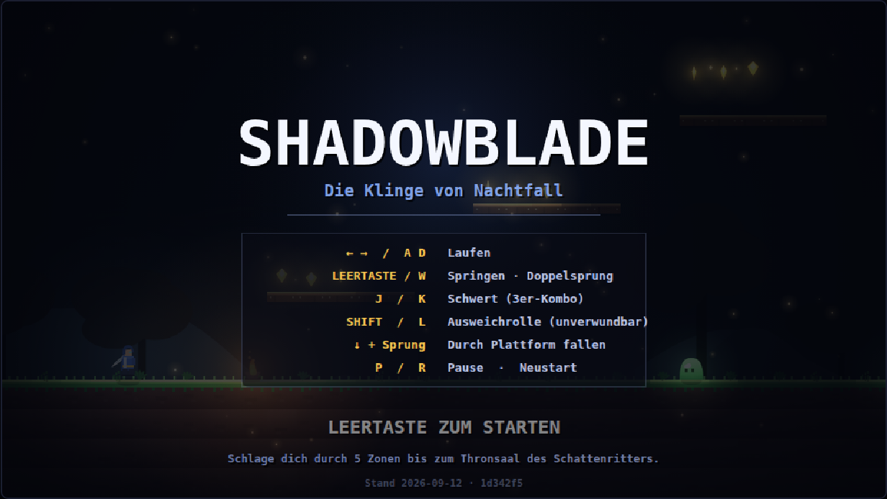](https://joswrf.github.io/2D-Platformer/)

## Starten

```bash
npm install
npm run dev      # http://127.0.0.1:5173
npm run build    # Typecheck + Produktions-Build nach dist/
```

Der Build legt genau eine Datei ab: `dist/index.html`, rund 98 kB, mit dem
gesamten Spiel darin. Sie braucht keinen Server — ein Doppelklick auf die
Datei genügt, und weitergeben lässt sie sich als einzelner Anhang.

## Steuerung

| Taste | Aktion |
| --- | --- |
| `←` `→` / `A` `D` | Laufen |
| `Leertaste` / `W` | Springen (in der Luft nochmal für den Doppelsprung) |
| `J` / `K` / `X` | Schwertschlag — dreiteilige Kombo, der dritte Schlag trifft doppelt |
| `J` / `K` / `X` halten | Ladeschlag — nach kurzem Aufladen ein schwerer Hieb mit dreifachem Schaden; Laufen, Springen und Rollen gehen dabei weiter |
| `E` / `I` | Parade — fängt einen Schlag ab, wenn sie im richtigen Moment kommt |
| `Shift` / `L` | Ausweichrolle, während der Rolle unverwundbar |
| `↓` + Sprung | Durch eine Holzplattform nach unten fallen |
| `P` / `Esc` | Pause |
| `R` | Neustart |

## Das Level

Ein durchgehendes Level aus 690 Kacheln (22 080 px) in sechs Zonen:

1. **Nebelwald** — Einstieg, Abgründe, Schleime
2. **Versunkene Ruinen** — Säulen, Klettertürme, Skelette
3. **Kristallhöhlen** — Lavaseen, wandernde Plattformen, dunkle Magier
4. **Burg Nachtfall** — Zinnen, Türme, Stachelfallen
5. **Thronsaal** — Bossarena; das Fallgitter schließt sich hinter dir
6. **Der Riss** — was hinter dem Thron aufbricht: Bruchstücke über dem Abgrund,
   wandernde Plattformen, dunkle Magier

Kontrollpunkte sichern den Fortschritt, Edelsteine geben Punkte, Herzen heilen.

Der Fall des Ritters ist nicht das Ende: Er bricht das Siegel hinter dem Thron
auf. Gewonnen ist der Lauf erst am Tor am anderen Ende des Risses.

| | |
| --- | --- |
| 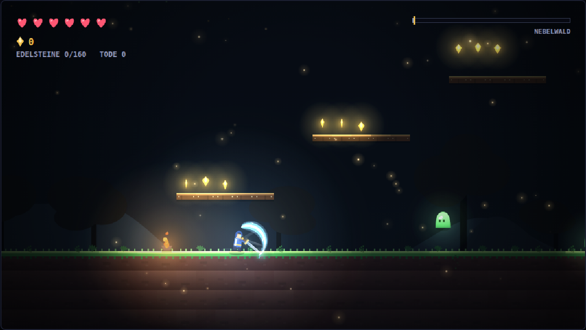 | 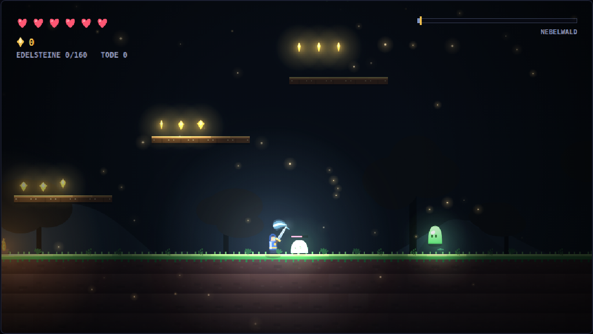 |
| 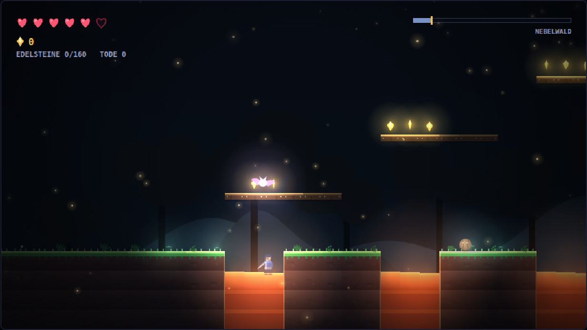 | 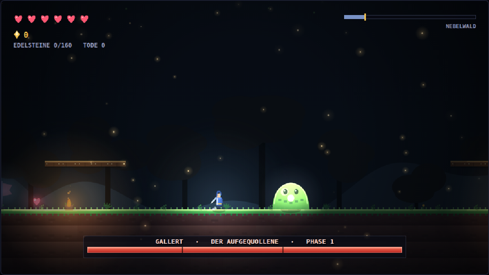 |
| 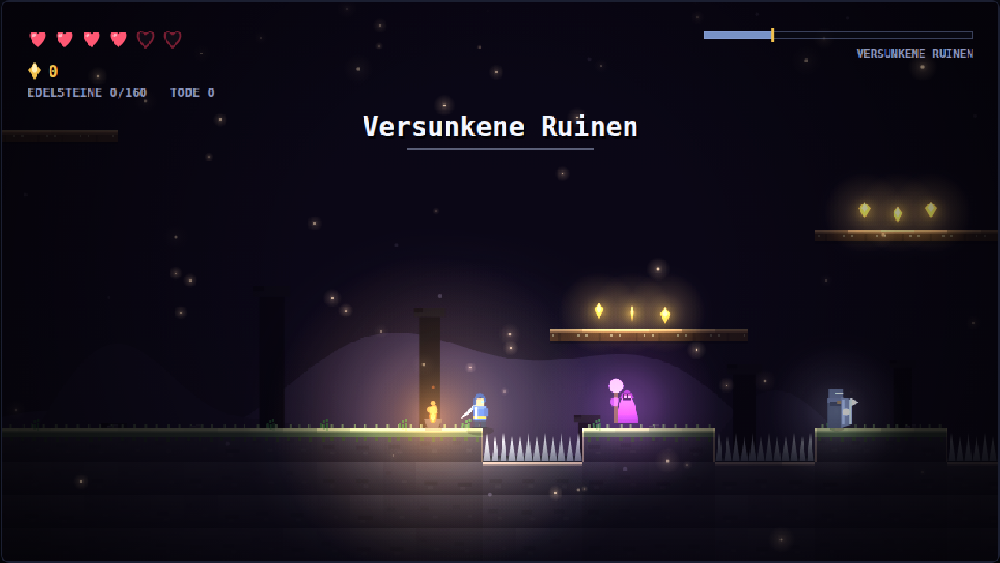 | 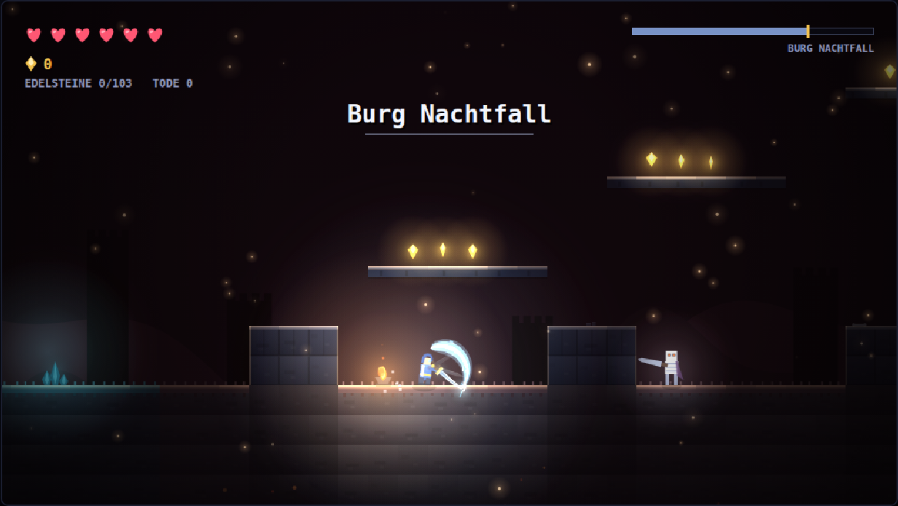 |

## Der Boss: Schattenritter Morvain

64 Trefferpunkte, drei Phasen mit eigener Bewegungs- und Angriffsauswahl:

* **Phase 1** — Schwertschlag mit Schockwelle, Sturmangriff quer durch die Arena
* **Phase 2** — Schockwellen in beide Richtungen, Schattenkugeln, beschworene Skelette
* **Phase 3** — schneller, kürzere Vorwarnzeiten, Sprungangriff mit Deckeneinsturz

Jeder Angriff wird vorher telegrafiert; nach genug Treffern wird der Ritter
kurz benommen und ist offen für eine volle Kombo. Sein Gefolge bleibt
überschaubar: mehr als zwei Skelette stehen nie gleichzeitig in der Arena.

Die Vorwarnung ist auch die Einladung zur Parade: Wer im richtigen Moment `E`
drückt, fängt den Schlag ab, statt ihn zu kassieren — der Ritter taumelt und
steht offen. Geschosse fliegen dabei zurück. Die Parade wirkt nur nach vorn und
nur gegen Angriffe; Stacheln und Lava lassen sich nicht wegparieren.

| | |
| --- | --- |
| 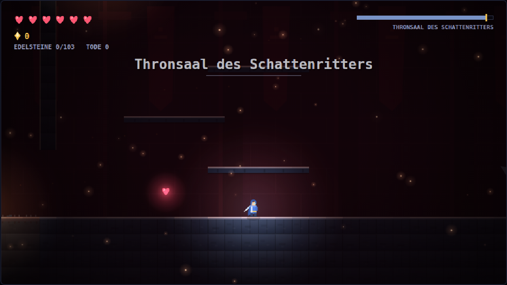 | 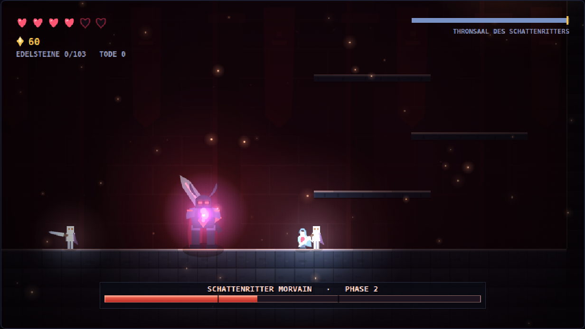 |
| 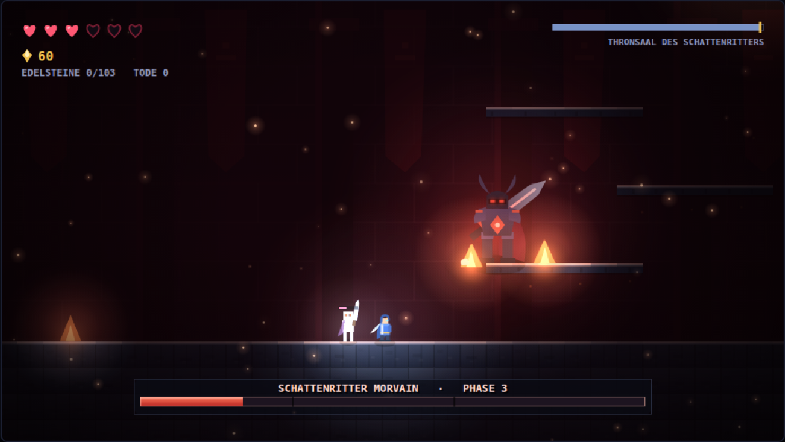 | 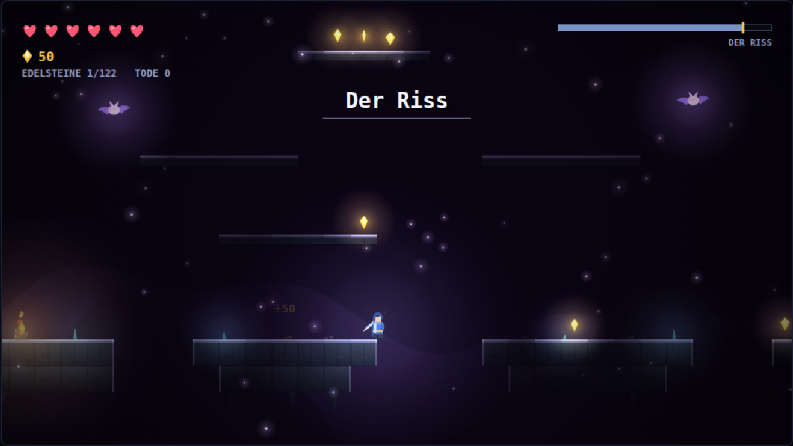 |
| 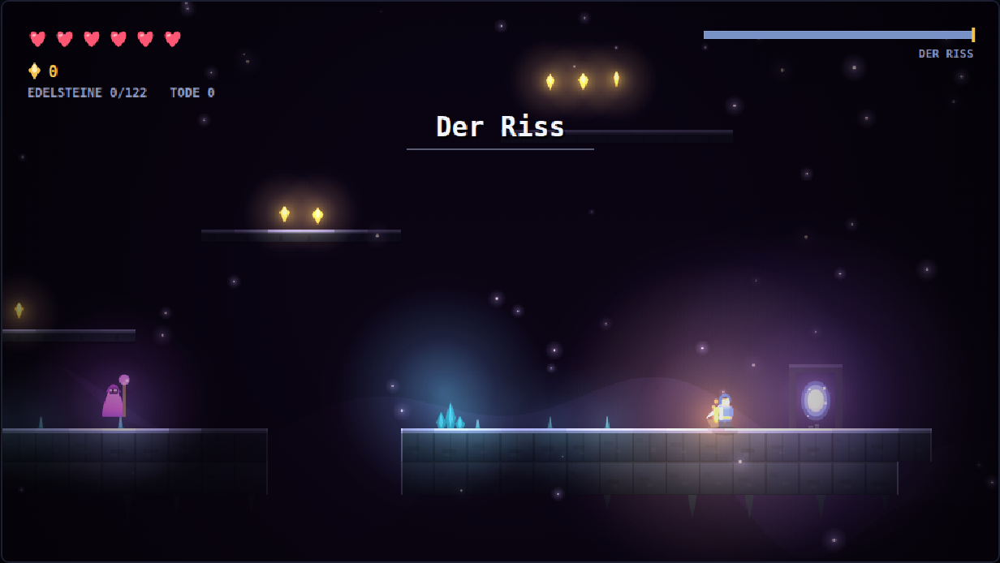 | 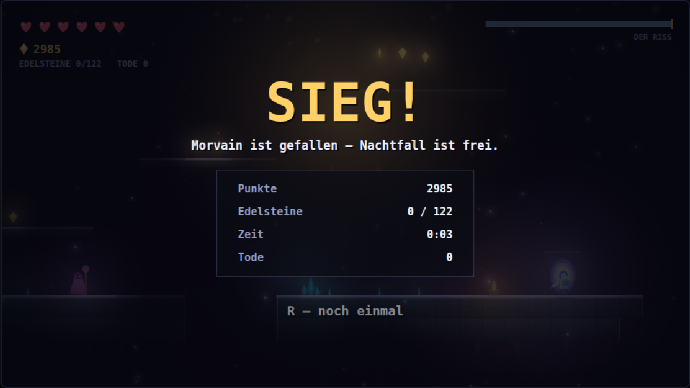 |

## Aufbau des Codes

```
src/
  core/      Spielschleife (fester Zeitschritt), Eingabe, Kamera, Mathe, WebAudio
  world/     Level-ASCII, Parser, Kachel-Kollision, World-Interface
  entities/  Physikkörper, Spieler, Gegner, Boss, Projektile, Pickups, Plattformen
  render/    Parallax-Hintergrund, Kachel-Renderer, Deko, Sprite-Helfer, Palette
  fx/        Partikel und Schadenszahlen
  ui/        HUD-Bausteine (Herzen, Bossleiste, Panels)
  game.ts    Zustandsautomat, der alles zusammenhält
```

Das Level steht als ASCII-Kunst in `src/world/levelData.ts`. Jeder Abschnitt ist
40 (die Arena 50) Zeichen breit und 22 Zeilen hoch; die Abschnitte werden
horizontal aneinandergehängt:

```
.  leer          #  Stein        =  Erde         -  Holzplattform
^  Stacheln      L/l Lava        G  Fallgitter   P  Startpunkt
S  Siegel (öffnet sich, wenn der Ritter fällt)     O  Tor nach Hause (Ziel)
s  Schleim       b  Fledermaus   k  Skelett      m  Dunkler Magier
$  Edelstein     H  Herz         C  Kontrollpunkt
T  Fackel        X  Kristall     M/V bewegliche Plattform    B  Boss
```

Damit das Level begehbar bleibt, gilt beim Bauen: Bodenlücken höchstens vier
Kacheln breit, Plattformen höchstens drei Reihen über der Fläche darunter.

## Werkzeuge

Alle Skripte fahren das gebaute Spiel in einem echten Chromium hoch:

```bash
npm run verify:level   # Erreichbarkeitsanalyse: kommt man vom Start zum Boss?
npm run verify:arena   # kommt man nach einem Tod am Tor zurück in die Bossarena?
npm run verify:combat  # fängt die Parade den Schlag, trifft der Ladeschlag härter?
npm run verify:ending  # führt der Riss zum Tor, und zählt der Lauf am Tor auch dann?
npm run playtest       # Bot spielt das Level mit echter Physik und meldet Hänger
npm run screenshots    # erzeugt die Bilder in screenshots/
```

`verify:level` baut einen Graphen aus allen begehbaren Kacheln und prüft mit
einem bewusst konservativen Sprungmodell, ob Boss **und** Tor vom Startpunkt
aus erreichbar sind — nützlich, sobald man am Level schraubt. Es meldet auch
begehbare Stellen, die von nirgendwo aus zu erreichen sind.

`verify:arena` spielt einen Softlock nach: den Schattenritter ans Fallgitter
locken, sterben, zurücklaufen. Das Gitter muss offen bleiben, bis der Spieler
wieder drin ist.

`verify:combat` prüft Parade und Ladeschlag am Boss. Die Parade hängt an einem
Fenster von einer Sechstelsekunde — geht auf dem Weg dorthin ein Tastendruck
verloren, fühlt sich das nicht schwer an, sondern kaputt.

`verify:ending` fährt den letzten Abschnitt ab: ein Bot reist mit echter Physik
durch den Riss bis zum Tor, und danach berührt der Held das Tor und läuft
weiter. Beides muss im Sieg enden. Der Riss stand vorher nur im statischen
Modell von `verify:level`, das keine Sprungbögen kennt.

## Veröffentlichen

[](https://github.com/JosWrf/2D-Platformer/actions/workflows/pages.yml)

`.github/workflows/pages.yml` baut das Spiel bei jedem Push auf `main` und
veröffentlicht `dist/` auf <https://joswrf.github.io/2D-Platformer/>. Es gibt
nichts weiter zu tun: pushen genügt.

Wer das Repo forkt, muss die Pages-Site einmal selbst anlegen — das Token des
Workflows darf das nicht: *Settings → Pages → Build and deployment → Source:*
**GitHub Actions**.
