# Shadowblade — Die Klinge von Nachtfall

## ▶ [Jetzt spielen](https://joswrf.github.io/2D-Platformer/)

Läuft direkt im Browser, ohne Installation: **joswrf.github.io/2D-Platformer**

Ein 2D-Jump-'n'-Run in TypeScript: ein schwertschwingender Held kämpft sich
durch ein großes, zusammenhängendes Level über sechs Zonen bis in den Thronsaal
des Schattenritters Morvain — und darüber hinaus.

Kein Spiel-Framework, keine Bild- oder Audiodateien — alles wird zur Laufzeit
auf ein `<canvas>` gezeichnet, Soundeffekte werden per WebAudio synthetisiert.

[](https://joswrf.github.io/2D-Platformer/)

## Starten

```bash
npm install
npm run dev      # http://127.0.0.1:5173
npm run build    # Typecheck + Produktions-Build nach dist/
```

Der Build legt genau eine Datei ab: `dist/index.html`, rund 98 kB, mit dem
gesamten Spiel darin. Sie braucht keinen Server — ein Doppelklick auf die
Datei genügt, und weitergeben lässt sie sich als einzelner Anhang.

## Steuerung

| Taste | Aktion |
| --- | --- |
| `←` `→` / `A` `D` | Laufen |
| `Leertaste` / `W` | Springen (in der Luft nochmal für den Doppelsprung) |
| `J` / `K` / `X` | Schwertschlag — dreiteilige Kombo, der dritte Schlag trifft doppelt |
| `J` / `K` / `X` halten | Ladeschlag — nach kurzem Aufladen ein schwerer Hieb mit dreifachem Schaden; Laufen, Springen und Rollen gehen dabei weiter |
| `E` / `I` | Parade — fängt einen Schlag ab, wenn sie im richtigen Moment kommt |
| `Shift` / `L` | Ausweichrolle, während der Rolle unverwundbar |
| `↓` + Sprung | Durch eine Holzplattform nach unten fallen |
| `P` / `Esc` | Pause |
| `R` | Neustart |
| `B` | Bildwackeln aus/an |

## Das Level

Ein durchgehendes Level aus 974 Kacheln (31 168 px) in sieben Zonen, plus eine
achte hinter der Welt, die man sich verdienen muss:

1. **Nebelwald** — Einstieg, Abgründe, Schleime, und am Ende das Moor mit
   Gallert darin
2. **Versunkene Ruinen** — Säulen, Klettertürme, Skelette
3. **Kristallhöhlen** — Lavaseen, wandernde Plattformen, dunkle Magier
4. **Die Ertrunkene Halle** — was das Wasser geholt hat: Algenkanten, Korallen,
   dunkle Magier im Kirchenschiff, und im Chor Thalassa, die den Boden aufmacht
5. **Burg Nachtfall** — Zinnen, Türme, Stachelfallen
6. **Thronsaal** — Bossarena; das Fallgitter schließt sich hinter dir
7. **Der Riss** — was hinter dem Thron aufbricht: 244 Kacheln violettes Gestein
   über dem Abgrund, dunkle Magier, in der Mitte der Splitterwächter, am Ende
   das Tor nach Hause
8. **Der Kristallhort** — nur per Teleport erreichbar, wenn alle 157 Edelsteine
   eingesammelt sind. Acht leere Spalten trennen ihn vom Riss; kein Sprung
   überbrückt die, das ist Absicht.

Kontrollpunkte sichern den Fortschritt, Edelsteine geben Punkte, Herzen heilen —
bei vollem Leben bleiben sie liegen, statt sich an nichts zu verbrauchen.

Der Fall des Ritters ist nicht das Ende: Er bricht das Siegel hinter dem Thron
auf. Gewonnen ist der Lauf erst am Tor am anderen Ende des Risses — und dazwischen
steht der Splitterwächter.

Wen das Bildwackeln bei Treffern stört, schaltet es mit `B` ab — jederzeit, auch
im Titelbild und in der Pause. Das beruhigt zugleich das Sporenfeld in allen
Zonen. Die Einstellung bleibt über Sitzungen erhalten.

Der Riss hält im Übrigen still: kein wehender Bewuchs, keine treibenden
Silhouetten, kaum pulsende Kristalle, und ein Sporenfeld, das am Bildschirm
hängt statt darüberzuziehen. Vor einem fast schwarzen Grund ist jedes
bewegte Glanzlicht ein Flackern, und ein Bildschirm voll davon ermüdet die Augen,
statt Stimmung zu machen.

| | |
| --- | --- |
|  |  |
| 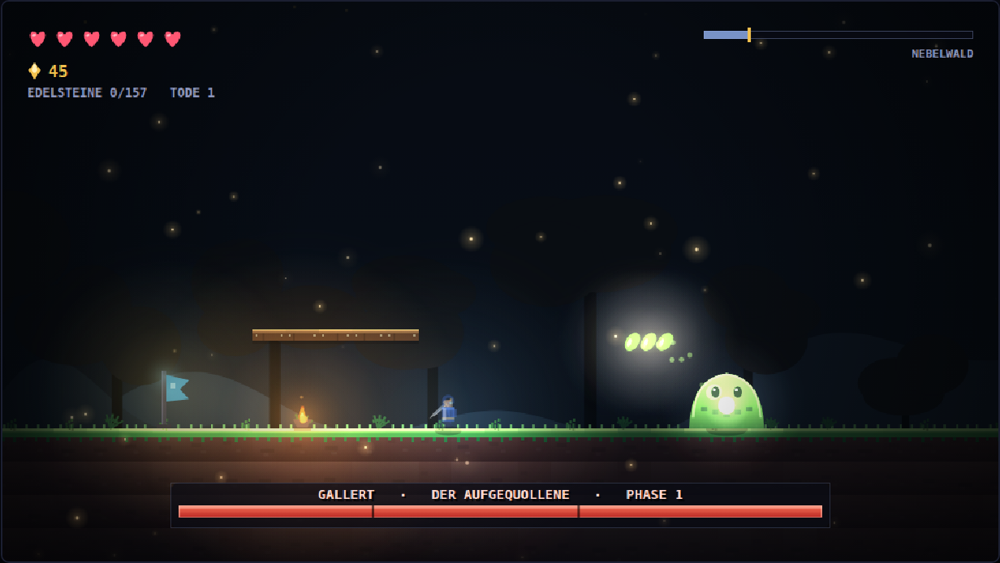 | 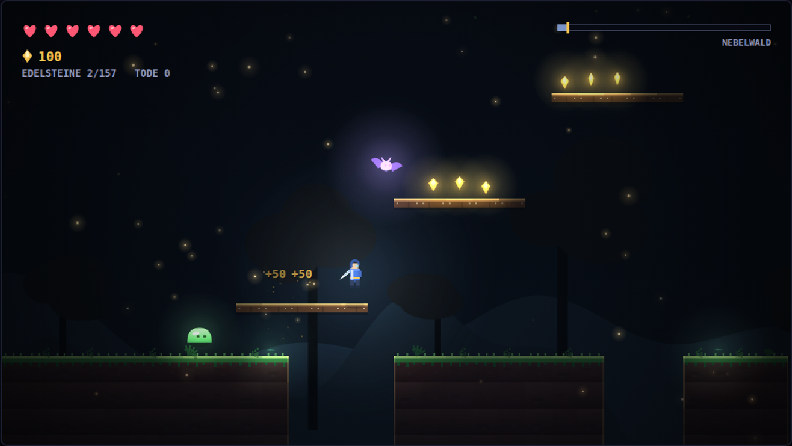 |
|  |  |
|  | 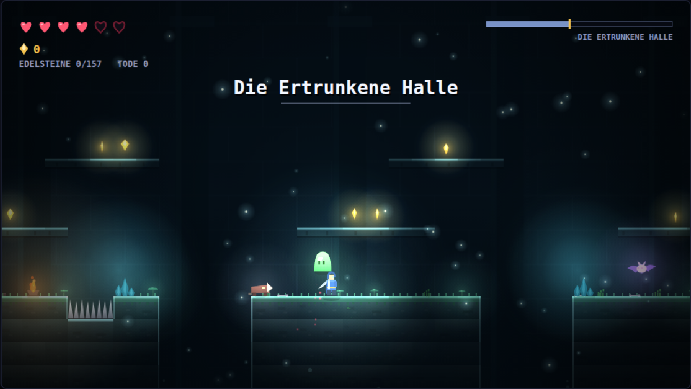 |
| 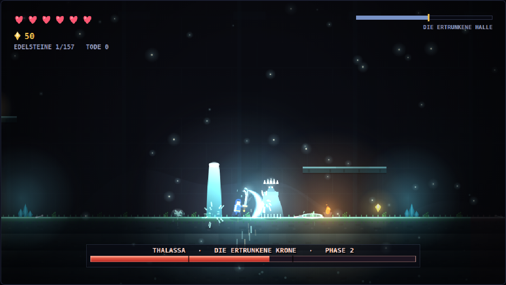 | 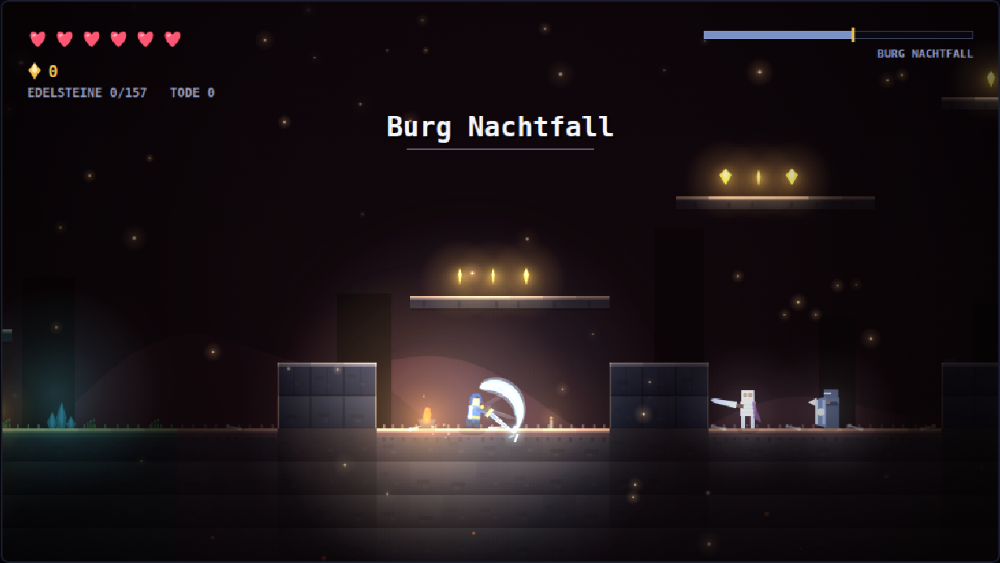 |

## Der Boss: Schattenritter Morvain

64 Trefferpunkte, drei Phasen mit eigener Bewegungs- und Angriffsauswahl:

* **Phase 1** — Schwertschlag mit Schockwelle, Sturmangriff quer durch die Arena
* **Phase 2** — Schockwellen in beide Richtungen, Schattenkugeln, beschworene Skelette
* **Phase 3** — schneller, kürzere Vorwarnzeiten, Sprungangriff mit Deckeneinsturz

Jeder Angriff wird vorher telegrafiert; nach genug Treffern wird der Ritter
kurz benommen und ist offen für eine volle Kombo. Sein Gefolge bleibt
überschaubar: mehr als zwei Skelette stehen nie gleichzeitig in der Arena.

#### Nicht festhalten lassen

Mit der geworfenen Klinge ließ sich der Ritter **stunlocken**. Gemessen, ein
Bot, der nur die Angriffstaste hält:

| | Anteil benommen | Züge im ganzen Kampf | kassierte Herzen |
| --- | --- | --- | --- |
| ohne Klinge | 15 % | 30 | 52 |
| Flutklinge, **vorher** | **42 %** | **2** | 4 |
| Klingenwelle, **vorher** | **46 %** | **2** | 4 |
| Flutklinge, jetzt | 16–19 % | 9–26 | 11–44 |
| Klingenwelle, jetzt | 14–20 % | 5–26 | 5–44 |

Dauer und Tode stehen nicht in der Tabelle, weil sie über einzelne Läufe wild
schwanken: ein Tod des Helden füllt die Leiste des Ritters wieder, und ob ein
Bot einmal stirbt oder nicht, entscheidet über 13 gegen 120 Sekunden. Belastbar
sind der Anteil benommener Zeit und die Zahl der Züge, die er überhaupt
anfängt — und die sagen dasselbe: **mit der Klinge kam er im ganzen Kampf
zweimal zum Zug und stand fast die Hälfte der Zeit benommen da.**

Der Grund: 14 Schaden mitten im Zug werfen ihn um, und mit der Klinge macht ein
Spieler die 14 schneller, als eine Benommenheit dauert. Jede Erholung lief
direkt in die nächste. Jetzt hält er nach einer Benommenheit **2,6 Sekunden**
die Füße still, was blinden Schaden angeht. Eine **Parade** wirft ihn weiter
jedes Mal um — die kommt nur, wenn er wirklich zuschlägt, also begrenzt sein
eigener Takt sie.

#### Bosse nehmen die Klinge zur Kenntnis

Wer mit einer geworfenen Klinge ankommt, trifft auf mehr Boss. Das Upgrade ist
etwa zwei Schaden pro Sekunde ohne jedes Risiko, und die Bosse waren gegen ein
Schwert gebaut. Beim Aufwachen sieht sich jeder Boss einmal an, was auf ihn
zukommt — mitten im Kampf verschiebt sich nichts, und wer das Upgrade nie
gefunden hat, trifft genau den Boss, der für ihn eingestellt wurde:

| Klinge | Leben | Schaden bis zur Benommenheit |
| --- | --- | --- |
| nur Schwert | 64 | 14 |
| Flutklinge | 78 | 19 |
| Klingenwelle | 92 | 24 |

Dasselbe gilt für Thalassa, den Splitterwächter, den Prismarchen und Gallert
(+22 % Leben und +35 % Poise je Stufe). Auf Distanz stehen bleiben hilft
seitdem auch nicht mehr: der Ritter wählt weit draußen zweimal so oft den
Sturmangriff wie das Hinterherlaufen, und ein Bot, der auf 150 px kampierte und
die Klinge schickte, verliert jetzt statt in 30 s zu gewinnen.

#### Und sie bleiben tot

Ein gefallener Boss kam bisher mit dem nächsten Kontrollpunkt zurück: der
Kontrollpunkt baut die Gegnerliste neu auf, und Thalassa, der Splitterwächter
und der Prismarch stehen in dieser Liste. Ein Tod irgendwo in der Welt stellte
sie wieder hin, mit voller Leiste. Gemessen und behoben — nur der komplette
Neustart (`R`) bringt sie zurück, und der nimmt einem auch die Klinge und den
Herzkern wieder ab.

## Die Gegner

| | | Antwort |
| --- | --- | --- |
| **Schleim** | hüpft stur geradeaus | drüber oder drauf |
| **Fledermaus** | fliegt in Wellen an | Timing |
| **Skelett** | patrouliert, schlägt telegrafiert | parieren oder ausweichen |
| **Dunkler Magier** | schwebt, wirft Kugeln | Kugeln zurückparieren |
| **Zunder** | läuft heran und zündet sich | **auf Abstand erledigen** |
| **Schildwache** | alles in den Schild hinein bleibt dort | **von hinten, oder parieren** |
| **Klingenläufer** | gräbt sich ein und stürmt durch den Raum | **in eine Wand locken** |

Der **Zunder** ist eine Falle, keine Wache: er wartet, bis man nah ist, und
zündet dann eine gute Sekunde lang sichtbar und hörbar auf. Ihn zu erschlagen
löst dieselbe Explosion aus — wer ihn aus einem Meter Entfernung umhaut, kassiert
sie. Aus der Ferne erledigt kostet er nichts, und genau dafür ist die
Klingenwelle da — beziehungsweise ab der Halbzeit die Flutklinge, deren 145 px
weit außerhalb seiner Druckwelle von 66 px liegen. Was neben ihm steht, nimmt er
mit: ein Skelett in seiner Reichweite ist ein Skelett, das man nicht selbst
bekämpfen muss.

Die **Schildwache** ist der einzige Gegner im Spiel, den man mit gehaltener
Angriffstaste nicht schafft. Von vorn stirbt jeder Hieb im Schild, die
Klingenwelle inbegriffen. Hinten herum trifft alles — und ein parierter
Lanzenstoß reißt ihm den Schild für knapp zwei Sekunden herunter.

Der **Klingenläufer** ist der einzige, den das Level selbst erledigt: er gräbt
sich ein, stürmt los, und wer sich vor einer Wand wegdreht, sieht ihn dagegen
laufen. Danach steht er anderthalb Sekunden benommen da und nimmt doppelten
Schaden.

### Der erste Boss: Gallert, der Aufgequollene

22 Trefferpunkte, zwei Phasen, drei Züge — und der Lehrer des Spiels. Jeder
seiner Züge ist die einfache Form von etwas, das ein späterer Kampf härter
macht:

* **Klatschsprung** (aus der Nähe) — er flacht sich gegen den Boden, springt,
  und landet mit einem Ring: 2 Schaden, aber nur dort, wo er aufkommt (74 px).
  Derselbe Zug wie der Sprungschlag des Splitterwächters, nur langsamer
  angekündigt. Er trägt bis zu 230 px, ist also auch sein Weg zu einem, der
  Abstand hält.
* **Spucke** (auf Distanz) — drei Klumpen auf kurzer Bahn, einer auf den Helden
  und zwei daneben. **Ein Hieb schlägt sie aus der Luft**, und das ist der Sinn
  des Kampfes: die Regel, die Thalassas Flutwelle später verweigert, muss man
  vorher gelernt haben, sonst ist die Ausnahme keine.
* **Teilung** (zweite Hälfte, höchstens zweimal) — er kneift zwei gewöhnliche
  Schleime von sich ab. Erst die wegräumen, dann weiter.

Angekündigt wird alles über den Kern, der vor jedem Zug aufleuchtet; die
Silhouette sagt den Rest, weil er sich vor dem Sprung platt macht und in der
Luft streckt. Sein Schatten bleibt dabei unten am Boden und schrumpft — daran
sieht man, wie hoch er ist.

Poise 14, gemessen und nicht geraten: bei 8 warf ihn ein Dauerangreifer aus
jedem Zug, den er anfing, und kassierte im ganzen Kampf **keinen einzigen
Treffer**. Jetzt kostet derselbe Bot 5 von 6 Herzen und braucht 9 Sekunden; mit
aufgefüllter Bossleiste gemessen — sonst ist der Kampf vorbei, bevor er dreimal
zum Zug kam — landet Gallert 7 bis 18 Treffer in 25 Sekunden. Eine Parade
schüttelt ihn immer los. Vorbeilaufen geht auch hier: das Moor hat kein Tor.

Wer ihn schlägt, bekommt den **Herzkern**: sechs Herzen werden sieben, für den
ganzen Rest des Laufs, und die Leiste ist sofort wieder voll. Das ist die
einzige Belohnung im Spiel, die nicht die Klinge betrifft — nach der ersten
Stunde soll etwas anderes dastehen als eine größere Zahl auf einem Hieb.

### Der Boss der Halle: Thalassa, die Ertrunkene Krone

60 Trefferpunkte, drei Phasen, vier Züge. Ihre Züge nach Entfernung: aus der
Nähe ein **Flutstoß**, zwei Wellen über den Boden in beide Richtungen — die
Antwort ist Höhe, nicht Abstand. Auf Distanz ein **Ankerwurf** auf einer Bahn,
die dort landet, wo man gerade hinläuft. Der **Sog**, der einen für gut eine
Sekunde zu ihr hinzieht und dann Kugeln schickt: weglaufen kostet Boden, der
Kampf wird in ihrer Reichweite entschieden. Und die **Springflut**, die den
Boden selbst aufmacht.

Jeder Zug wird angekündigt — die Krone füllt sich, und woran man erkennt,
*welcher* kommt, steht ihr an: zwei Bögen am Saum für den Flutstoß, das Gewicht
über der Schulter für den Anker, ein Wirbel um die Füße für den Sog, beide Arme
hoch für die Flut.

#### Warum der Kampf neu gebaut wurde

Er war zu leicht, und zwar messbar: wer nur die Angriffstaste hielt, erledigte
sie in **elf Sekunden** und verlor dabei zwischen null und vier Herzen. Drei
Gründe, in der Reihenfolge, in der sie zählten:

1. **Die Klinge wischte alles weg.** Jeder Hieb pariert Geschosse in Reichweite
   — und schickt sie mit doppeltem Schaden zurück. Wer draufhielt, schlug damit
   jede Welle ab, die sie machte, *und* traf sie damit selbst.
2. **Ihr Poise war zu niedrig.** Sechs Schaden mitten im Zug warfen sie heraus;
   ein Dauerangreifer macht 3,6 Schaden pro Sekunde. Sie kam in einem ganzen
   Kampf viermal zum Zug.
3. **Was übrig blieb, stand herum.** Über die Hälfte des Kampfes verbrachte sie
   in der Erholung.

Dagegen, der Reihe nach:

**Ihre Flutwelle lässt sich nicht wegwischen.** Eine Wand aus Wasser ist nichts,
was ein blinder Hieb zur Seite schlägt — die springt man, oder man pariert sie.
Sie kommt seitdem auch in den Farben der ertrunkenen Halle statt in denen des
Ritters, denn ein Geschoss, das man abschlagen kann, und eines, das man springen
muss, dürfen nicht gleich aussehen.

**Die Springflut macht den Boden auf.** Marken auf dem Boden — eine unter den
Füßen des Helden, die anderen im Raum verteilt — blubbern zwei Drittel einer
Sekunde, dann kommt das Wasser durch sie hoch. Das ist der eine Zug, den die
Klinge nicht beantworten kann, also ist es der Zug, der Stehenbleiben
beantwortet: wer sich in ihre Reichweite stellt und draufhaut, bekommt ihn.
Trotzdem fair — man läuft aus der Marke heraus, oder man kommt mit dem
Doppelsprung über die Säule (eine Säule ist 118 px hoch, ein einfacher Sprung
trägt 103). Und weil man nach einem Treffer einen Moment unverwundbar ist, käme
ein Schwung Säulen auf einmal nur ein Herz teuer: die Flut fragt darum ab der
zweiten Phase zweimal, die zweite Welle dort, wo man inzwischen steht.

**Poise 13 statt 6, und die Parade bricht sie immer.** Draufhauen kauft jetzt
gelegentlich eine Unterbrechung statt immer. Was zuverlässig wirkt, ist die
Parade: die reißt sie aus jedem Zug, egal wie viel Poise sie noch hat. Wer schon
taumelt, taumelt nicht doppelt — sonst hielte man die Taste einfach gedrückt.

**Drei Phasen statt zwei**, geschnitten dort, wo die Bossleiste ihre Kerben
zeichnet. In der zweiten antwortet die Flut doppelt: der Flutstoß in zwei
Salven, weit genug auseinander, dass ein Sprung nicht beide nimmt; der Anker als
Paar, einer dorthin, wo man steht, einer dorthin, wo man hinläuft; der Sog
greift auch in der Luft. Ihr letztes Drittel eröffnet der **Ruf der Krone** —
einmal im Kampf, ein Ring aus fünf Säulen und die ganze Halle antwortet —, und
danach hängt sie zwei Züge aneinander, bevor sie durchatmet.

Gemessen, mit echten Lebenspunkten auf beiden Seiten, drei Läufe je Spielweise:

| Spielweise | vorher | jetzt |
| --- | --- | --- |
| nur Angriffstaste halten | 11–12 s, 0–4 Treffer, kein Tod | 21–24 s, 9–13 Treffer, 1–2 Tode |
| ausweichen, Kugeln parieren | 17–28 s, 0–4 Treffer, kein Tod | 40–58 s, 8–17 Treffer, 1–2 Tode |
| stehen bleiben und hauen | 0–2 Treffer | 4–5 Treffer |
| in ihrer Reichweite parieren | — | 18 s, 3–4 Treffer, kein Tod |
| einfach vorbeilaufen | 1 Treffer | 1 Treffer |

Ein Treffer ist ein kassiertes Herz von sechs; ein Tod füllt die Leiste wieder
auf, darum stehen in der zweiten Spalte auch Zahlen über sechs.

Die letzte Zeile ist Absicht und wird geprüft: ihr Chor hat kein Fallgitter, wer
den Kampf nicht will, muss vorbeikommen. Und die vorletzte auch: die beste
Antwort auf sie ist die Parade, nicht das Ausdauerhalten.

Wer sie schlägt, nimmt mit, was sie gehalten hat: die **Flutklinge**, die erste
Hälfte des Klingen-Upgrades.

### Die Klinge: zwei Stufen

Jeder Hieb wirft eine Sichel voraus. Das ist eine Reichweitenverlängerung, keine
Kanone: eine je Hieb, und sie ist nach einem knappen halben Herzschlag weg.

| | woher | Reichweite | Schaden |
| --- | --- | --- | --- |
| Schwert allein | von Anfang an | 40 px | 1 / 2 in der Kombo / 3 geladen |
| **Flutklinge** | Thalassa fällt — bei knapp der Hälfte des Levels | 145 px | 1, geladen 2 |
| **Klingenwelle** | Prismarch fällt — hinter allen 157 Edelsteinen | 273 px | 1 / 2 / 3 wie der Hieb |

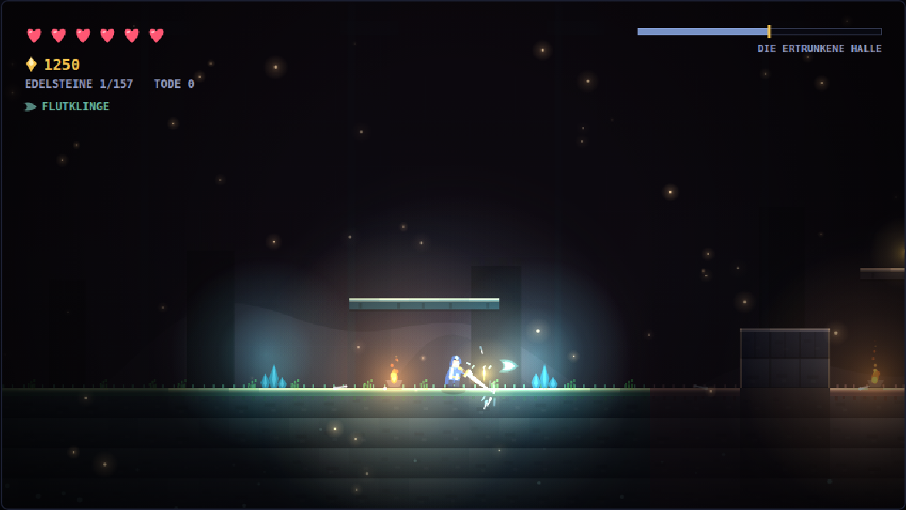

Vorher hing das ganze Upgrade am Prismarchen. Das heißt: man musste alle 157
Edelsteine finden, um es überhaupt zu sehen — und hatte dann nur noch den letzten
Rest der Welt, um damit zu spielen. Die Hälfte kommt jetzt zur Halbzeit, der
Prismarch schärft, was schon da ist. Die zwei Stufen sehen auch verschieden aus:
die Flutklinge wirft Wasser, die Klingenwelle Licht, und im HUD steht, was man
hat.

Dass die erste Stufe das Spiel dahinter nicht kaputt macht, ist gemessen — ein
Bot, der auf 150 px Abstand bleibt und nur die Sichel schickt:

| gegen | nur Schwert | Flutklinge | Klingenwelle |
| --- | --- | --- | --- |
| Schattenritter (64 TP) | verliert, 7 Tode | 47 s, 10 Treffer, 1 Tod | 21 s, 2 Treffer |
| Splitterwächter (16 TP) | 5 s, 0 Treffer | 8,3 s, 1 Treffer | 3,8 s, 0 Treffer |

Der Ritter bleibt der härteste Kampf im Spiel, auch mit der Flutklinge in der
Hand; beim Splitterwächter ändert sie nichts, den erledigt der Nahkampf ohnehin
in fünf Sekunden. Die volle Klingenwelle ist stark — das ist der Punkt einer
Belohnung, für die man die ganze Welt abgesucht hat.

### Der Bonusboss: Prismarch, Herz des Kristalls

Wer alle 157 Edelsteine findet, hält an Ort und Stelle an: eine Stimme aus dem
Stein meldet sich, fünf Zeilen lang, und wer sie zu Ende gelesen hat, steht im
Kristallhort. Es gibt zwei Türen dorthin — der volle Zähler öffnet sie sofort,
und wer trotzdem am Tor im Riss ankommt, wird dort hinübergeschickt statt den
Lauf zu beenden. Eine Belohnung, die man sich erarbeitet hat, darf nicht an
einem einzigen Auslöser hängen. Solange der Dialog liegt, steht die Welt still — sonst liest man
und läuft dabei von der Kante.

70 Trefferpunkte, zwei Phasen, drei Züge nach Entfernung: aus der Nähe ein
Sturmangriff quer durch die Halle, auf mittlere Distanz Splitter, die von der
Decke fallen und dorthin zielen, wo man gleich sein wird, von weitem ein Fächer
aus drei Splittern — in der zweiten Phase fünf, und alle Pausen um ein Fünftel
kürzer. Denselben Zug zweimal hintereinander macht er nie.

Fällt er, ist der Lauf **nicht** vorbei: die Splitter seines Herzens gehen in die
Klinge, und der Held wird genau dorthin zurückgesetzt, wo er weggeholt wurde —
mitsamt seinem alten Kontrollpunkt. Aus der Flutklinge wird damit die
**Klingenwelle**: doppelte Reichweite und der volle Schaden des Hiebs dahinter,
1 in der Kombo, 2 beim Abschluss, 3 beim Ladeschlag. Wer Thalassa vorbeigelaufen
ist und die erste Stufe nicht hat, bekommt sie hier — das Herz sagt dann auch
einen anderen Satz.

Das Tor im Riss beendet den Lauf wie immer — der Siegbildschirm nennt dann das
wahre Ende, wenn das Herz gefallen ist.

### Der Miniboss: Splitterwächter

16 Trefferpunkte, drei Züge, die er nach Entfernung wählt: aus der Nähe ein
Sprungschlag, auf mittlere Distanz ein Sturmangriff, von weitem eine Salve aus
drei Splittern. Jeder Zug wird angekündigt — sein Kern glüht auf —, und danach
steht er lange genug offen für eine Antwort.

Er lässt sich nicht mit gehaltener Angriffstaste erledigen: einen begonnenen Zug
zieht er durch. Erst fünf Schadenspunkte am Stück oder eine Parade bringen ihn
aus dem Gleichgewicht.

Sein Sprungschlag blieb lange hängen: die Landung fragte nach einer
Abwärtsgeschwindigkeit, die die Kollision im Landebild schon auf null gesetzt
hatte. Er kam also auf und stand dann in diesem Zustand, bis ihn eine Parade
oder genug Schaden herausriss. `verify:warden` zeigte es die ganze Zeit, wenn
man genau hinsah — der Nahkampflauf ging *stalk, slamWind, slam* und kam nie
zurück. Beides ist gerichtet, und beides wird jetzt geprüft.

Die Vorwarnung ist auch die Einladung zur Parade: Wer im richtigen Moment `E`
drückt, fängt den Schlag ab, statt ihn zu kassieren — der Ritter taumelt und
steht offen. Geschosse fliegen dabei zurück. Die Parade wirkt nur nach vorn und
nur gegen Angriffe; Stacheln und Lava lassen sich nicht wegparieren.

| | |
| --- | --- |
| 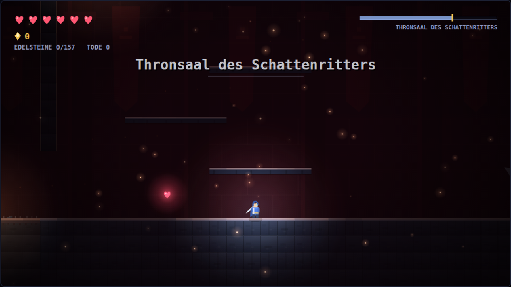 | 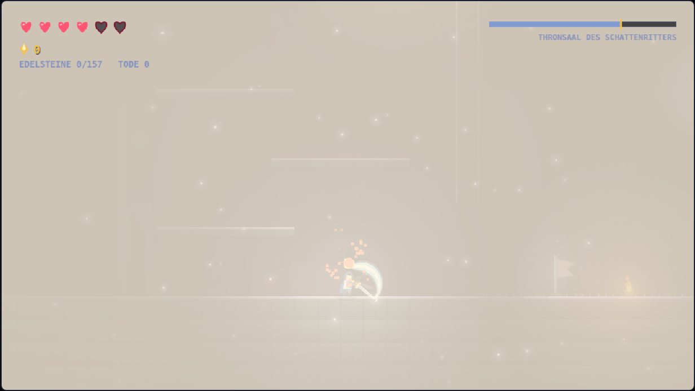 |
| 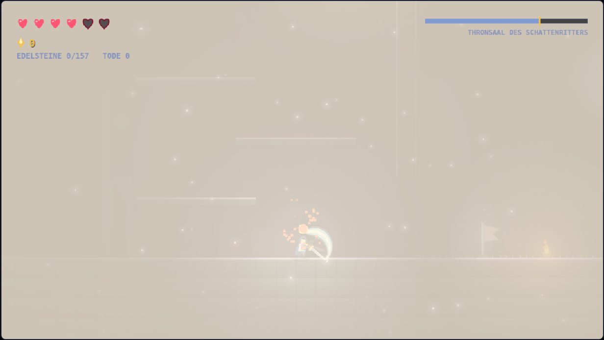 | 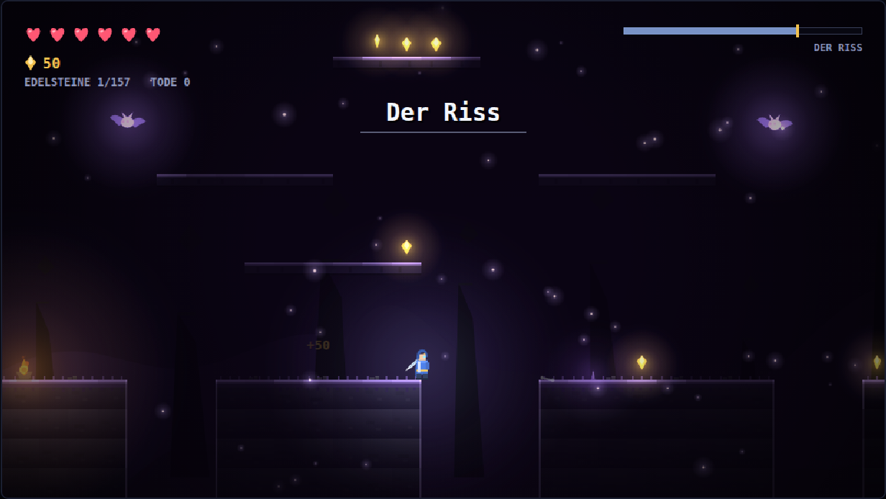 |
| 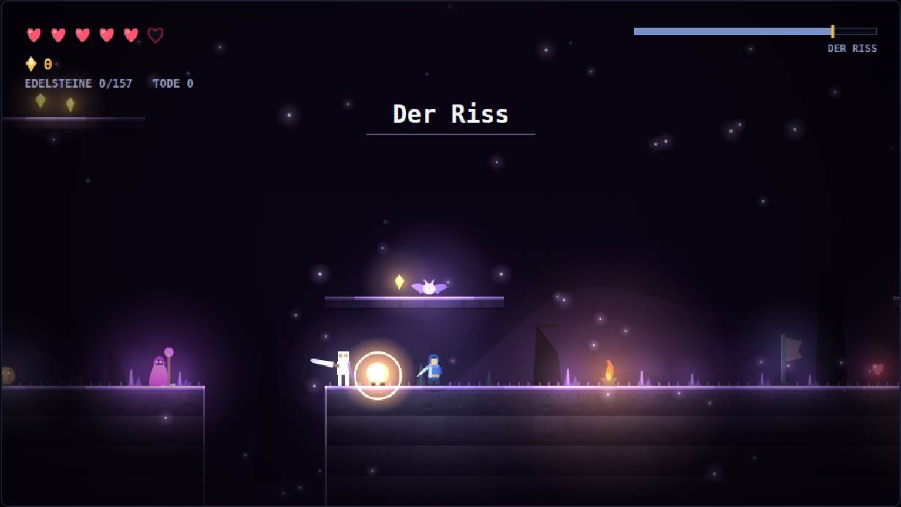 | 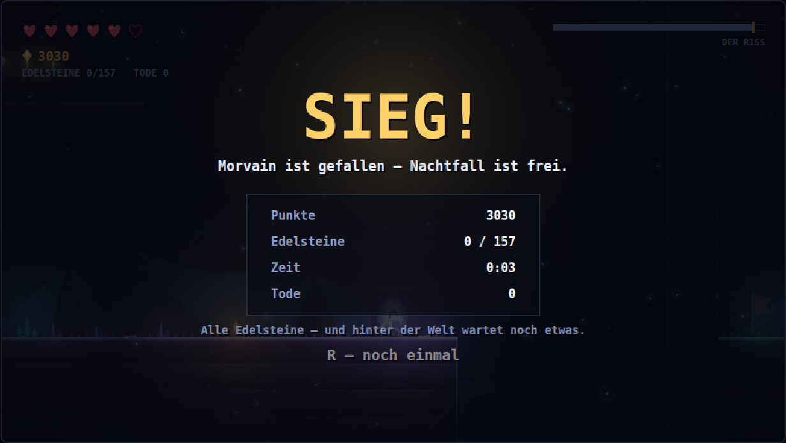 |

## Aufbau des Codes

```
src/
  core/      Spielschleife (fester Zeitschritt), Eingabe, Kamera, Mathe, WebAudio
  world/     Level-ASCII, Parser, Kachel-Kollision, World-Interface
  entities/  Physikkörper, Spieler, Gegner, Boss, Projektile, Pickups, Plattformen
  render/    Parallax-Hintergrund, Kachel-Renderer, Deko, Sprite-Helfer, Palette
  fx/        Partikel und Schadenszahlen
  ui/        HUD-Bausteine (Herzen, Bossleiste, Panels)
  game.ts    Zustandsautomat, der alles zusammenhält
```

Das Level steht als ASCII-Kunst in `src/world/levelData.ts`. Jeder Abschnitt ist
40 (die Arena 50) Zeichen breit und 22 Zeilen hoch; die Abschnitte werden
horizontal aneinandergehängt:

```
.  leer          #  Stein        =  Erde         -  Holzplattform
^  Stacheln      L/l Lava        G  Fallgitter   P  Startpunkt
S  Siegel (öffnet sich, wenn der Ritter fällt)     O  Tor nach Hause (Ziel)
s  Schleim       b  Fledermaus   k  Skelett      m  Dunkler Magier
z  Zunder        w  Schildwache  r  Klingenläufer   Q  Gallert (Boss)
$  Edelstein     H  Herz         C  Kontrollpunkt
T  Fackel        X  Kristall     M/V bewegliche Plattform    B  Boss
W  Splitterwächter (Miniboss)   Y  Thalassa (Boss)   K  Prismarch (Bonusboss)
```

Damit das Level begehbar bleibt, gilt beim Bauen: Bodenlücken höchstens vier
Kacheln breit, Plattformen höchstens drei Reihen über der Fläche darunter und
waagerecht mit der Stufe darunter überlappend, Stacheln in der Bodenreihe statt
darauf.

Die Prüfwerkzeuge leiten ihre Startpunkte inzwischen aus den Spawns ab statt aus
Kachelzahlen. Ein Abschnitt, der mitten im Level eingeschoben wird, verschob
sonst jedes Werkzeug auf einmal.

## Werkzeuge

Alle Skripte fahren das gebaute Spiel in einem echten Chromium hoch:

```bash
npm run verify:level   # Erreichbarkeitsanalyse: kommt man vom Start zum Boss?
npm run verify:arena   # kommt man nach einem Tod am Tor zurück in die Bossarena?
npm run verify:combat  # fängt die Parade den Schlag, trifft der Ladeschlag härter?
npm run verify:gallert # Züge, Spucke zum Abschlagen, Herzkern — und bleibt er tot?
npm run verify:thalassa # ihre Züge, die Springflut, ihr Fall und die Flutklinge danach
npm run verify:enemies # zündet der Zunder, hält der Schild, zahlt sich die Wand aus?
npm run verify:ending  # führt der Riss zum Tor, und zählt der Lauf am Tor auch dann?
npm run verify:warden  # wählt der Splitterwächter seinen Zug, und wehrt er sich?
npm run verify:bonus   # letzter Edelstein, Prismarch, und die geschärfte Klinge
npm run verify:motion  # schwingt das Bild bei Treffern, oder rüttelt es?
npm run playtest       # Bot spielt das Level mit echter Physik und meldet Hänger
npm run screenshots    # erzeugt die Bilder in screenshots/
```

`verify:level` baut einen Graphen aus allen begehbaren Kacheln und prüft mit
einem bewusst konservativen Sprungmodell, ob Boss **und** Tor vom Startpunkt
aus erreichbar sind — nützlich, sobald man am Level schraubt. Es meldet Gegner,
die auf nichts oder neben Stacheln stehen (gefunden: fünf Skelette, die sich
binnen neun Sekunden selbst erledigten), und außerdem
begehbare Stellen, die von nirgendwo aus zu erreichen sind, und getrennt davon
Plattformen, auf die niemand kommt: die reine Spaltenprüfung übersieht sie, weil
eine unerreichbare Plattform über festem Boden hängt und die Spalte dadurch als
erreichbar zählt. Für den Kristallhort gilt die Prüfung andersherum — er *muss*
unerreichbar sein, sonst wäre der Erwerb umsonst.

`verify:arena` spielt einen Softlock nach: den Schattenritter ans Fallgitter
locken, sterben, zurücklaufen. Das Gitter muss offen bleiben, bis der Spieler
wieder drin ist.

`verify:combat` prüft Parade und Ladeschlag am Boss. Die Parade hängt an einem
Fenster von einer Sechstelsekunde — geht auf dem Weg dorthin ein Tastendruck
verloren, fühlt sich das nicht schwer an, sondern kaputt.

`verify:gallert` prüft den ersten Boss: Zugwahl nach Entfernung; dass ein
blinder Hieb seine Spucke **abschlägt** und dass Dastehen ein Herz kostet; dass
sein Sprung dort trifft, wo er landet, und 420 px weiter eben nicht; dass die
Teilung genau zwei Schleime bringt und nur zweimal; dass eine Parade ihn
losschüttelt; dass ein Draufhauer zahlt und trotzdem gewinnt; dass sein Fall
die sechs Herzen auf sieben setzt und die Leiste füllt; dass er nach einem Tod
des Helden **nicht wieder aufsteht**; und dass man an ihm vorbeikommt.

`verify:thalassa` prüft ihren Kampf Eigenschaft für Eigenschaft: die Zugwahl auf
zwei Entfernungen; zwei Wellen in Phase eins und vier in Phase zwei, ein Anker
und dann zwei; dass ein blinder Hieb ihre Welle **nicht** abschlägt und sie
trotzdem trifft; dass die Springflut jemandem ein Herz nimmt, der auf der Marke
stehen bleibt, und **keines** dem, der herausläuft; dass sie von selbst danach
greift, wenn einer in ihrer Reichweite parkt; dass die Krone genau einmal ruft,
mit fünf Säulen; dass sie erst im letzten Drittel zwei Züge aneinanderhängt;
dass eine Parade sie bricht; und zum Schluss vierzig Sekunden gegen jemanden,
der nur die Angriffstaste hält, mit aufgefüllter Lebensleiste — sonst ist der
Kampf vorher vorbei und es hängt vom Zufall ab, ob sie überhaupt zum Zug kam.
Aus dieser Messung ist die Aufprall-Sperre entstanden, und später der ganze
Umbau oben: Poise allein reicht nicht, weil ein Dauerangreifer schneller Schaden
macht als jede Ankündigung dauert. Danach, dass ihr Fall die Flutklinge hergibt:
eine Sichel je Hieb, die auf 120 px trifft und auf 250 px eben nicht — das ist
die andere Hälfte, und die gehört dem Prismarchen. Und der Held läuft einmal an
ihr vorbei, ohne zu kämpfen — das muss gehen, und es darf höchstens drei Herzen
kosten.

`verify:enemies` stellt die drei neuen Typen einzeln auf ebenen Boden und prüft
je die Sache, für die sie da sind: der Zunder zündet von selbst **und** beim
Erschlagen aus einem Meter (2 Herzen), aus der Ferne erschlagen kostet nichts,
und Nachbarn nimmt er mit (3 Schaden). Am Schild von vorn kommt 0 an, von hinten
4, nach einer Parade wieder etwas. Und der Klingenläufer läuft, trifft, und wird
an der Wand benommen — wo zwei Schaden zu vier werden. Die Wandprobe steht in der
Kristallhalle, weil das die einzige Stelle mit einer Wand vom Boden bis zur
Decke ist; die Arenen sind offener Boden, und ein Sturm über offenen Boden
landet nie. Zuletzt: eine Explosion darf kein Bild kosten. Der Treffer-Blitz ist
ein Canvas-Filter, jeder Gegner in der Druckwelle trägt einen, und jeder
gefilterte Zug lässt den Browser eine Ebene in voller Bildgröße anlegen —
gemessen 97 ms je Bild, sechs hintereinander, bei jeder Explosion. Erlaubt sind
16,67 ms, gemessen werden 5,7.

`verify:ending` fährt den letzten Abschnitt ab: ein Bot reist mit echter Physik
durch den Riss bis zum Tor, und danach berührt der Held das Tor und läuft
weiter. Beides muss im Sieg enden. Der Riss stand vorher nur im statischen
Modell von `verify:level`, das keine Sprungbögen kennt.

`verify:warden` stellt den Splitterwächter auf drei Entfernungen und prüft, dass
er jeweils den passenden Zug wählt — und dass er gegen jemanden, der nur die
Angriffstaste hält, überhaupt zum Zug kommt.

`verify:bonus` fährt den ganzen Bonusweg ab: den letzten Edelstein wirklich
aufsammeln, den Dialog lesen (und prüfen, dass die Welt dabei steht), im Hort
landen, den Prismarchen auf zwei Entfernungen zu seinen Zügen bringen und ihn
erlegen. Dazu beide Türen: mit vollem Zähler muss das Tor im Riss in den Hort
führen, ohne ihn weiterhin den Lauf beenden. Es ist der einzige Inhalt, an dem niemand aus Versehen vorbeikommt —
also auch der, der am leichtesten unbemerkt kaputtgeht.

`verify:motion` misst, wie weit das Bild bei einem Treffer je Einzelbild springt
und wie oft es dabei die Richtung wechselt. Bildwackeln war einmal ein neuer
Zufallsversatz pro Bild — 18 px Sprung und 69 Richtungswechsel je Sekunde, also
kein Aufschlag, sondern ein Stroboskop. Erlaubt sind jetzt 5 px und 22 Wechsel;
gemessen werden 2 px und 14.

Dieselbe Prüfung misst außerdem, was sich im Himmel einer ruhigen Zone noch
bewegt, nachdem das reine Vorbeiziehen herausgerechnet ist. Das Sporenfeld zog
mit halbem Kameratempo über den Himmel, auf gebrochenen Pixelpositionen: fünfzig
helle Punkte, die vor fast schwarzem Grund in jedem Bild neu gemischt wurden.
Das waren zwei Drittel der Restbewegung dort oben — der Hintergrund, der bebte.
In ruhigen Zonen hängt das Feld jetzt am Bildschirm und atmet nur noch; die
Punkte sitzen auf ganzen Pixeln. Erlaubt sind 0,15, gemessen werden 0,077.

Und sie prüft die Stelle, an der es am meisten wehtat: den Sturz des Ritters und
den Siegelbruch. Der Todeskampf warf eine Zufallserschütterung auf jedem sechsten
Bild — zehn je Sekunde, anderthalb Sekunden lang —, und jede davon richtete das
Bild neu aus. Ein Aufschlag darf das, ein Strom von Nachschlägen nicht: er reitet
jetzt auf der laufenden Schwingung mit, und das Grollen kommt im Takt statt per
Los. Über sechs Sekunden gemessen: 203 zitternde Bilder und 8,8 Richtungswechsel
je Sekunde vorher, 56 und 2,2 jetzt.

Und `B` schaltet alles davon ganz ab — das Bildwackeln und die ziehenden Sporen,
in jeder Zone.

## Welcher Stand läuft gerade?

Unten im Titelbild steht `Stand <Datum> · <Commit>`. Das Spiel wird als eine
einzige `index.html` ohne Dateinamens-Hash ausgeliefert, und ein Browser, der
die festhält, zeigt ein altes Spiel, das genauso aussieht wie ein neues. Wenn
etwas Neues fehlt, sagt diese Zeile zuerst, ob es überhaupt ankommen ist — sonst
hilft ein hartes Neuladen (Strg+Umschalt+R bzw. Cmd+Umschalt+R).

## Veröffentlichen

[](https://github.com/JosWrf/2D-Platformer/actions/workflows/pages.yml)

`.github/workflows/pages.yml` baut das Spiel bei jedem Push auf `main` und
veröffentlicht `dist/` auf <https://joswrf.github.io/2D-Platformer/>. Es gibt
nichts weiter zu tun: pushen genügt.

Wer das Repo forkt, muss die Pages-Site einmal selbst anlegen — das Token des
Workflows darf das nicht: *Settings → Pages → Build and deployment → Source:*
**GitHub Actions**.
