# Shadowblade — Die Klinge von Nachtfall

## ▶ [Jetzt spielen](https://joswrf.github.io/2D-Platformer/)

Läuft direkt im Browser, ohne Installation: **joswrf.github.io/2D-Platformer**

Ein 2D-Jump-'n'-Run in TypeScript: ein schwertschwingender Held kämpft sich
durch ein großes, zusammenhängendes Level über acht Zonen bis in den Thronsaal
des Schattenritters Morvain — und darüber hinaus. Siebzehn Bosse stehen auf dem Weg,
an keinem führt er vorbei, und jeder lässt ihm etwas da, das er behält.

Kein Spiel-Framework, keine Bild- oder Audiodateien — alles wird zur Laufzeit
auf ein `<canvas>` gezeichnet, und alles, was man hört, wird per WebAudio
synthetisiert: gut vierzig Soundeffekte und vierundzwanzig Musikstücke, keines
davon aufgenommen.

[](https://joswrf.github.io/2D-Platformer/)

## Starten

```bash
npm install
npm run dev      # http://127.0.0.1:5173
npm run build    # Typecheck + Produktions-Build nach dist/
```

Der Build legt genau eine Datei ab: `dist/index.html`, rund 375 kB, mit dem
gesamten Spiel darin. Sie braucht keinen Server — ein Doppelklick auf die
Datei genügt, und weitergeben lässt sie sich als einzelner Anhang.

## Steuerung

| Taste | Aktion |
| --- | --- |
| `←` `→` / `A` `D` | Laufen |
| `Leertaste` / `W` | Springen (in der Luft nochmal für den Doppelsprung) |
| `J` / `K` / `X` | Schwertschlag — dreiteilige Kombo, der dritte Schlag trifft doppelt |
| `J` / `K` / `X` halten | Ladeschlag — nach kurzem Aufladen ein schwerer Hieb mit dreifachem Schaden; Laufen, Springen und Rollen gehen dabei weiter |
| `E` / `I` | Parade — fängt einen Schlag ab, wenn sie im richtigen Moment kommt |
| `Shift` / `L` | Ausweichrolle, während der Rolle unverwundbar |
| `F` / `U` / `C` | Boss-Angriff einsetzen — der, den man gerade gewählt hat (siehe [Und einen seiner Angriffe](#und-einen-seiner-angriffe)) |
| `Q` / `O` / `V` | Boss-Angriff wechseln — reihum durch alle, die man schon hat |
| `↓` + Sprung | Durch eine Holzplattform nach unten fallen (auf festem Boden springt er normal) |
| `P` / `Esc` | Pause |
| `R` | Neustart |
| `B` | Bildwackeln aus/an |
| `M` | Musik aus/an |
| `N` | Ton aus/an (alles) |

Die Belegung wird mit **echten Tastendrücken** geprüft, nicht über die
Eingabeschicht: `verify:combat` fährt Parade, Ladeschlag und das Durchfallen
über dieselbe Kette, die ein Spieler benutzt. Dabei kam heraus, dass `↓` +
Sprung nicht funktionierte — die Plattform wurde korrekt ignoriert, aber der
Sprung feuerte im selben Bild und trug den Helden 107 px in die falsche
Richtung. Jetzt fällt er drei Kacheln tief durch, und auf Stein springt er
weiter.

Das Bild passt sich dem Fenster an und wird dabei **kleiner statt
abgeschnitten**. Vorher stand eine Untergrenze von 0,4 in der Skalierung: in
einem Fenster unter 416 px Breite — ein Handy im Hochformat — hing die Leinwand
32 px über jeden Rand hinaus, mitsamt der Herzen links und der Fortschrittsleiste
rechts. Geprüft von 320×240 bis 2560×1440, dazu Hochformat 500×900.

## Das Level

Ein durchgehendes Level aus 1666 Kacheln (53 312 px) in acht Zonen, plus eine
neunte hinter der Welt, die man sich verdienen muss:

1. **Nebelwald** — Einstieg, Abgründe, Schleime, das Moor mit Gallert darin,
   und am Ende **der Keilerbau**, in dem Grimmzahn haust
2. **Versunkene Ruinen** — gleich am Eingang **die Schatzkammer**, in der nur
   noch eine Truhe steht: Gierschlund. Dann Säulen, Klettertürme, Skelette,
   **das Theater**, auf dessen Bühne Maskarill seine letzte Vorstellung gibt, und
   dahinter **das Tempelherz**, der Innenhof, um den die Ruinen gebaut sind:
   Ankhor, der Tempelkoloss
3. **Kristallhöhlen** — gleich hinter dem Höhleneingang **die Dunkelgrotte**, in
   der Nyktos jedes Licht gefressen hat, dann Lavaseen, wandernde Plattformen,
   dunkle Magier, in der Mitte **die Netzkammer**, unter deren Decke Arachna
   hängt, und am Ende **die Glutkammer**, in deren Boden Ignivor schwimmt
4. **Die Ertrunkene Halle** — was das Wasser geholt hat: gleich hinter der Treppe
   **der Sternenaltar**, an dem Sol und Luna Wache halten, dann Algenkanten, Korallen,
   dunkle Magier im Kirchenschiff, und im Chor Thalassa, die den Boden aufmacht
5. **Burg Nachtfall** — Mauern, und auf **den Zinnen** der eine Wasserspeier,
   der nicht immer Stein ist: Grauwacht. Dann Türme, Stachelfallen, **der
   Uhrturm**, in dem Tickmar den Takt schlägt, und oben auf dem Bergfried **der
   Blutturm**, über dem Vesperon kreist
6. **Thronsaal** — Bossarena; das Fallgitter schließt sich hinter dir
7. **Der Riss** — was hinter dem Thron aufbricht: 372 Kacheln violettes Gestein
   über dem Abgrund, dunkle Magier, gleich zu Anfang **der Spiegelgrund**, wo
   der Held seinem eigenen Schatten begegnet, in der Mitte der Splitterwächter —
   und hinter ihm wieder Riss bis zum Tor nach Hause
8. **Der Schlund der Fünfkronigen** — grün statt violett, mit Decke und Wänden:
   der einzige Abschnitt des Risses, der ein Raum ist. Ein Rippentor an jedem
   Ende fällt zu, sobald sie wach wird
9. **Der Kristallhort** — nur per Teleport erreichbar, wenn alle 163 Edelsteine
   eingesammelt sind. Acht leere Spalten trennen ihn vom Riss; kein Sprung
   überbrückt die, das ist Absicht.

Kontrollpunkte sichern den Fortschritt, Edelsteine geben Punkte, Herzen heilen —
bei vollem Leben bleiben sie liegen, statt sich an nichts zu verbrauchen.

Der Fall des Ritters ist nicht das Ende: Er bricht das Siegel hinter dem Thron
auf. Gewonnen ist der Lauf erst am Tor am anderen Ende des Risses — und dazwischen
stehen der Splitterwächter und, unmittelbar davor, die Fünfkronige. Das Tor
bleibt zu, solange sie lebt, und sagt das auch, statt den Helden zu ignorieren.

Wen das Bildwackeln bei Treffern stört, schaltet es mit `B` ab — jederzeit, auch
im Titelbild und in der Pause. Das beruhigt zugleich das Sporenfeld in allen
Zonen. Die Einstellung bleibt über Sitzungen erhalten, genau wie `M` (Musik) und
`N` (der ganze Ton); das Pausenbild zeigt, was gerade an ist.

Die Zonengrenzen stehen nicht mehr als Zahlen in der Palette, sondern werden aus
den Abschnitten abgeleitet. Vorher hätte jeder eingeschobene Abschnitt jede Zone
dahinter um seine Breite verschoben — drei neue Arenen hätten den Thronsaal wie
eine Burgmauer beleuchtet. Die sechs Kammern, die seitdem dazugekommen sind,
haben das bestätigt: eingeschoben, und jede Zone dahinter saß weiter richtig.

Der Riss hält im Übrigen still: kein wehender Bewuchs, keine treibenden
Silhouetten, kaum pulsende Kristalle, und ein Sporenfeld, das am Bildschirm
hängt statt darüberzuziehen. Vor einem fast schwarzen Grund ist jedes
bewegte Glanzlicht ein Flackern, und ein Bildschirm voll davon ermüdet die Augen,
statt Stimmung zu machen.

| | |
| --- | --- |
|  |  |
|  |  |
|  |  |
|  |  |
|  |  |

## Kein Boss ist optional

Früher standen drei Bosse im offenen Gelände: das Moor, der Chor der Ertrunkenen
Halle und die Mitte des Risses hatten keine Tür. Wer Gallert, Thalassa oder den
Splitterwächter nicht wollte, lief vorbei — gemessen und bis dahin sogar
*geprüft*, für ein Herz. Dem Schleim konnte man schlicht weglaufen.

Jetzt ist jede Bossarena **gebannt**. An beiden Enden steht eine Bannwand, ein
Vorhang aus Licht in der Farbe der Zone, vom Boden bis in den Himmel — eine vier
Kacheln hohe Tür auf freiem Feld wäre eine Tür, über die man springt:

* **Der Weg weiter** steht von Anfang an und fällt erst, wenn der Boss fällt.
* **Der Weg zurück** liegt offen, bis der Boss wach ist *und* der Held ganz
  drin steht; dann kommt er hinter ihm herunter. Offen zeigt er sich als Naht
  aus Runen im Boden — dass er sich schließt, ist ein gehaltenes Versprechen,
  keine Überraschung.
* Wer darin stirbt, findet ihn offen (der Kontrollpunkt liegt davor), und der
  Boss wartet schlafend, der Weg weiter weiterhin zu.
* Der Boss bleibt in seinem Raum. Einer, der dem Helden durch die offene Tür
  folgt, könnte sonst auf der falschen Seite landen.

Die Tür hinter ihm schließt sich nur, wenn er **ganz** drin ist: Ein Boss, der
aufwacht, während der Held noch in der Tür steht, hätte ihn sonst aus seinem
eigenen Kampf ausgesperrt — wach, unerreichbar, und für immer im Weg.

Gierschlund, Arachna und Umbra kamen gleich mit gebannten Kammern ins Spiel,
Grimmzahn, die Sternzwillinge und Tickmar auch, Maskarill, Nyktos und Grauwacht
ebenso. `verify:wards` fährt das für alle fünfzehn gebannten Arenen mit echter
Physik ab. Ein
Held, der dreißig Sekunden lang springend auf die ferne Wand zurennt und dabei am
Leben gehalten wird — sodass nur die Wand ihn aufhalten kann —, kommt in keiner
Arena auch nur einen Pixel weiter als bis an die Wand. Die Tür hinter ihm fällt
nach 1,1 bis 1,4 Sekunden, und acht Sekunden Zurückrennen bringen ihn nicht
hinaus. Der Ritter und die Fünfkronige hatten ihre Türen schon; der Prismarch
bleibt, was er ist — ein Bonus hinter allen Edelsteinen, aber wer im Hort steht,
kommt dort auch nur über ihn wieder heraus.


## Jeder Boss lässt etwas da

Früher belohnten drei von neun Bossen: Gallert gab ein Herz, Thalassa die
Flutklinge, der Prismarch die Klingenwelle. Ankhor, Ignivor und Vesperon füllten
die Herzen auf und sonst nichts, und der Ritter, der Splitterwächter und die
Fünfkronige machten eine Tür auf. Ein Kampf, der nichts einbringt, ist ein
Kampf, der nur im Weg steht.

Jetzt hinterlässt **jeder** Boss ein **Relikt**, für den Rest des Laufs — achtzehn
Bosse, achtzehn Relikte. Erst kommen die Worte über seinem Fall, dann das Relikt,
mit Banner und Namen: Ein Lohn ohne ein Wort liest sich als eine Zahl, die
steigt, nicht als etwas, das man jemandem abgenommen hat.

| Boss | Relikt | was es tut |
| --- | --- | --- |
| Gallert | **Herzkern** | ein Herz mehr, für den ganzen Lauf |
| Grimmzahn | **Keilerhaut** | Treffer werfen den Helden kaum noch zurück (70 statt 210 px/s) und bringen ihn nicht mehr ins Taumeln |
| Gierschlund | **Goldzahn** | jeder zehnte Edelstein bringt ein Herz zurück — bei vollem Leben wird gespart |
| Maskarill | **Gauklerschritt** | wer durch einen Angriff hindurchrollt, trifft mit dem nächsten Hieb, der verwundet, doppelt (drei Sekunden lang) |
| Ankhor | **Bebenfaust** | der Ladeschlag lädt schneller (0,3 statt 0,42 s) und schickt eine Schockwelle über den Boden |
| Nyktos | **Lichtkern** | ein verlorenes Herz fällt als Licht zu Boden, ein Stück zum Angreifer hin — wer es in drei Sekunden aufhebt, hat es zurück |
| Arachna | **Seidenmantel** | fängt einen Treffer ab und webt sich nach zwölf ruhigen Sekunden neu |
| Ignivor | **Glutklinge** | Abschlusshieb und Ladeschlag treffen mit Glut: ein Schaden mehr |
| Sol und Luna | **Zwillingsstern** | jede gelungene Parade macht den gewählten Boss-Angriff sofort wieder bereit |
| Thalassa | **Flutklinge** | jeder Hieb wirft eine kurze Sichel aus Wasser voraus |
| Grauwacht | **Steinblick** | was auf den Helden zufliegt, während er es ansieht, fliegt ein Drittel langsamer |
| Tickmar | **Taktgeber** | die Boss-Angriffe laden ein Drittel schneller nach |
| Vesperon | **Blutdurst** | je sechzehn ausgeteilte Schaden kommt ein Herz zurück |
| Morvain | **Schattenschritt** | zwei Ausweichrollen hintereinander, auch in der Luft |
| Umbra | **Zweiter Atem** | einmal pro Leben bleibt ein tödlicher Schlag bei einem Herz stehen |
| Splitterwächter | **Splitterparade** | längeres Paradefenster (0,26 statt 0,18 s), und jede Parade wirft drei Splitter |
| Fünfkronige | **Hydrablut** | alle achtzehn Sekunden wächst ein verlorenes Herz nach |
| Prismarch | **Klingenwelle** | die Sichel fliegt doppelt so weit und trifft so hart wie der Hieb |

Was rettet, hat immer eine Bedingung: ein Mantel, der nachwachsen muss, Blut,
das erst fließen muss, ein Licht, das man holen muss, ein zweiter Atem pro Leben — und nichts davon verbraucht
sich an einer vollen Leiste. Unter den Herzen steht für jedes Relikt ein Zeichen,
und die, die auf etwas warten, zeigen es: der Mantel als Ring, der sich neu webt,
Blut und Gold als Füllstand, der zweite Atem hell oder verbraucht. Die Pause
listet alle mit dem, was sie tun.

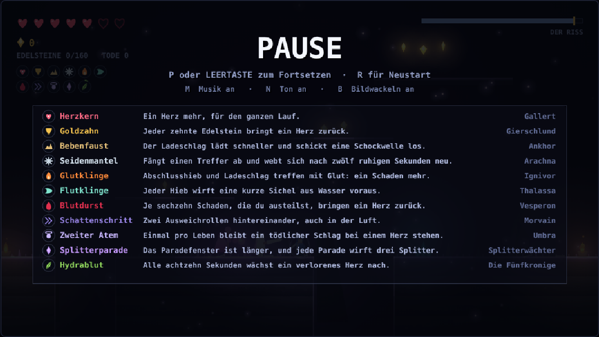

Die Schockwelle der Bebenfaust geht übrigens durch das hindurch, was die Klinge
gerade getroffen hat. Sie ist der längere Arm des Ladeschlags, nicht ein zweiter
— als sie noch obendrauf landete, hob sie den Ladeschlag in Reichweite gemessen
von 3,4 auf 6,6 Schaden pro Sekunde.

### Und einen seiner Angriffe

Die Relikte arbeiten von selbst. Dazu bringt jetzt **jeder Boss dem Helden
einen seiner eigenen Angriffe bei** — mit demselben Fall, im selben Banner:
Unter dem Namen des Relikts steht *NEUER ANGRIFF*, und der neue ist sofort der
gewählte. Eingesetzt wird immer nur einer, der gewählte, mit **F** (oder `U`,
`C`); **Q** (oder `O`, `V`) wählt reihum den nächsten, in der Reihenfolge des
Weges. Jeder hat seine eigene Abklingzeit.

| Boss | Angriff | was er tut | Abklingzeit |
| --- | --- | --- | --- |
| Gallert | **Klatschsprung** | ein Satz nach vorn (in der Luft: nach unten), und wo der Held landet, ein Ring: 3 Schaden | 3,5 s |
| Grimmzahn | **Felswurf** | ein Brocken im Bogen, der dort, wo er aufschlägt, weiterrollt: 2 Schaden an allem, was er trifft | 4 s |
| Gierschlund | **Goldregen** | vier Münzen im Fächer nach vorn, je 1 Schaden | 3,5 s |
| Maskarill | **Trugbild** | ein Trugbild des Helden springt nach vorn und schlägt zu: 2 Schaden an allem auf seinem Weg | 3,5 s |
| Ankhor | **Sonnenblick** | eine Säule aus Sonnenlicht auf den nächsten Feind; sie folgt ihm 1,2 s lang und brennt alle 0,3 s für 1 | 5 s |
| Nyktos | **Irrlichter** | drei Irrlichter kreisen vier Sekunden um den Helden; jedes trifft, was es berührt, für 1 | 5 s |
| Arachna | **Netzschuss** | drei Ballen Seide, je 1 Schaden; was sie treffen, lebt 2,2 s lang mit einem knappen Drittel seines Tempos (ein Boss 1,1 s mit gut der Hälfte) | 4,5 s |
| Ignivor | **Feuerwelle** | der Boden vor dem Helden bricht als Feuer auf, sieben Säulen weit: 2 Schaden an allem darin | 4 s |
| Sol und Luna | **Mondsichel** | eine Sichel aus Mondlicht fliegt hinaus und kehrt zurück: je 1 Schaden auf dem Hin- und dem Rückweg | 3 s |
| Thalassa | **Springflut** | unter bis zu drei Feinden schießt das Wasser hoch: je 2 Schaden | 4,5 s |
| Grauwacht | **Steinsturz** | ein steinerner Wasserspeier stürzt auf den nächsten Feind: 3 Schaden, wo er aufschlägt | 4,5 s |
| Tickmar | **Pendelschlag** | ein Pendel aus Messing schwingt vor dem Helden über den Boden: 2 Schaden an allem, was es streift | 4 s |
| Vesperon | **Blutsicheln** | drei Sicheln aus Blut im Fächer, durch alles hindurch: je 1 Schaden | 3 s |
| Morvain | **Schattenwelle** | die Klinge in den Boden: zwei Schockwellen, nach vorn und nach hinten, je 2 Schaden | 3,5 s |
| Umbra | **Schattensprung** | durch die Dunkelheit hinter den nächsten Feind — und gleich der Ladeschlag | 4,5 s |
| Splitterwächter | **Splitteransturm** | ein Sturm nach vorn in Kristall, unverwundbar: 2 Schaden an allem im Weg | 3 s |
| Fünfkronige | **Kronenfeuer** | fünf Würfe im Bogen, einer je Kopf und in dessen Farbe: je 1 Schaden, wo sie platzen | 4,5 s |
| Prismarch | **Splitterregen** | sechs Kristalle regnen auf den Feind vor dem Helden: je 1 Schaden | 5 s |

Sie treffen, wie die Klinge trifft — dieselbe Prüfung, dieselben Regeln:
Gierschlunds Deckel bleibt zu, Ignivors Platten klingen, Ankhors Gesicht nimmt
doppelt. Gezielt wird auf den nächsten Feind vor dem Helden, nie durch eine Wand
und nie auf einen Boss, der noch schläft: Ein Angriff, den man durch die
Bannwand auf einen Boss herabrufen könnte, machte die Arena überflüssig. Aus
demselben Grund geht auch der Schattensprung nicht durch Wände.

Unten links zeigt ein Feld den gewählten Angriff: sein Zeichen, das sich beim
Abklingen von unten wieder füllt, „bereit“ oder die Sekunden, die noch fehlen,
und für jeden gelernten einen Punkt hinter dem Q. Die Pause hat eine zweite
Seite (`←` `→`) mit allen gelernten Angriffen und dem, was sie tun.

| | |
| --- | --- |
| 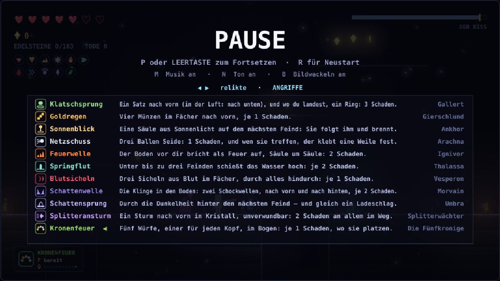 | 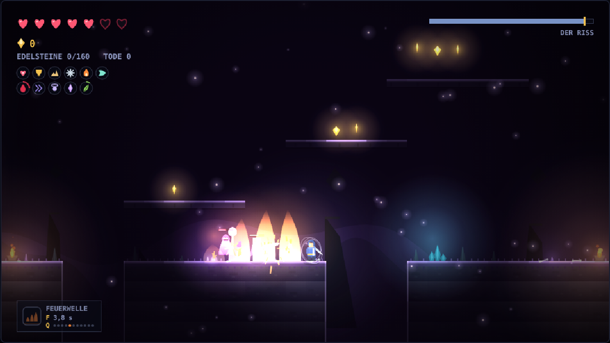 |

Die Monster rechnen sie — anders als die Relikte — nicht mit: Bereit ist immer
nur einer, und er will abgewartet werden. Gemessen, zwanzig Sekunden Hauen gegen
ein festgehaltenes Ziel, den Angriff gedrückt, sobald er bereit ist:

| | Schaden pro Sekunde | | | Schaden pro Sekunde |
| --- | --- | --- | --- | --- |
| nur Schwert | 3,70 | | | |
| Klatschsprung | 3,75 (+1 %) | | Pendelschlag | 4,15 (+12 %) |
| Felswurf | 4,15 (+12 %) | | Blutsicheln | 4,55 (+23 %) |
| Goldregen | 4,65 (+26 %) | | Schattenwelle | 4,15 (+12 %) |
| Sonnenblick | 4,35 (+18 %) | | Schattensprung | 3,95 (+7 %) |
| Netzschuss | 4,10 (+11 %) | | Splitteransturm | 3,85 (+4 %) |
| Feuerwelle | 4,15 (+12 %) | | Kronenfeuer | 4,60 (+24 %) |
| Mondsichel | 4,20 (+14 %) | | Splitterregen | 4,40 (+19 %) |
| Springflut | 4,05 (+9 %) | | Trugbild | 4,15 (+12 %) |
| Irrlichter | 4,25 (+15 %) | | Steinsturz | 4,25 (+15 %) |

Höchstens ein Viertel mehr, und die mit den kleinsten Zahlen tun etwas anderes
als Schaden: Klatschsprung und Splitteransturm tragen den Helden weg (der zweite
unverwundbar durch einen Angriff hindurch), der Schattensprung setzt ihn hinter
den Gegner, die Seide hält einen fest. Dafür reichen Sonnenblick, Springflut und
Splitterregen dorthin, wo keine Klinge hinkommt — auch zu Arachna an ihrem
Faden.

`verify:skills` prüft das mit echten Tastendrücken: dass jedes Relikt seinen
Angriff mitbringt und Q sie reihum wählt; dass jeder Angriff trifft, was er
verspricht, seine Abklingzeit abwartet und mehrere Gegner nimmt, wo er das sagt;
dass nichts durch die Wand einer geschlossenen Arena geht; dass sie einen Tod
überstehen und mit einem Neustart verschwinden — und die Tabelle oben.
`verify:relics` prüft beim Fall jedes Bosses mit, dass sein Angriff dabei ist.

### Und die Monster rechnen mit

Achtzehn Relikte sollen einen Helden machen, der anders spielt — keinen, der durch
alles hindurchläuft. Also sieht sich jedes Monster an, was es vor sich hat,
einmal, wenn es ihm zum ersten Mal begegnet (ein Boss: beim Aufwachen). Mitten
im Kampf verschiebt sich nichts.

Jedes Relikt hat dafür einen **Angriffswert A** und einen **Verteidigungswert V**:

* ein **Boss** bekommt Leben × (1 + A + 0,3·V) und Poise × (1 + 1,6·A) — wer
  härter zuschlägt, braucht länger, wer mehr aushält, ein bisschen; und Poise
  wächst mit dem Angriff schneller als das Leben, damit eine stärkere Klinge
  nicht in einen Dauerstun kippt;
* ein **gewöhnliches Monster** bekommt Leben × (1 + A): ein Skelett, das einem
  Helden mit Glut, Flut und Bebenfaust begegnet, hat 8 statt 5.

| Relikt | A | V | | Relikt | A | V |
| --- | --- | --- | --- | --- | --- | --- |
| Herzkern | 0 | 0 | | Blutdurst | 0 | 0,15 |
| Keilerhaut | 0 | 0,04 | | Schattenschritt | 0 | 0,06 |
| Goldzahn | 0 | 0,05 | | Zweiter Atem | 0 | 0,1 |
| Bebenfaust | 0,06 | 0 | | Splitterparade | 0,04 | 0,04 |
| Seidenmantel | 0 | 0,12 | | Hydrablut | 0 | 0,1 |
| Glutklinge | 0,25 | 0 | | Klingenwelle | 0,22 | 0 |
| Zwillingsstern | 0 | 0 | | Taktgeber | 0 | 0 |
| Flutklinge | 0,22 | 0 | | Gauklerschritt | 0,04 | 0,02 |
| Lichtkern | 0 | 0,08 | | Steinblick | 0 | 0,05 |

Der Herzkern zählt nichts, weil er der Grundstock ist: Jeder Kampf nach dem Moor
ist für sieben Herzen gebaut. Zwillingsstern und Taktgeber zählen auch nichts:
Sie wirken nur auf die Boss-Angriffe, und die rechnen die Monster nicht mit
(siehe oben). Die Angriffswerte sind gemessen, nicht geraten —
zwanzig Sekunden gegen ein festgehaltenes Ziel, in Schaden pro Sekunde:

| | Dauerhauen | Ladeschlag | aus 120 px |
| --- | --- | --- | --- |
| nur Schwert | 3,70 | 3,35 | 0 |
| Bebenfaust | 3,70 | 3,95 | 0 |
| Glutklinge | 4,60 | 4,45 | 0 |
| Flutklinge | 6,50 | 5,60 | 3,30 |
| Bebenfaust + Glut + Flut | 7,40 | 7,90 | 3,30 |
| dazu die Klingenwelle | 8,30 | 9,20 | 4,40 |

Die beiden Klingen behalten die +22 %, mit denen die Kämpfe nach Thalassa gebaut
und vermessen wurden, obwohl ihre Sichel aus nächster Nähe mehr wert ist — sie
landet auf dem Hieb, aus dem sie geworfen wurde. Was das unterm Strich heißt,
zeigt der Ritter: Früher kam der Held mit der Flutklinge bei ihm an, schlug
1,76-mal so schnell zu wie mit dem Schwert allein, und der Ritter hatte 1,22-mal
so viel Leben — er fiel also 1,44-mal so schnell. Heute kommt der Held mit
zehn Relikten an und schlägt doppelt so schnell zu, aber der Ritter hat 111
statt 68 Leben: 1,23. **Der Held ist stärker geworden, und der Ritter trotzdem
zäher als vorher.**

Entlang des Weges, jeder Boss mit den Relikten, die man hat, wenn man bei ihm
ankommt (gemessen, nicht gerechnet):

| Boss | Relikte | Leben | Poise |
| --- | --- | --- | --- |
| Gallert | 0 | 22 | 14 |
| Grimmzahn | 1 | 62 | 8 |
| Gierschlund | 2 | 32 | 8 |
| Ankhor | 3 | 54 → 55 | 8 |
| Arachna | 4 | 48 → 52 | 9 → 10 |
| Ignivor | 5 | 44 → 49 | 5 |
| Sol und Luna | 6 | 2 × 30 → 2 × 41 | 6 → 9 |
| Thalassa | 7 | 60 → 82 | 13 → 19 |
| Tickmar | 8 | 190 → 303 | |
| Vesperon | 9 | 56 → 89 | 9 → 17 |
| Morvain | 10 | 68 → 111 | |
| Umbra | 11 | 30 → 58 | 7 → 13 |
| Splitterwächter | 12 | 16 → 27 | 5 → 9 |
| Fünfkronige | 13 | 50 → 87 | 8 → 15 |

Umbra rechnet als einziger anders: Sein Leben sind fünf je Herz des Helden, und
die Relikte trägt er obendrein selbst.

`verify:relics` prüft beide Hälften: dass jeder der achtzehn Bosse spricht, sein
Relikt hergibt und dass es einen Tod übersteht und einen Neustart nicht; und dass
jedes Relikt genau das tut, was es sagt — am Helden gemessen, nicht an einem
Schalter abgelesen.

## Der Boss: Schattenritter Morvain

68 Trefferpunkte, drei Phasen mit eigener Bewegungs- und Angriffsauswahl:

* **Phase 1** — Schwertschlag mit Schockwelle, Sturmangriff quer durch die Arena
* **Phase 2** — Schockwellen in beide Richtungen, Schattenkugeln, beschworene Skelette
* **Phase 3** — schneller, kürzere Vorwarnzeiten, Sprungangriff mit Deckeneinsturz

Jeder Angriff wird vorher telegrafiert; nach genug Treffern wird der Ritter
kurz benommen und ist offen für eine volle Kombo. Sein Gefolge bleibt
überschaubar: mehr als zwei Skelette stehen nie gleichzeitig in der Arena.

#### Nicht festhalten lassen

Mit der geworfenen Klinge ließ sich der Ritter **stunlocken**. Gemessen, ein
Bot, der nur die Angriffstaste hält:

| | Anteil benommen | Züge im ganzen Kampf | kassierte Herzen |
| --- | --- | --- | --- |
| ohne Klinge | 15 % | 30 | 52 |
| Flutklinge, **vorher** | **42 %** | **2** | 4 |
| Klingenwelle, **vorher** | **46 %** | **2** | 4 |
| Flutklinge, jetzt | 16–19 % | 9–26 | 11–44 |
| Klingenwelle, jetzt | 14–20 % | 5–26 | 5–44 |

Dauer und Tode stehen nicht in der Tabelle, weil sie über einzelne Läufe wild
schwanken: ein Tod des Helden füllt die Leiste des Ritters wieder, und ob ein
Bot einmal stirbt oder nicht, entscheidet über 13 gegen 120 Sekunden. Belastbar
sind der Anteil benommener Zeit und die Zahl der Züge, die er überhaupt
anfängt — und die sagen dasselbe: **mit der Klinge kam er im ganzen Kampf
zweimal zum Zug und stand fast die Hälfte der Zeit benommen da.**

Der Grund: 14 Schaden mitten im Zug werfen ihn um, und mit der Klinge macht ein
Spieler die 14 schneller, als eine Benommenheit dauert. Jede Erholung lief
direkt in die nächste. Jetzt hält er nach einer Benommenheit **2,6 Sekunden**
die Füße still, was blinden Schaden angeht. Eine **Parade** wirft ihn weiter
jedes Mal um — die kommt nur, wenn er wirklich zuschlägt, also begrenzt sein
eigener Takt sie.

#### Er schlägt die Sichel aus der Luft

Auch mit mehr Leben blieb er nach dem Klingen-Upgrade zu leicht, und das lag
nicht an seinen Zahlen. Gemessen, der Held steht fest und unverwundbar auf
Abstand und schwingt nur:

| Klinge | Abstand | Wellen in 30 s | Schaden | Anteil seiner Leiste |
| --- | --- | --- | --- | --- |
| Klingenwelle, **vorher** | 250 px | 99 | 92 | **100 %** |
| Flutklinge, **vorher** | 130 px | 98 | 78 | **100 %** |
| Klingenwelle, jetzt | 250 px | 100 | 33 | 36 % |
| nur Schwert | 60 px | — | 64 | 100 % |

250 px liegen außerhalb von allem, was er erreichen kann. Dastehen und
schwingen nahm ihm also die ganze Leiste ab, ohne ein einziges Mal in Gefahr
zu sein — mehr Leben macht das nur länger, nicht schwerer.

Er ist ein Ritter mit einem Großschwert. Also **schlägt er die Sichel aus der
Luft**, solange er nicht in einem Zug festhängt. Das ist keine Mauer:

* nur von vorn — was in seinen Rücken fliegt, kommt an;
* **nie**, während er festgelegt ist: Sturmangriff, Sprungschlag, Deckensprung
  und benommen sind alle offen;
* und höchstens dreimal pro Sekunde, damit zwei Sicheln in einem Moment nicht
  zwei Funken werfen.

Etwa ein Viertel des Kampfes sind seine festgelegten Bilder, also kommt aus der
Ferne etwa ein Viertel der Sicheln an. Wer mehr will, muss nah genug heran, um
seine Ansagen zu lesen — dieselbe Regel, nach der der ganze Kampf schon läuft.
Wenn er es tut, leuchtet die Klinge auf ihrer ganzen Länge auf und es sprüht
am Aufprallpunkt: man soll sehen, warum die Sichel weg ist. Ein Bot, der nur
aus der Ferne warf, hat ihn vorher in 41 Sekunden erledigt; jetzt steht er nach
100 Sekunden immer noch bei 64 von 78 Trefferpunkten.

`verify:combat` nagelt beides fest: acht Sicheln auf einen offenen Ritter
machen **0** Schaden, dieselben acht auf einen festgelegten machen **8**.


#### Gereizt: wer in die Ankündigung hineinhaut, kriegt sie früher

Gemessen, und der Grund für diese Regel: Ein Held, der sich einfach vor ihn
stellte und die Angriffstaste hielt, nahm ihn in **17,8 Sekunden** von voll auf
null und verlor dabei **sechs** Trefferpunkte — ohne einen einzigen Tod. Sein
Ausholen war ein Gratisfenster, in dem man stehen und ihn austauschen konnte.

Das Ausholen *war* schon die Ankündigung. Jetzt kostet es etwas, sie zu
ignorieren: Ein Treffer, während er ausholt, lässt den Schlag **früher**
kommen statt später — 0,18 s statt 0,62 s, mit eigenem Aufblitzen, eigenem
Ton und „GEREIZT!" über ihm. Wer den Tell liest und zurückgeht, sieht das nie.

Fair bleibt es durch zwei Grenzen: Reizen geht **einmal pro Zug** (sonst hielte
ein schneller Held ihn ewig auf Bruchteilen einer Sekunde), und eine Parade
bricht ihn weiterhin aus jedem Schwung heraus — der Könnerweg ist unberührt.

`verify:combat` nagelt beide Hälften fest: unangetastet läuft sein Slam-Ausholen
38 Bilder, gereizt bricht es auf 15 zusammen, und der zweite Treffer verkürzt
nichts mehr.

Was die Messung nach der Änderung sagt, über fünf Läufe je 100 Sekunden: Der
Draufhauer legt ihn **nicht mehr um** — er kommt im Median auf 50 % seiner
Leiste und stirbt dabei neun Mal. Ohne die geworfene Klinge sind es 83 %.

#### Bosse nehmen die Klinge zur Kenntnis — und alles andere auch

Wer mit einer geworfenen Klinge ankommt, trifft auf mehr Boss. Das Upgrade ist
etwa zwei Schaden pro Sekunde ohne jedes Risiko, und die Bosse waren gegen ein
Schwert gebaut. Beim Aufwachen sieht sich jeder Boss einmal an, was auf ihn
zukommt — mitten im Kampf verschiebt sich nichts, und wer das Upgrade nie
gefunden hat, trifft genau den Boss, der für ihn eingestellt wurde:

| Klinge | Leben | Schaden bis zur Benommenheit |
| --- | --- | --- |
| nur Schwert | 68 | 18 |
| Flutklinge | 83 | 24 |
| Klingenwelle | 98 | 31 |

Dasselbe gilt für jeden anderen Boss — und seit jeder Boss etwas hinterlässt,
nicht mehr nur für die Klinge: Jedes Relikt geht in diese Rechnung ein, die
Klinge behält dabei genau ihre alten +22 % Leben und +35 % Poise je Stufe. Mit
allem, was ein Held bis zum Thron einsammelt, steht Morvain mit **111** Leben da.
Die ganze Rechnung steht unter [Jeder Boss lässt etwas da](#jeder-boss-lässt-etwas-da).
Auf Distanz stehen bleiben hilft seitdem auch nicht mehr: der Ritter wählt weit
draußen zweimal so oft den Sturmangriff wie das Hinterherlaufen, und ein Bot, der
auf 150 px kampierte und die Klinge schickte, verliert jetzt statt in 30 s zu
gewinnen.

#### Was er hinterlässt

Sein Fall bricht das Siegel — und eine Atempause später spricht, was von ihm
übrig ist, und gibt dem Helden den **Schattenschritt**: zwei Ausweichrollen ohne
Atem dazwischen, auch in der Luft. Die Worte warten 1,6 Sekunden, bis der
Siegelbruch seinen Moment gehabt hat; vorher redete sonst jemand in das Bild
hinein, für das der ganze Kampf da war.

#### Und sie bleiben tot

Ein gefallener Boss kam bisher mit dem nächsten Kontrollpunkt zurück: der
Kontrollpunkt baut die Gegnerliste neu auf, und Thalassa, der Splitterwächter
und der Prismarch stehen in dieser Liste. Ein Tod irgendwo in der Welt stellte
sie wieder hin, mit voller Leiste. Gemessen und behoben — nur der komplette
Neustart (`R`) bringt sie zurück, und der nimmt einem auch die Klinge und den
Herzkern wieder ab.

## Die Gegner

| | | Antwort |
| --- | --- | --- |
| **Schleim** | hüpft stur geradeaus | drüber oder drauf |
| **Fledermaus** | fliegt in Wellen an, zieht vor dem Sturz hoch | Timing |
| **Skelett** | patrouliert, schlägt telegrafiert | parieren oder ausweichen |
| **Dunkler Magier** | schwebt, wirft Kugeln | Kugeln zurückparieren |
| **Zunder** | läuft heran und zündet sich | **auf Abstand erledigen** |
| **Schildwache** | alles in den Schild hinein bleibt dort | **von hinten, oder parieren** |
| **Klingenläufer** | gräbt sich ein und stürmt durch den Raum | **in eine Wand locken** |

Der **Zunder** ist eine Falle, keine Wache: er wartet, bis man nah ist, und
zündet dann eine gute Sekunde lang sichtbar und hörbar auf. Ihn zu erschlagen
löst dieselbe Explosion aus — wer ihn aus einem Meter Entfernung umhaut, kassiert
sie. Aus der Ferne erledigt kostet er nichts, und genau dafür ist die
Klingenwelle da — beziehungsweise ab der Halbzeit die Flutklinge, deren 145 px
weit außerhalb seiner Druckwelle von 66 px liegen. Was neben ihm steht, nimmt er
mit: ein Skelett in seiner Reichweite ist ein Skelett, das man nicht selbst
bekämpfen muss.

Die **Schildwache** ist der einzige Gegner im Spiel, den man mit gehaltener
Angriffstaste nicht schafft. Von vorn stirbt jeder Hieb im Schild, die
Klingenwelle inbegriffen. Hinten herum trifft alles — und ein parierter
Lanzenstoß reißt ihm den Schild für knapp zwei Sekunden herunter.

Der **Schleim** hüpft stur geradeaus, dreht aber an Kanten um. Diese zweite
Hälfte fehlte lange: sein Kommentar behauptete sie, geprüft wurde nur auf
Wände, und ein Kantencheck auf den nächsten Schritt ist für einen Springer die
falsche Frage — er besteht ihn am Rand stehend und landet in der Grube dahinter.
Gemessen an seinem echten Platz in den Ruinen (drei Kacheln Boden fehlen,
Stacheln darunter) war einer neun Sekunden nach Laufbeginn weg, bevor der
Spieler ihn je gesehen hätte. Jetzt wird der **Landeplatz** geprüft, und wenn es
in beide Richtungen schlecht aussieht, hüpft er auf der Stelle.

Die **Fledermaus** zieht vor jedem Sturz eine knappe halbe Sekunde (0,42 s) hoch,
weg vom Helden, mit glühenden Augen und einem Schrei — vorher stieß sie ohne jedes
Zeichen aus dem Schweben herab, 90 px in 0,37 s. Und sie setzt sich nicht mehr auf
Planken: Lag der Held darunter, landete sie auf dem Brett und blieb hüpfend dort
sitzen.

Der **Klingenläufer** ist der einzige, den das Level selbst erledigt: er gräbt
sich ein, stürmt los, und wer sich vor einer Wand wegdreht, sieht ihn dagegen
laufen. Danach steht er anderthalb Sekunden benommen da und nimmt doppelten
Schaden.

### Der erste Boss: Gallert, der Aufgequollene

34 Trefferpunkte, zwei Phasen, drei Züge — und der Lehrer des Spiels. Jeder
seiner Züge ist die einfache Form von etwas, das ein späterer Kampf härter
macht:

* **Klatschsprung** (aus der Nähe) — er flacht sich gegen den Boden, springt,
  und landet mit einem Ring: 2 Schaden, aber nur dort, wo er aufkommt (74 px).
  Derselbe Zug wie der Sprungschlag des Splitterwächters, nur langsamer
  angekündigt. Er trägt bis zu 230 px, ist also auch sein Weg zu einem, der
  Abstand hält.
* **Spucke** (auf Distanz) — drei Klumpen auf kurzer Bahn, einer auf den Helden
  und zwei daneben. **Ein Hieb schlägt sie aus der Luft**, und das ist der Sinn
  des Kampfes: die Regel, die Thalassas Flutwelle später verweigert, muss man
  vorher gelernt haben, sonst ist die Ausnahme keine.
* **Teilung** (zweite Hälfte, höchstens zweimal) — er kneift zwei gewöhnliche
  Schleime von sich ab. Erst die wegräumen, dann weiter.

Angekündigt wird alles über den Kern, der vor jedem Zug aufleuchtet; die
Silhouette sagt den Rest, weil er sich vor dem Sprung platt macht und in der
Luft streckt. Sein Schatten bleibt dabei unten am Boden und schrumpft — daran
sieht man, wie hoch er ist.

Poise 14, gemessen und nicht geraten: bei 8 warf ihn ein Dauerangreifer aus
jedem Zug, den er anfing, und kassierte im ganzen Kampf **keinen einzigen
Treffer**. Jetzt kostet derselbe Bot 5 von 6 Herzen und braucht 9 Sekunden; mit
aufgefüllter Bossleiste gemessen — sonst ist der Kampf vorbei, bevor er dreimal
zum Zug kam — landet Gallert 7 bis 18 Treffer in 25 Sekunden. Mit 22
Trefferpunkten lag er nach acht Sekunden, bevor er sich ein einziges Mal geteilt
hatte; mit 34 braucht der Leser rund zwölf, und die Teilung kommt. Eine Parade
schüttelt ihn immer los. Vorbeilaufen geht **nicht mehr**: das Moor ist gebannt,
und `verify:gallert` prüft jetzt das Gegenteil dessen, was es früher prüfte.

Wer ihn schlägt, bekommt den **Herzkern**: sechs Herzen werden sieben, für den
ganzen Rest des Laufs, und die Leiste ist sofort wieder voll. Lange war das eine
von nur drei Belohnungen im ganzen Spiel; jetzt ist es die erste von achtzehn —
siehe [Jeder Boss lässt etwas da](#jeder-boss-lässt-etwas-da).

### Der zweite Boss: Grimmzahn, der Keiler

Im Bau am Ende des Waldes schläft ein Keiler, der jeden Baum hier schon einmal
umgerannt hat. 62 Trefferpunkte, zwei Phasen, und die Regel eines Keilers:
**Lass ihn gegen die Wand laufen.** Er trägt keinen Panzer und ist immer zu
treffen — aber sein Ansturm hört erst an der Wand der Arena auf.

* **Ansturm** — er scharrt mit dem Huf und senkt den Kopf (0,75 s), rennt los,
  bis 420 px/s, und hält erst an der Wand: zwei Herzen, der einzige Zug, der zwei
  kostet. Gesenkt ist er 34 px hoch — ein normaler Sprung klärt ihn. Die Wand
  lässt ihn **2,2 s benommen** stehen (*BENOMMEN!*, Sterne), und benommen nimmt
  er **doppelten Schaden**. Wer ihn pariert, hält ihn sofort an: 2,6 s benommen.
* **Stampfer** — er steigt hoch (0,6 s) und kracht herunter; nach beiden Seiten
  läuft ein Erdwall über den Boden, gut 200 px weit. Drüberspringen — oder auf
  eine Planke, bis dorthin reicht er nicht.
* **Steinwurf** — er gräbt die Hauer ein (0,6 s) und schleudert einen Brocken
  hoch dorthin, wo der Held steht. Er trifft nur, wo er herunterkommt:
  weitergehen genügt, und ein Hieb schlägt ihn weg.

Nach Stampfer und Steinwurf steht er 1,6 bzw. 1,7 s keuchend in Schwerthöhe da.
Ab der Hälfte rennt er manchmal gleich von der Wand zurück (0,65 s Ankündigung),
nie zweimal hintereinander. Dazwischen trabt er auf Abstand, und das tut nicht
weh: Nur was sich bewegt, trifft — die Front seines Ansturms, die Erdwälle, ein
fallender Brocken.

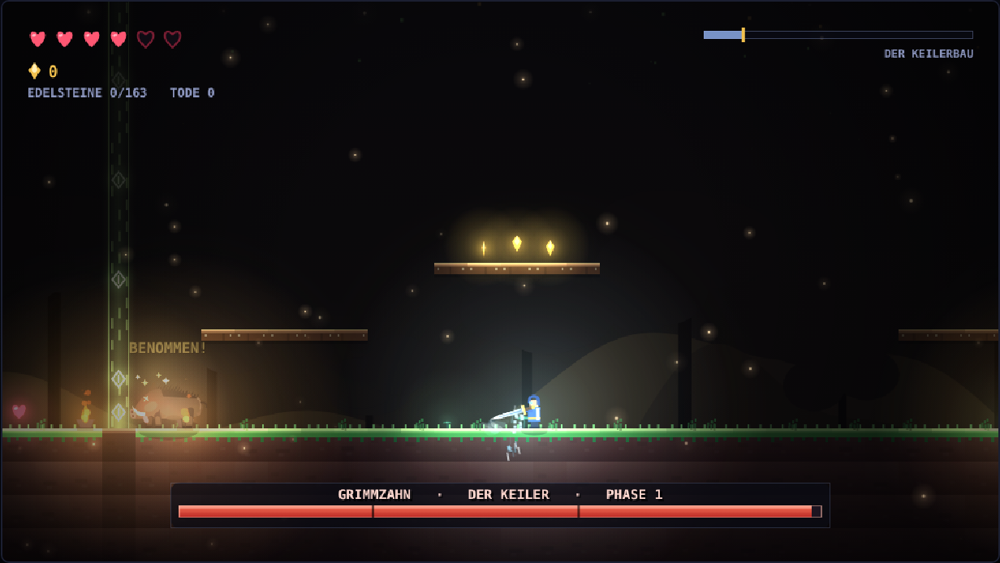

Ein Held, der ihn 0,3 s zu spät sieht und nur vom Boden aus zuschlägt, fällt ihn
in 26 bis 53 s, in vierzig Kämpfen ohne ein verlorenes Herz; wer stehen bleibt,
verliert 20 Herzen in der Minute. Die 62 Trefferpunkte sind gemessen: Mit den
30, mit denen er gezeichnet war, lag er nach 18 bis 24 Sekunden, denn eine
Benommenheit neben einem Helden, der ihn liest, ist bis zu zwanzig davon wert.
Er hinterlässt die **Keilerhaut** und den **Felswurf**.

### Der dritte Boss: Gierschlund, die gierige Truhe

In der Schatzkammer der Ruinen steht nur noch eine Truhe. Was sonst hier lag, hat
sie gefressen — Gold, Steine, Diebe. 40 Trefferpunkte, zwei Phasen, und die Regel
einer Truhe: **Zu ist sie ein Tresor.** Jeder Hieb auf den Deckel klingt und tut
nichts. Sie öffnet sich nur, um etwas zu nehmen, und offen ist sie nur noch Maul:

* **Schnappbiss** — der Deckel klafft, im Spalt leuchtet ein Auge, sie lehnt sich
  zurück (0,75 s) und springt mit offenem Maul. Danach steht sie 1,9 Sekunden
  offen da und hechelt: das Fenster. Wer den Biss **pariert**, klemmt den
  Deckel auf, zweieinhalb Sekunden lang.
* **Schnapper** — wer an ihr klebt, bekommt den Deckel: Steht der Held fast
  eine Sekunde am Stück an ihr, rattert sie kurz (0,5 s), dann ist er zu — ein
  Herz. Eine Truhe umarmen ist, wie Truhen einen fressen. Wer nur ein Fenster
  genutzt hat, bekommt dagegen einen Hüpfer zurück, keinen Deckel.
* **Goldregen** — sie wirft den Deckel zurück und spuckt einen Fächer Münzen,
  eine auf den Helden und die anderen gut eine Heldenbreite daneben: ein halber
  Schritt zur Seite, und keine trifft. Weite Würfe fliegen länger und kommen
  steil herunter — auf festen 0,85 s Flug kamen sie flach und schnell, strichen
  zwanzig Pixel über ihr Ziel hinaus durch die ganze Höhe des Helden, und ab
  320 px Abstand gab es keinen sicheren Fleck mehr. Die Münzen bleiben einen Moment liegen,
  tun dort niemandem etwas, und **ein Hieb schlägt eine flach zurück**. Gold, das
  heimkommt, ist das Einzige, wofür sie den Deckel nicht zuhalten kann — sie
  reißt ihn auf, und die Münze geht für zwei Schaden ins Maul.
* **Zunge** — sie rollt sie ein und peitscht sie 230 px über den Boden.
  Drüberspringen. Danach liegt sie 1,7 Sekunden hechelnd da.
* **Gierschlucken** — ab der Hälfte: Sie atmet ein, und der Boden rutscht zum
  Maul, mit 120 px/s — langsamer, als der Held läuft (235). Wer stehen bleibt,
  landet im Maul; wer läuft, kommt heraus.

Zwischen den Zügen hüpft sie ihm mit fest geschlossenem Deckel hinterher — und
landet ein Stück vor ihm, nicht auf ihm. Dann gibt es nichts zu tun, als Abstand
zu halten und zu warten, bis sie etwas will. Nach dem Goldregen steht sie 1,5 s
offen, nach dem Gierschlucken 1,6 s, und ihre zweite Hälfte macht alles
schneller außer diesen Fenstern.

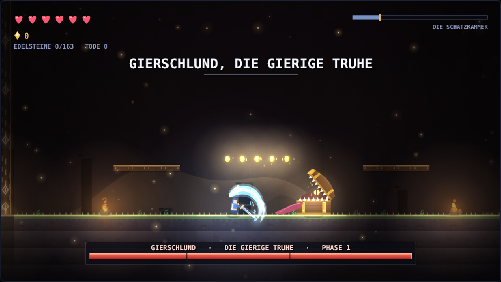

#### Drei Regeln, die nicht stimmten

Alle drei standen im Kommentar ihres Codes, und keine hielt, als `verify:bosses`
sie nachmaß:

* **Münzen ließen sich nicht zurückschlagen.** Sie kamen steil von oben auf den
  Helden herunter, und das Schwert trifft vor ihm, auf Brusthöhe. Ein Bot, der
  nach jeder nahen Münze schlug, traf in neun Läufen keine einzige — es gab genau
  ein Bild, in dem eine vor ihm und noch nicht in ihm war. Jetzt bleiben sie
  liegen, und eine liegende Münze fliegt flach zurück: 4 Schaden aus einem
  einzigen Goldregen im Prüflauf.
* **Ihr Einatmen zog niemanden.** Es schob am Tempo des Helden, und seine eigene
  Bodenhaftung fraß das in jedem Bild wieder auf: Wer stillstand, bewegte sich
  keinen Pixel. Jetzt rutscht der Boden selbst, und wer stehen bleibt, wird von
  170 auf 32 px herangezogen und gebissen.
* **Ein parierter Biss klemmte den Deckel nur manchmal.** Die Parade erreicht,
  was innerhalb von 60 px steht, die Zähne der springenden Truhe erreichen den
  Helden aber schon aus 64 px — je nachdem, in welchem Bild sie ankam, klemmte
  der Deckel oder eben nicht. Jetzt merkt sie selbst, wenn ihre Zähne auf eine
  Parade treffen.

Gemessen, ein Bot, der ihre Ankündigungen liest und in ihre Fenster schlägt:
72 bis 88 Sekunden, 2 bis 4 Treffer. Einer, der nur draufhaut: 24 bis 26 Treffer
in gut einer halben Minute — mit sieben Herzen verliert er.

#### Viel zu stark — gemessen wie ein Mensch

Der lesende Bot von damals reagierte im selben Bild, in dem sie etwas tat. Mit
einem, der sie wie ein Mensch **0,3 Sekunden zu spät** sieht und nur vom Boden aus
in ihr offenes Maul schlägt, dauerte der damals zweite Boss des Spiels **127 bis über
150 Sekunden** und kostete **11 bis 15 Herzen** — bei sieben Herzen ein bis zwei
Tode. Woran es lag:

1. **Ihre Fenster waren kürzer als der Weg zu ihr.** 0,85 bis 1,15 Sekunden
   stand sie offen, in der zweiten Hälfte noch ein Fünftel weniger — und ihr
   eigener Zug hatte gerade hundert Pixel und mehr zwischen sie und den Helden
   gelegt. Eine Viertelsekunde, um das Fenster zu sehen, eine halbe, um
   hinzulaufen: ein Hieb pro Fenster, wenn überhaupt.
2. **Wer ein Fenster nutzte, bekam den Deckel.** Sie schnappte nach jedem, der
   nah war, wenn sie den nächsten Zug wählte — also direkt nach jedem Fenster
   nach dem, der es genutzt hatte, mit 0,4 s Rattern. Das war die Hälfte aller
   verlorenen Herzen.
3. **Ihre Hüpfer landeten auf dem Helden**, und auch beim Abspringen tat sie weh.
4. **Ihr Biss lief einem davon**, der beim ersten Klaffen des Deckels
   zurückwich: 540 px/s nach 0,62 s Ansage.

Jetzt steht sie nach dem Biss 1,9 s offen, nach der Zunge 1,7 s, nach dem
Goldregen 1,5 s, nach dem Gierschlucken 1,6 s — in beiden Hälften. Der
Schnapper kommt nur noch nach knapp einer Sekunde Klammern, nach 0,5 s Rattern
und für ein Herz statt zwei. Ihre Hüpfer landen vor dem Helden und tun nur noch
im Fallen weh, der Biss kündigt sich 0,75 s an und springt mit 480 px/s. 8
Schaden klemmen den Deckel (statt 11). Sie hatte danach erst 32 statt 40 Leben —
das schoss übers Ziel: Der Leser leerte sie in 18 bis 21 s, schneller als
Grimmzahn davor, und wer nur draufhielt, ging mit einem Herz übrig heraus.
Jetzt wieder 40.

Derselbe menschenähnliche Bot:

| | vorher | jetzt |
| --- | --- | --- |
| bis sie leer ist | 127 bis über 150 s | 23–44 s |
| verlorene Herzen | 11–15 | 0–2 (mit 0,4 s Verspätung 0–3) |

Wer stehen bleibt, zahlt weiter (siehe die Tabelle unter „Gemessen: lesen lohnt
sich“). Wer sie leert, bekommt den **Goldzahn** — und ihren **Goldregen**.

### Der vierte Boss: Maskarill, der Gaukler

Im Theater der Ruinen gibt der letzte Spieler noch jede Nacht seine Vorstellung,
vor Reihen, auf denen seit hundert Jahren niemand mehr sitzt. 88 Trefferpunkte,
zwei Phasen, und die Regel jeder Bühne, die von vorn beleuchtet wird: **Nur einer
wirft einen Schatten.** Die Rampenlichter werfen ihn groß an die Rückwand — vom
ersten Augenblick des Kampfes an, lange bevor es darauf ankommt —, und die
Trugbilder, die er sich herbeizaubert, werfen gar keinen.

* **Messerwurf** — drei Messer wirbeln über seinem Kopf (0,65 s), dann fliegen
  sie nacheinander im Bogen dorthin, wo der Held steht. Weitergehen genügt, und
  ein Hieb schickt eines zurück in ihn: zwei Schaden. Danach verbeugt er sich —
  das Fenster.
* **Radschlag** — er duckt sich, die Schellen klingen (0,6 s), dann schlägt er
  Rad quer über die Bühne, durch den Helden hindurch und weiter. Das Rad ist
  48 px hoch: Ein normaler Sprung klärt es. Er landet im Spagat — das Fenster.
  Wer das Rad pariert, wirft ihn auf einen Haufen: 1,6 s schwindlig.
* **Salto** — die Knie beugen sich (0,57 s), er springt hoch und kommt dort
  herunter, wo der Held stand; sein Schatten auf den Brettern zeigt die Stelle,
  und die Landung wirft einen Ring. Danach steht er schwindlig da — das Fenster.
* **Trugbilder** — eine Verbeugung, eine Rauchwolke (0,7 s), und es gibt ihn
  dreimal, ab der Hälfte viermal. Sie mischen sich über die Bühne, kreuzen sich,
  schlagen Rad und Salto — nichts davon tut weh, nichts davon ist zu treffen —,
  dann stellen sie sich in einer Reihe auf und verbeugen sich. Jetzt ein Hieb: auf
  den mit dem Schatten, und er ist **ENTLARVT!** — die Maske springt, die
  Trugbilder vergehen, und er kniet 2,6 s da und nimmt **doppelten Schaden**. Auf
  ein Trugbild: *PUFF*, und jede Figur, die noch steht, wirft ein Messer; ins
  Leere genauso. Auch diese Messer gehen erst eine halbe Sekunde blitzend hoch.

Außerhalb seiner Fenster findet ihn die Klinge nie ganz: Er biegt sich weg
(*HOPPLA!*). Überall treffbar, wurde er zwischen seinen Zügen einfach zerlegt —
ein Held, der ihn las, hatte ihn nach 15 Sekunden am Boden, bevor der Trick ein
einziges Mal gekommen war. Nur seine eigenen Messer, zurückgeschlagen, treffen
immer. Wer in einem Gaukler steht, der jongliert, sich verbeugt oder im Spagat
sitzt, verliert nichts; weh tun das Rad, die Landung des Saltos und die Messer.
Ab der Hälfte: vier Figuren, schnelleres Mischen, ein schnelleres Rad, und hin und
wieder ein Rad, das gleich in die Messer übergeht.

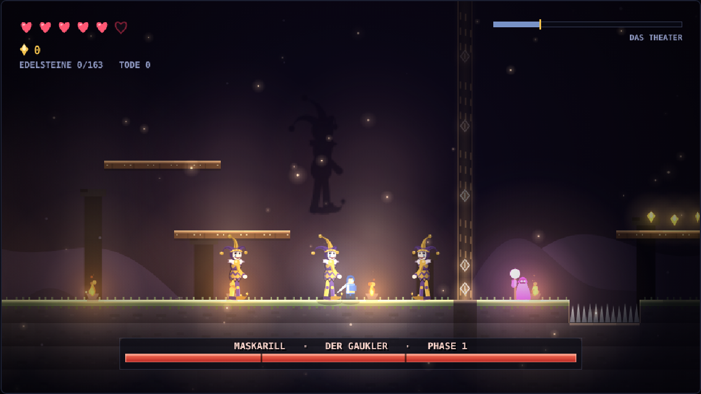

Ein Held, der ihn 0,3 s zu spät sieht und nur vom Boden aus zuschlägt, legt ihn
in 43 s um, entlarvt ihn bei jedem Trick und verliert ein oder zwei Herzen — an
Messer, unter die er gelaufen ist. Wer nur hinläuft und zuschlägt, nimmt sechs
bis neun Treffer: Rad, Salto und Messer finden ihn, und die Reihe ist für ihn ein
Ratespiel. Maskarill hinterlässt den **Gauklerschritt** und das **Trugbild**.

### Der fünfte Boss: Ankhor, der Tempelkoloss

Im Innenhof der Ruinen, bis zur Brust im eigenen Pflaster vergraben: ein Wächter
aus Sandstein mit Nemes-Kopftuch in Lapis und Gold, einem Halskragen aus
Perlenreihen, einer Sonnenscheibe auf der Brust und Rissen, durch die das Licht
in ihm scheint. Er geht nicht — dafür hat er zwei Hände, die keine Arme brauchen.
Solange niemand den Hof betritt, liegen sie auf dem Boden, und er ist eine Statue.

54 Trefferpunkte, zwei Phasen, vier Züge:

* **Faustschlag** — eine Faust steigt über den Helden und folgt ihm, ihr
  Schatten wird auf dem Boden größer; dann hält sie eine Drittelsekunde *still*
  und kommt herunter. Aus dem Schatten treten. Danach liegt sie so lange am
  Boden, dass man hineinschlagen kann. (Das Stillhalten dauerte erst 0,2 s —
  kürzer als ein Auge, das 0,3 s hinterher ist: Wer es sah, stand schon unter
  der Faust.)
* **Wischer** — eine Hand geht an die Wand gegenüber, legt sich auf den Boden
  und fegt über den ganzen Hof. Drüberspringen, oder auf einem Absatz stehen.
  Sie kommt immer von der fernen Seite, quer an ihm vorbei: der längste Blick
  auf einen Angriff, den man verlangen kann.
* **Sonnenblick** — er sieht nach oben, zwei dünne Strahlen aus seinen Augen in
  den Himmel, und der Himmel antwortet: eine Säule aus Sonnenlicht kommt auf den
  Helden herunter und folgt ihm — langsamer, als er läuft. Ein Grund, sich zu
  bewegen, kein Urteil.
* **Doppelschlag** — ab der Hälfte beide Fäuste nacheinander, und jeder Schlag
  schickt Schockwellen über den Boden.

Jeder Teil von ihm, den man trifft, zählt — aber **sein Gesicht nimmt doppelt**,
und eine Faust, die genug abbekommen hat oder deren Schlag pariert wurde,
**zerspringt**. Ohne sie sackt er nach vorn, der ganze Leib sinkt ins Pflaster,
und sein Kopf kommt dorthin, wo ein Schwert vom Boden aus hinkommt. Das ist die
Öffnung, um die der Kampf gebaut ist. Sechs Sekunden später fliegen die Splitter
zurück und die Faust ist wieder da.


### Der sechste Boss: Nyktos, der Lichtfresser

Gleich hinter dem Höhleneingang liegt eine Grotte, in der kein Kristall mehr
leuchtet: Nyktos hat jedes Licht darin gefressen. 58 Trefferpunkte, zwei Phasen,
und seine Regel: **Im Licht ist er Fleisch.** Im Dunkeln ist er Rauch, und die
Klinge geht durch ihn hindurch (*NUR IM LICHT!*). Steht seine Mitte im Schein
eines leuchtenden Kristalls, ist er Fleisch — und Fleisch lässt sich schneiden.
Vier Kristalle hat die Grotte, zwei am Boden und zwei auf den hohen Simsen, alle
dunkel, bis der Held einen mit der Klinge anschlägt. Dann leuchtet er acht
Sekunden (ab der Hälfte sechs), zum Ende hin schwächer — und Nyktos will ihn:

* **Fressen** — hat ein Kristall 0,8 s geleuchtet, kommt er (zu dem, der am
  weitesten vom Helden weg ist), senkt sich darauf und frisst 2,4 s lang: im
  Licht, also in Reichweite. Das ist das Fenster. Sieben Schaden in einer
  Mahlzeit, und er fährt **GEBLENDET!** zurück auf den Boden, 2,7 s lang fest, und
  der Kristall bleibt hell; sonst ist er dunkel, wenn er fertig ist, und bleibt
  eine Weile leer.
* **Hieb** — wer am Kristall steht, wenn er ankommt, wird erst weggestoßen
  (0,52 s Ankündigung): ein Herz, und weg vom Licht. Wer den Hieb pariert, blendet
  ihn auf der Stelle.
* **Schattengriff** — unter einem Helden im Dunkeln öffnet sich ein Pfuhl
  (0,95 s): Er folgt ihm, langsamer als er geht, steht 0,35 s still, und Klauen
  kommen heraus. Heraustreten. Ins Licht reicht er nie.
* **Finsterwelle** — er steigt (0,7 s) und schlägt auf den Boden: Eine Welle aus
  Dunkel läuft nach beiden Seiten — drüberspringen — und löscht jeden
  leuchtenden Bodenkristall, über den sie läuft. Die Simse behalten ihres.
* **Schattenkugeln** — ab der Hälfte (0,65 s): drei dunkle Kugeln treiben auf
  den Helden und auf alles, was leuchtet. Eine, die einen Kristall erreicht,
  löscht ihn; ein Hieb schlägt sie weg.

Licht hält ihn fern: Er hängt im Dunkeln und geht nur zum Fressen ins Licht. Was
kein Zug ist, tut nicht weh — Rauch nicht, in den man hineinläuft, und Fleisch,
das frisst, auch nicht.

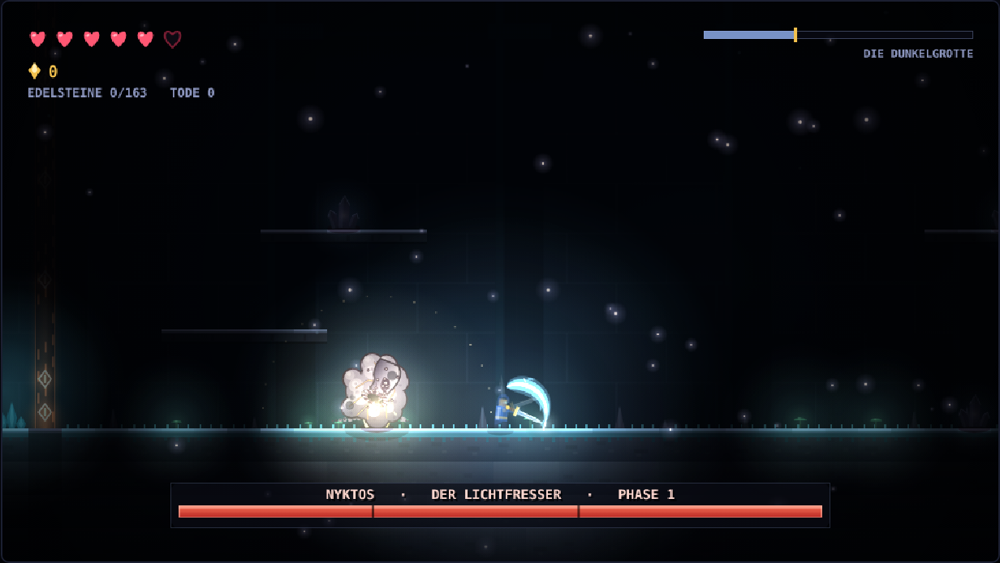

Mit den fünf Relikten bis hierher legt der Leser ihn in 41 bis 48 s um, vier
Mahlzeiten und drei Blendungen, für null bis zwei Herzen. Wer nur zuschlägt,
fällt ihn auch — die Klinge zündet ab und zu aus Versehen einen Kristall an —,
aber in rund einer Minute und für 13 bis 17 Treffer: zweimal tot. Bei den 46
Trefferpunkten aus dem Entwurf lag er nach gut einer halben Minute ohne einen
Treffer am Boden. Er hinterlässt den **Lichtkern** und die **Irrlichter**.

### Der siebte Boss: Arachna, die Netzkönigin

Mitten in den Kristallhöhlen liegt die Netzkammer, und unter ihrer Decke hängt
Arachna an einem einzigen Faden, einen Kristall im Rücken. 48 Trefferpunkte, zwei
Phasen. Oben auf ihrem Faden ist sie vom Boden aus außer Reichweite — ihr Leib
hängt 164 px über ihm —, und der Kampf dreht sich um die zwei Wege nach unten:
ihren und den des Helden.

* **Sturzbiss** — unter dem Helden sammelt sich ihr Schatten als Ring auf dem
  Boden, sie zieht die Beine an (0,7 s) und lässt sich fallen. Der Ring folgt
  ihm und steht dann eine Viertelsekunde still: raus aus dem Schatten. Wo sie
  aufkommt, muss sie 1,6 Sekunden sitzen, bevor sie wieder hinaufklettern kann
  — das Fenster. Wer den Sturz **pariert**, legt sie auf den Rücken.
* **Netzschuss** — Ballen aus Seide, einer auf den Helden, die anderen links und
  rechts daneben. Wo einer landet, klebt der Boden: Laufen geht nur noch gut
  halb so schnell (59 statt 100 px in einer halben Sekunde), Springen nicht mehr
  so hoch. Ein Ballen auf den Helden bindet ihn, verletzt ihn aber nicht, und
  ein Hieb schneidet einen Fleck weg.
* **Brut** — Eiersäcke auf den Boden; was schlüpft, wuselt auf den Helden zu.
  Ein Hieb sticht einen Sack auf, bevor er schlüpft, und mehr als vier Junge und
  Eier sind nie draußen.
* **Pendel** — ab der Hälfte schwingt sie quer durch die Kammer, zur Kugel
  gerollt: Die Unterkante kommt bis auf 10 px an den Boden, die Oberkante bleibt
  58 px darüber. Das trifft jeden, der stehen bleibt, und ein Sprung nimmt es mit
  Luft.

Und der Weg des Helden: Die beiden hohen Absätze stellen ihn auf ihre Höhe. Wer
sie dort trifft, bringt sie zum Loslassen, wer den Faden über ihr trifft,
zerschneidet ihn (vier Hiebe). So oder so kommt sie auf dem Rücken herunter, die
Beine in der Luft, 2,6 Sekunden lang in Reichweite eines Schwerts vom Boden: das
lange Fenster.

Oben hatte sie lange keine Antwort: Seide verletzt nicht, ihre Brut klettert
nicht, ihr Pendel geht unter den Absätzen durch — und sie hing eine Klingenlänge
neben dem Helden. Ein Leser, der die Absätze kannte, brauchte 23 Sekunden und
ein Herz. Jetzt hat sie die **Beinpeitsche**: Steht der Held auf ihrer Höhe und
nah, hebt sie die rötlichen Vorderbeine (0,6 s) und fegt 96 px weit über den
Absatz. Zurücktreten oder hinunter — oder **parieren**: Dann reißt es sie vom
Faden (*PARIERT — SIE STÜRZT!*).

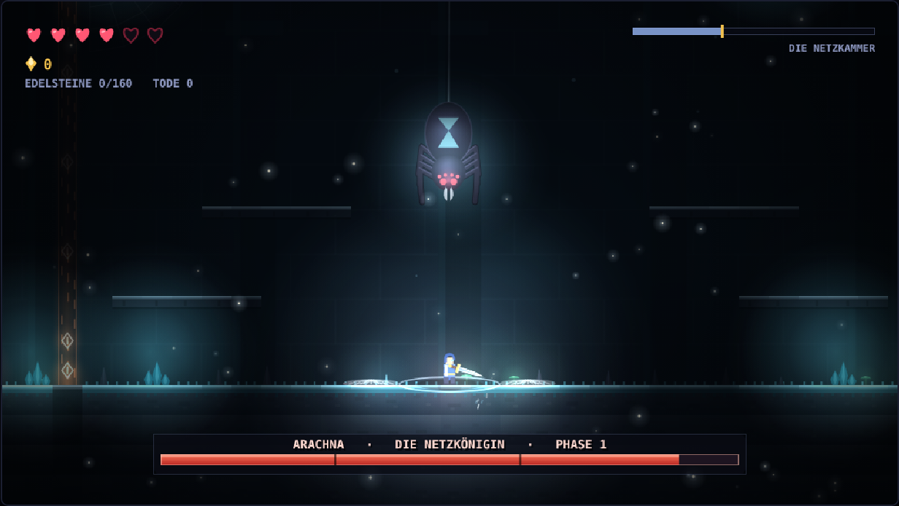

Gemessen, ein Bot, der ihre Ankündigungen liest: 76 bis 89 Sekunden, 3 bis 10
Treffer. Einer, der nur draufhaut, kommt — am Leben gehalten — in 45 bis 58
Sekunden durch und kassiert dabei 14 bis 21 Treffer, die meisten von ihren
Stürzen: Mit sieben Herzen stirbt er zwei-, dreimal. Wer sie stürzt, bekommt
den **Seidenmantel**.

### Der achte Boss: Ignivor, der Glutwurm

Fünfzehn Platten aus Obsidian, zwischen denen das Feuer des Berges läuft, ein
langer Schädel mit zurückgeschwungenen Hörnern und einem Kiefer, der fällt, wenn
er speit. Der Boden seiner Kammer ist Fels, weil Fels das ist, wodurch er
schwimmt — und wer hereinkommt, sieht zuerst gar nichts. Dann grollt es.

44 Trefferpunkte, zwei Phasen, und eine Regel, die jeder Wurm hat: **Die Panzerung
ist Panzerung.** Eine Klinge auf seinen Platten klingt und tut nichts — und sagt
es auch, ab und zu, über dem Panzer: *NUR DER KOPF!* Nur der Kopf zählt, und
jeder seiner Züge außer der Welle endet damit, dass der Kopf dort ist, wo ein
Schwert vom Boden aus hinkommt. Solange er dort ist, glüht er:

* **Durchbruch** — der Boden unter dem Helden glüht und folgt ihm, hält dann
  **0,55 Sekunden** still und bricht auf. In Bewegung bleiben; wenn es stehen
  bleibt, gehen. Der Wurm fährt gerade nach oben, nicht dorthin, wohin der Held
  inzwischen gelaufen ist. Was hochgeht, kommt herunter: Der Kopf schlägt neben
  dem Loch auf den Boden und **steckt fest** — 2,3 Sekunden, in der zweiten
  Hälfte 2,1. Er landet in Richtung des Helden, gut 54 px vor ihm und bis zu
  170 px vom Loch, nie auf ihm: genau das Ausweichen, das die Ankündigung
  verlangt hat, stellt einen in Reichweite. Beißen und brennen kann er nur auf
  dem Weg nach oben; der Weg herunter gehört dem Helden.
* **Glutspeien** — er steigt 110 bis 150 px vom Helden entfernt aus dem Boden,
  wirft den Kopf zurück und speit Klumpen aus Magma, die dort weiterbrennen, wo
  sie landen: einer auf den Helden, die anderen **hinter** ihn, vom Kopf weg. Nie
  dazwischen — der Weg zum Kopf bleibt frei. Danach hängt der Kopf 2,8 Sekunden
  tief und pendelnd, 34 px über dem Boden, in Kopfhöhe des Helden: Ein Hieb vom
  Boden trifft den ganzen Kopf.
* **Feuerwelle** — er geht an die ferne Wand und schwimmt die ganze Kammer
  entlang knapp unter dem Boden, und hinter ihm schlägt der Boden als Feuer
  hoch, den ganzen Weg. Der Boden ist kein Ort, an dem man dann sein will; die
  vier Absätze sind es.

Wer den hängenden Kopf genug trifft — 5 Schaden —, holt ihn herunter: Er schlägt
betäubt auf den Boden, liegt dort 3 Sekunden und sackt dabei zum Helden hin,
nie auf ihn. Das ist das lange Fenster. Ab der Hälfte bricht er zweimal
hintereinander durch, und das Feuer, das er oben am Scheitel aufwirft, kommt als
Regen wieder herunter.

| | |
| --- | --- |
|  | 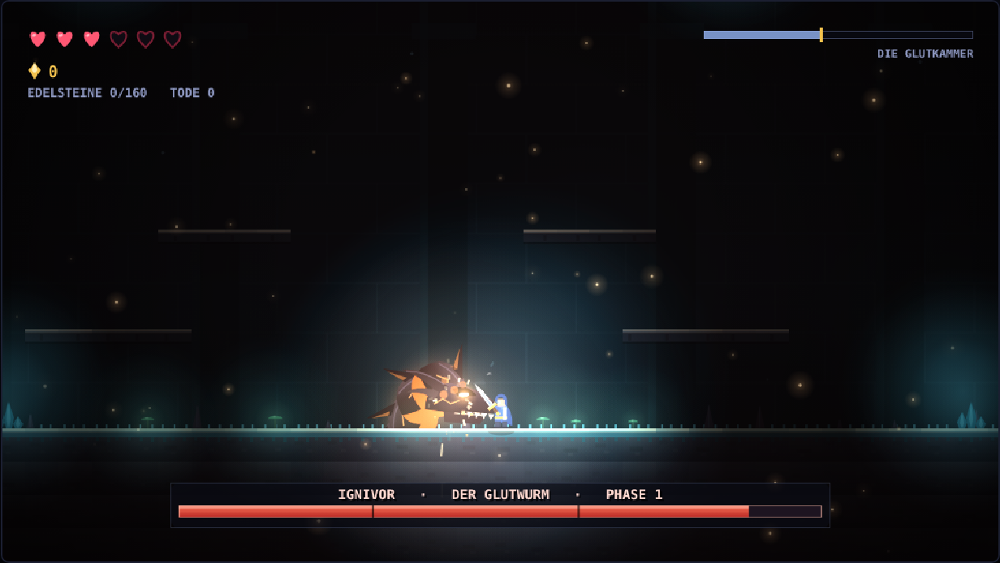 |
|  | |

#### Zu mächtig, weil kaum zu treffen

Gemessen, bevor er umgebaut wurde: Ein Bot, der jede Ankündigung las und jedes
Mal auf den Kopf losging, wenn der sich zeigte, machte **0,3 bis 0,5 Schaden pro
Sekunde**, kassierte in zwei Minuten rund dreißig Herzen und hatte ihn danach
immer noch nicht erledigt. An seinen Zahlen lag das nicht:

1. Der Kopf war neun Zehntel des Kampfes außer Reichweite eines Hiebs vom Boden.
   Nach dem Speien hing er 96 px hoch, was nur ein Sprung genau im Scheitel
   erreichte.
2. Das Speien legte sein Feuer genau auf den einzigen Weg zum Kopf: Die Klumpen
   landeten links und rechts vom Helden, einer also immer zwischen ihm und dem
   Wurm. Zwei Drittel dessen, was ein Held in diesem Kampf verlor, verlor er auf
   dem Weg durch dieses Feuer.
3. Nach einem Durchbruch war er wieder im Boden, bevor man sich umgedreht hatte,
   und zum Speien tauchte er 230 bis 300 px entfernt auf — über eine Sekunde
   Rennen.

Dazu brauchte es elf Schaden in einem einzigen Fenster, um ihn umzuwerfen; das
schaffte kaum jemand, und das lange Fenster kam zweimal pro Kampf. Jetzt sind es
sieben.

Derselbe lesende Bot erledigte ihn danach in **63 bis 73 Sekunden** und
kassierte dabei 5 bis 8 Herzen.

#### Immer noch zu mächtig — diesmal gemessen wie ein Mensch

Der Bot von damals war kein Mensch: Er wusste auf den Pixel, wo der Kopf ist, sah
jeden Zustandswechsel im selben Bild, in dem er geschah, und hüpfte im richtigen
Moment, um den hängenden Kopf zu erwischen. Gespielt fühlte sich der Wurm weiter
an wie einer, den man nicht treffen kann — und nachgemessen stimmte das. Ein
Bot, der den Kampf **0,3 Sekunden zu spät** sieht, wie ein Mensch eben, und **nur
vom Boden aus** zuschlägt, zeigte, woran es lag:

1. Der hängende Kopf hing 54 px hoch, sein Trefferfeld endete 28 px über dem
   Boden — ein Hieb im Stehen reicht bis 33 px hinauf. Fünf Pixel Überlappung,
   und keine, sobald er nach oben pendelte. Wer nicht hüpfte, traf ihn kaum.
2. Das Trefferfeld des Kopfes war 60 × 52 px, der gezeichnete Schädel streckt
   die Schnauze aber 46 px nach vorn — ausgerechnet der Teil, auf den man
   zuschlägt, war nicht da.
3. Der Durchbruch stand 0,4 s still. Wer ihn mit einer Viertelsekunde
   Reaktionszeit sah, hatte eine Zehntelsekunde, um unter ihm herauszukommen.
4. Nach dem Durchbruch steckte der Kopf 1,5 s fest — das Ausweichen, das der
   Durchbruch verlangt, trägt einen aber gerade von ihm weg. Umdrehen und
   zurücklaufen kostete den größten Teil davon.

Jetzt hängt der Kopf in Kopfhöhe des Helden, sein Trefferfeld ist so groß wie der
gezeichnete Schädel (80 × 64 px), der Durchbruch steht 0,55 s still, der Kopf
steckt 2,3 s fest und hängt nach dem Speien 2,8 s, und er steigt näher am Helden
auf. 5 statt 7 Schaden holen ihn herunter, und er liegt 3 statt 2,4 s. Er hat 44
statt 58 Leben, sein Durchbruch und sein Biss kosten ein Herz statt zwei, und wer
ihm auf dem Weg herunter entgegenkommt, wird nicht mehr von den nachfolgenden
Platten erschlagen. Und er beißt nur noch im Steigen: Der Biss wurde gefragt,
bevor gefragt wurde, ob der Kopf steigt oder fällt — wer genau das tat, was die
Glut verlangt, und 50 bis 70 px aus ihr heraustrat, wurde vom landenden Kopf
gebissen.

Derselbe menschenähnliche Bot, mit den vier Relikten, die man bis dahin hat, in
je fünf bzw. vier Läufen:

| | vorher | jetzt |
| --- | --- | --- |
| bis er fällt | 51–72 s | 31–47 s |
| verlorene Herzen | 1–4 | 0–2 |

Die Panzerung bleibt Panzerung, die Feuerwelle bleibt, wie sie war, und wer
stehen bleibt, zahlt weiter (siehe die Tabelle unten). Wer ihn löscht, bekommt
die **Glutklinge** — und seine **Feuerwelle**.

### Am Sternenaltar: Sol und Luna, die Sternzwillinge

Über der Treppe in die Tiefe halten zwei Wache, die einander nie losgelassen
haben: **Sol**, ein Ritter in Sonnengold mit Strahlenkrone und kurzer Glefe, und
**Luna**, eine Priesterin in Mondlicht, die eine Handbreit über dem Boden
schwebt. Ein Boss, zwei Körper, je 30 Trefferpunkte (mit den sechs Relikten des
Weges 41) — und sie greifen **abwechselnd** an; wer gerade nicht dran ist, hält
Abstand. Jeder hat seine eigene Leiste unter den Füßen, und unter der Bossleiste
stehen eine Sonne und ein Mond.

* **Sonnensprung** — Sol duckt sich glühend (0,68 s), ein Sonnenring folgt dem
  Helden, bleibt stehen, und Sol springt hinein: 70 px Glutstoß. In Bewegung
  bleiben.
* **Flammenschweif** — Sol senkt die Glefe (0,63 s), Glut zeigt seine Bahn: 300 px
  über den Boden, dahinter brennt es 1,2 s. Hinter ihr Ende, früh über ihn hinweg
  oder auf ein Brett.
* **Mondsicheln** — zwei Sicheln flach über den Boden (0,63 s), die wie Bumerangs
  zu Luna zurückkehren. Drüberspringen — oder zurückschlagen, dann trifft die
  Sichel Luna, für 2.
* **Eisfall** — drei Frostringe um den Helden (0,83 s), dann die Zapfen.
  Dazwischen stellen oder unter das lange Brett, an dem sie zerspringen.
* **Finsternis** — ab der zweiten Hälfte gemeinsam in der Mitte: Der Mond schiebt
  sich vor die Sonne (1 s), dann läuft ein Ring aus Licht und Schatten den Boden
  entlang. Drüberspringen.

**Fällt einer, ruft ihn der andere zurück.** Der Gefallene liegt als matter Stern
am Boden, der andere steht sieben Sekunden still und ruft ihn — treffbar wie
immer, aber der Ruf bricht alle 1,9 s als Ring über den Boden aus, jeder eine
halbe Sekunde vorher angesagt: Die Hände glühen auf, ein Ton, dann der Ring.
Drüberspringen. Fällt der Rufende dabei auch, ist der Kampf vorbei; sonst steht
der Gefallene mit halber Gesundheit wieder auf. Also beide klein halten, dann
einen nach dem anderen. Ohne die Ringe war der Ruf sieben Sekunden Stillstand:
Wer nur hinlief und zuschlug, fällte den ersten in einem Dutzend Sekunden, den
Rufenden im Ruf, und kam mit drei Treffern durch — der Leser brauchte doppelt so
lange für gleich viele. Nach jedem Zug ist 1,5 s Ruhe, und
eine parierte Landung oder ein parierter Lauf bringt Sol 1,8 s aus dem Tritt.

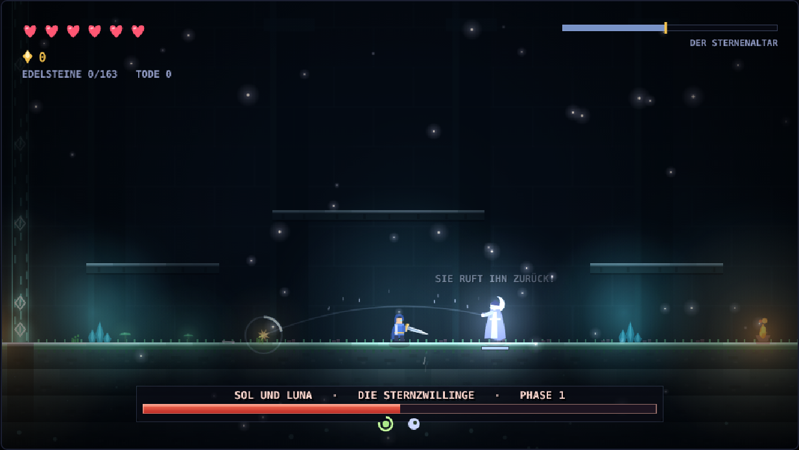

Gemessen wie ein Mensch, der 0,3 s zu spät sieht und nur vom Boden aus zuschlägt:
45 bis 64 Sekunden und 0 bis 2 Herzen. Wer stehen bleibt, verliert 20 in der
Minute. Wer beide löscht, bekommt den **Zwillingsstern** — und Lunas
**Mondsichel**.

### Der Boss der Halle: Thalassa, die Ertrunkene Krone

72 Trefferpunkte, drei Phasen, vier Züge. Ihre Züge nach Entfernung: aus der
Nähe ein **Flutstoß**, zwei Wellen über den Boden in beide Richtungen — die
Antwort ist Höhe, nicht Abstand. Auf Distanz ein **Ankerwurf** auf einer Bahn,
die dort landet, wo man gerade hinläuft. Der **Sog**, der einen für gut eine
Sekunde zu ihr hinzieht und dann Kugeln schickt: weglaufen kostet Boden, der
Kampf wird in ihrer Reichweite entschieden. Und die **Springflut**, die den
Boden selbst aufmacht.

Jeder Zug wird angekündigt — die Krone füllt sich, und woran man erkennt,
*welcher* kommt, steht ihr an: zwei Bögen am Saum für den Flutstoß, das Gewicht
über der Schulter für den Anker, ein Wirbel um die Füße für den Sog, beide Arme
hoch für die Flut.

#### Warum der Kampf neu gebaut wurde

Er war zu leicht, und zwar messbar: wer nur die Angriffstaste hielt, erledigte
sie in **elf Sekunden** und verlor dabei zwischen null und vier Herzen. Drei
Gründe, in der Reihenfolge, in der sie zählten:

1. **Die Klinge wischte alles weg.** Jeder Hieb pariert Geschosse in Reichweite
   — und schickt sie mit doppeltem Schaden zurück. Wer draufhielt, schlug damit
   jede Welle ab, die sie machte, *und* traf sie damit selbst.
2. **Ihr Poise war zu niedrig.** Sechs Schaden mitten im Zug warfen sie heraus;
   ein Dauerangreifer macht 3,6 Schaden pro Sekunde. Sie kam in einem ganzen
   Kampf viermal zum Zug.
3. **Was übrig blieb, stand herum.** Über die Hälfte des Kampfes verbrachte sie
   in der Erholung.

Dagegen, der Reihe nach:

**Ihre Flutwelle lässt sich nicht wegwischen.** Eine Wand aus Wasser ist nichts,
was ein blinder Hieb zur Seite schlägt — die springt man, oder man pariert sie.
Sie kommt seitdem auch in den Farben der ertrunkenen Halle statt in denen des
Ritters, denn ein Geschoss, das man abschlagen kann, und eines, das man springen
muss, dürfen nicht gleich aussehen.

**Die Springflut macht den Boden auf.** Marken auf dem Boden — eine unter den
Füßen des Helden, die anderen im Raum verteilt — blubbern zwei Drittel einer
Sekunde, dann kommt das Wasser durch sie hoch. Das ist der eine Zug, den die
Klinge nicht beantworten kann, also ist es der Zug, der Stehenbleiben
beantwortet: wer sich in ihre Reichweite stellt und draufhaut, bekommt ihn.
Trotzdem fair — man läuft aus der Marke heraus, oder man kommt mit dem
Doppelsprung über die Säule (eine Säule ist 118 px hoch, ein einfacher Sprung
trägt 103). Und weil man nach einem Treffer einen Moment unverwundbar ist, käme
ein Schwung Säulen auf einmal nur ein Herz teuer: die Flut fragt darum ab der
zweiten Phase zweimal, die zweite Welle dort, wo man inzwischen steht.

**Poise 13 statt 6, und die Parade bricht sie immer.** Draufhauen kauft jetzt
gelegentlich eine Unterbrechung statt immer. Was zuverlässig wirkt, ist die
Parade: die reißt sie aus jedem Zug, egal wie viel Poise sie noch hat. Wer schon
taumelt, taumelt nicht doppelt — sonst hielte man die Taste einfach gedrückt.

**Drei Phasen statt zwei**, geschnitten dort, wo die Bossleiste ihre Kerben
zeichnet. In der zweiten antwortet die Flut doppelt: der Flutstoß in zwei
Salven, weit genug auseinander, dass ein Sprung nicht beide nimmt; der Anker als
Paar, einer dorthin, wo man steht, einer dorthin, wo man hinläuft; der Sog
greift auch in der Luft. Ihr letztes Drittel eröffnet der **Ruf der Krone** —
einmal im Kampf, ein Ring aus fünf Säulen und die ganze Halle antwortet —, und
danach hängt sie zwei Züge aneinander, bevor sie durchatmet.

Gemessen, mit echten Lebenspunkten auf beiden Seiten, drei Läufe je Spielweise:

| Spielweise | vorher | jetzt |
| --- | --- | --- |
| nur Angriffstaste halten | 11–12 s, 0–4 Treffer, kein Tod | 21–24 s, 9–13 Treffer, 1–2 Tode |
| ausweichen, Kugeln parieren | 17–28 s, 0–4 Treffer, kein Tod | 40–58 s, 8–17 Treffer, 1–2 Tode |
| stehen bleiben und hauen | 0–2 Treffer | 4–5 Treffer |
| in ihrer Reichweite parieren | — | 18 s, 3–4 Treffer, kein Tod |
| einfach vorbeilaufen | 1 Treffer | geht nicht mehr — der Chor ist gebannt |

Ein Treffer ist ein kassiertes Herz von sechs; ein Tod füllt die Leiste wieder
auf, darum stehen in der zweiten Spalte auch Zahlen über sechs.

Die letzte Zeile hat sich umgedreht und wird weiter geprüft: früher hatte ihr
Chor kein Fallgitter und wer den Kampf nicht wollte, kam vorbei — jetzt steht an
jedem Ende eine Bannwand, und der Kampf in der Mitte des Spiels lässt sich nicht
mehr auslassen.
Die vorletzte gilt wie gehabt: die beste Antwort auf sie ist die Parade, nicht
das Ausdauerhalten.

Mit dem einheitlichen Prüfstand (siehe [Herausfordernd, aber keine
Wand](#herausfordernd-aber-keine-wand)) war sie trotzdem zu leicht für die Mitte
des Spiels: Der Leser legte sie mit den Relikten bis hierher in unter dreißig
Sekunden ohne einen Treffer um, und wer nur draufhielt, sah fünf, sechs Züge. Zwei
Gründe: **Ihr Sog zog niemanden** — er schob am Tempo des Helden, und dessen
Bodenhaftung fraß das im nächsten Bild wieder auf, derselbe Fehler, den
Gierschlunds Einatmen hatte. Jetzt trägt ihn die Strömung, 80 px/s, in der dritten
Phase 110. Und **ihre Kugeln ließen sich blind wegschlagen**: Sie kamen innerhalb
der Reichweite einer Klinge an ihrem Saum heraus, und wer draufhielt, schickte
alle fünfzehn eines Kampfes zurück. Jetzt gilt für sie dieselbe Regel wie für ihre
Wellen — springen oder parieren. Dazu 72 statt 60 Leben, damit auch ein
Draufhauer ihr ganzes Repertoire zu sehen bekommt: Der Leser braucht jetzt rund
35 s und verliert nichts, der Draufhauer kassiert sieben Treffer in 25.

Wer sie schlägt, nimmt mit, was sie gehalten hat: die **Flutklinge**, die erste
Hälfte des Klingen-Upgrades.

### Auf den Zinnen: Grauwacht, der Wasserspeier

Auf den Zinnen der Burg sitzen Wasserspeier, und einer davon hat es in hundert
Wintern auf der Mauer nie ertragen, angesehen zu werden. 80 Trefferpunkte (mit
den zehn Relikten bis hierher 133), und seine Regel: **Sieh ihn an, und er ist
Stein.** Was der Held ansieht — dorthin, wohin er zuletzt gegangen ist —, ist eine
Statue: Sie rührt sich nicht, und nichts geht durch (*STEIN!*), weder die Klinge
noch die Sichel der Flutklinge. Dreht der Held ihm den Rücken zu, ist er Fleisch
und kommt:

* **Speien** — 2,2 s am Boden angesehen (ab der Hälfte 1,6 s), gurgelt der Stein
  (0,6 s), und fünf Wasserstöße fallen im Bogen dorthin, wo der Held steht. Unter
  den Bogen hineingehen hält ihn Stein; weggehen dreht ihm den Rücken zu, und er
  wacht auf.
* **Pirschen** — unbeobachtet huscht er dem Helden nach, langsamer als der geht.
  Dicht hinter ihm bäumt er sich auf (0,52 s) und schlägt zu: ein Herz. Umdrehen
  in der Ausholbewegung lässt ihn erstarren, weitergehen bringt den Helden aus
  der Reichweite.
* **Sturzflug** — weiter weg reißt er die Flügel auf und kreischt (0,65 s, ab der
  Hälfte 0,57), steigt 150 bis 180 px hoch und stürzt auf den Helden: zwei
  Herzen, der einzige Zug, der zwei kostet.
* **Gleitflug** — ab der Hälfte: in Kopfhöhe quer über die Zinnen (0,52 s
  Ankündigung). Drüberspringen — oder ansehen: dann sackt er 16 px ab, und nichts
  bricht.

In der Luft angesehen, fällt er als Stein. Ab sechzig Pixeln zerbricht die Statue
auf den Zinnen: **ZERSPRUNGEN!**, ein paar Schaden für den Fall, sechs aus einem
Sturzflug, und 2,6 s lang trifft jeder Hieb, angesehen oder nicht. Das ist sein
Fenster — ins Taumeln kommt er nie. Eine Statue, die auf den Helden fällt, kostet
ein Herz. So wird der Kampf ein Tanz mit dem eigenen Rücken: weggehen, damit er
fliegt, und umdrehen, solange er hoch ist.

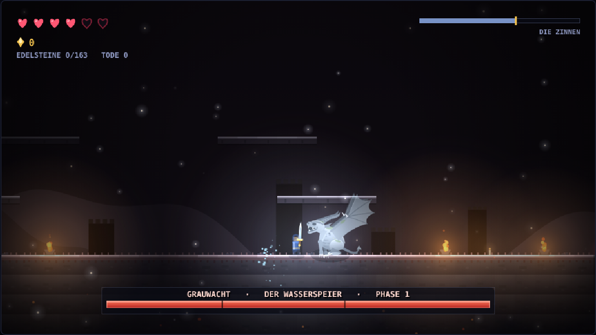

Der Leser legt ihn in 44 bis 49 s um, in fünfzehn von fünfzehn Kämpfen ohne ein
verlorenes Herz: Jeder Zug ist eine halbe Sekunde vorher angesagt und mit einer
Taste beantwortet, umdrehen — was ein Mensch hier verliert, ist das Lesen des
falschen. Wer ihn immer nur ansieht und zuschlägt, nimmt in zwei Minuten 27
Treffer und ihm keinen Punkt ab. Mit den 52 Trefferpunkten aus dem Entwurf war
der Leser nach 31 s fertig: Ein Sprung neben einem Helden mit der Flutklinge ist
rund zwanzig wert. Grauwacht hinterlässt den **Steinblick** und den
**Steinsturz**.

### Im Uhrturm: Tickmar, das Uhrwerk

Im Uhrturm ist die große Uhr der Burg herabgestiegen: ein Automat aus Messing auf
Kolbenbeinen, ein Zifferblatt als Brust, Zahnräder im Bauchfenster, ein Schlüssel
im Rücken und darunter das lange Pendel. Seine Regel: **Er schlägt im Takt.** Jede
halbe Sekunde tickt er — der Sekundenzeiger springt, die Lampe auf dem Kopf
blinkt —, und nichts geschieht außer auf einem Tick. Einen ganzen Takt (2 s) vor
jedem Zug steht der Minutenzeiger auf dessen Zeichen, das Zeichen glüht, die Ticks
zählen hörbar hinauf, und der Zug kommt auf die nächste Eins:

* **Pendelschlag** — 200 px weit über den Boden, hin und zurück: drüberspringen
  oder auf eine Planke. Sein einziger Schlag, der zwei Herzen kostet. Wer es
  **pariert**, klemmt es — er steht rund 1,8 s still.
* **Zahnräder** — drei auf drei Schläge, aus der Klappe in seinem Bauch: einen
  Schritt vor ihn, oder, wer direkt unter der Klappe steht, gerade auf ihn
  herunter. Ein Hieb schickt eines *ins Getriebe* — zwei Schaden —, aber erst,
  wenn es sich nach dem Aufprall einen Augenblick (0,22 s) in den Boden gebissen
  hat.
* **Glockenschlag** — der Ring läuft unter ihm heraus über den Boden bis an die
  Wände. Drüberspringen.
* **Zeigerstich** — Marken am Boden, sobald der Takt beginnt; auf die Eins stechen
  die Zeiger hinein.

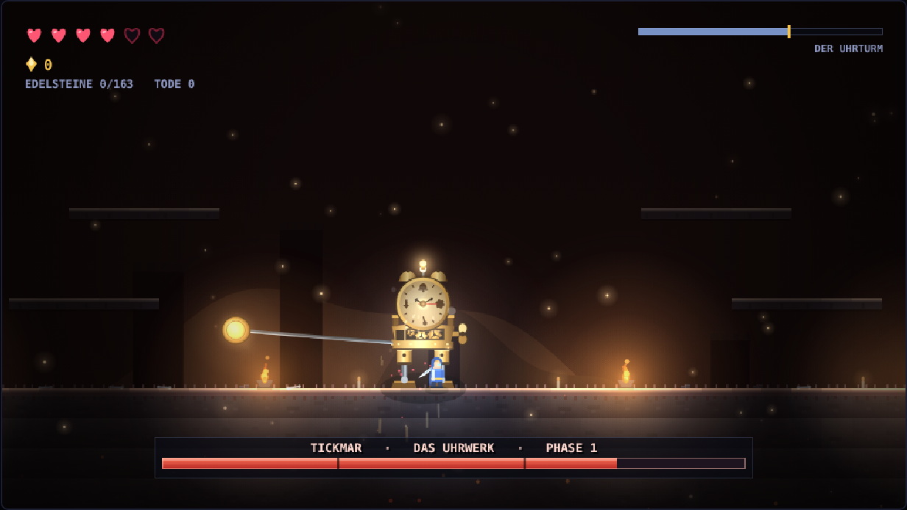

Seine Beine sind immer in Reichweite, und nach jedem dritten Zug muss er sich
aufziehen: Das Ticken stockt, das Glas klappt hoch, 2,5 s lang zählt jeder Treffer
doppelt. Ab der Hälfte tickt er alle 0,4 s, und jede Ansage dauert 1,6 s. Nach
jedem Zug bleiben knapp 3 s Ruhe. Weil er immer zu treffen ist, hat er 230
Trefferpunkte (mit den Relikten bis hierher rund 385): Der Bot, der ihn 0,3 s zu
spät sieht, legt ihn in rund einer Minute um und verliert höchstens ein Herz; wer
stehen bleibt, verliert 13 bis 16 Herzen in der Zeit, in der der Leser 0 bis 3
verliert.

Wer dagegen nur an seinen Beinen stand und zuschlug, kam lange zu billig davon:
In 41 Sekunden sah er sechs Züge und nahm drei, vier Treffer. Die Zahnräder
landeten hinter einem Helden zwischen seinen Füßen und rollten von ihm weg — und
wer dauernd schlug, schickte die übrigen aus Versehen ins Getriebe; die Glocke
klang zwei Hände neben seiner Mitte, und zwischen ihren Ringen stand man sicher;
und vor jedem Zug ging er erst einen ganzen Takt auf einen Helden zu, der längst
an seinen Füßen stand. Jetzt bekommt, wer an seinen Füßen steht, den nächsten
Einzähler auf die nächste Eins, das Pendel kostet zwei Herzen, und er hat 230 statt
190 Leben. Danach gehören dem Helden der **Taktgeber** und sein **Pendelschlag**.

### Der Herr des Bergfrieds: Vesperon, der Blutfürst

Über dem Dach des Bergfrieds, unter einem Mond, der seine Farbe angenommen hat.
Ein hoher Kragen, ein bleiches Gesicht mit spitzen Ohren und rotem Blick, und
Fledermausflügel mit Armknochen, vier Fingern und einer gewellten Hinterkante,
die bei jedem Schlag im Mondlicht aufglüht. Er ist ein Flieger — ein Problem für
jemanden mit einem Schwert. Also ist der Kampf um die Momente gebaut, in denen
er herunterkommt. 56 Trefferpunkte, zwei Phasen, vier Züge:

* **Sturzflug** — er steigt, breitet die Flügel, schreit und zeichnet eine rote
  Linie dorthin, wo er hinwill; eine Viertelsekunde vorher rastet sie ein, dann
  kommt er. Durchrollen oder von der Linie gehen. Wo er landet, muss er Atem
  holen: auf dem Dach, in Reichweite, gut eine Sekunde lang. Wer den Sturz
  **pariert**, legt ihn aufs Gesicht; wer ihn gegen eine Zinne lockt, auch.
* **Blutsicheln** — ein Fächer aus Sicheln aus dem Umhang. Ein Hieb schickt sie
  zu ihm zurück.
* **Schwarm** — Fledermäuse aus dem Mantel, zwei auf einmal und nie mehr als
  drei, und sie jagen, statt zurück ins Gebälk zu fliegen. Sie stoßen eine nach
  der anderen herab, jede nach einem sichtbaren Hochziehen (siehe die
  Fledermaus unter [Die Gegner](#die-gegner)), und nie, während er selbst
  stürzt.
* **Blutmond** — ab der Hälfte steigt er ganz nach oben, der Mond hinter ihm
  färbt sich, und wo es auf dem Dach rot markiert ist, regnet es.

Und man kann ihn herunterholen: die Planken und die Zinnen stellen den Helden
auf seine Höhe, und genug Schaden in der Luft wirft ihn aufs Dach.


Der Schwarm war lange das Teuerste an ihm: Vier Fledermäuse, drei auf einen Ruf,
stießen ohne Ankündigung und nach Belieben herab, zwei und drei auf einmal, auch
während der Held für die Parade seines Sturzflugs stillstand. Ein Leser, der
alles andere kommen sah, verlor sechs bis sieben Herzen — fast alle an Fledermäuse
— und lesen lohnte sich kaum mehr als draufhauen. Jetzt verliert er rund drei
bis vier, in gut einer Minute; der Draufhauer nimmt neun bis zehn Treffer. Wer
ihn zerstieben lässt, bekommt den **Blutdurst**.

### Im Spiegelgrund: Umbra, dein Schatten

Gleich hinter dem Thron liegt ein Stück Riss, so still, dass der Boden zeigt, wer
auf ihm geht. In seiner Mitte liegt ein Fleck Dunkelheit in der Form eines
Mannes — und wenn der Held nah genug ist, steht er auf.

Umbra ist **der Held**: ein echter Heldenkörper, gesteuert von einem Verstand
statt von einer Tastatur. Er läuft, wie der Held läuft, schlägt dieselbe Kombo,
lädt mit demselben Ring, rollt mit derselben Rolle — und trägt dieselben
Relikte: die Sichel, wenn die Klinge des Helden eine wirft, die Schockwelle, wenn
Ankhors Faust seine ist, den Mantel, die zweite Rolle, Ignivors Glut. Sein Leben
sind fünf je Herz des Helden, und darauf kommt dieselbe Rechnung wie bei jedem
Boss. Je stärker der Held geworden ist, desto stärker das, was er schlagen muss —
das ist die ganze Antwort dieses Kampfes auf einen Helden, der alles gesammelt
hat.

Was er nicht hat, ist Geduld, und was er liest, ist die des Helden:

* **Wer blind draufhaut, wird pariert.** Jeder Hieb in schneller Folge macht die
  nächste Parade wahrscheinlicher, und jede Parade beantwortet er mit einem
  harten Gegenhieb.
* **Seine eigenen Angriffe sind die Fenster.** Vor seiner Kombo setzt er die
  Füße, und seine Augen flammen auf (0,38 s, in der zweiten Hälfte 0,3) — die
  Kombo des Helden selbst hat gar keine Ankündigung, und ein Spiegel, der ohne
  Vorwarnung so schnell zuschlägt, wäre ein Münzwurf. Vor seinem Ladeschlag
  zieht er die Klinge 0,5 s zurück, ein unterbrochener Ring schließt sich um ihn,
  mit eigenem Ton. Nach der Kombo, nach dem Ladeschlag, nach einer Rolle steht er
  einen Atemzug lang da: dort trifft man. Eine Parade seines Hiebs bringt ihn ins
  Wanken wie alles andere.
* **Ab der Hälfte geht er durch die Dunkelheit**: Er sinkt in den Boden und
  steigt hinter dem Helden wieder auf, Klinge voran. Die Pfütze, aus der er
  steigt, zeigt sich vorher — 0,93 Sekunden, bevor er zuschlägt.

Gemessen in `verify:bosses`, über vier Läufe: Wer nur draufhaut, wird in 20 bis
25 Sekunden 15- bis 21-mal pariert und kassiert 18 bis 25 Treffer — mit sechs
Herzen sind das drei bis vier Leben. Wer
pariert und auf die Fenster wartet, legt ihn in 31 bis 37 Sekunden um und nimmt
dabei höchstens einen Treffer — wenn er es im selben Bild sieht, in dem Umbra
etwas tut. Mit 0,3 s Verspätung, wie ein Mensch, waren es lange vier Herzen im
Mittel und bis zu acht, und drei Viertel davon kamen von einem einzigen Hieb: Der
Ladeschlag des Helden beginnt mit einem gewöhnlichen Hieb auf den Tastendruck, und
mit der Flutklinge wirft der seine Sichel — Umbras begann also mit einem Hieb samt
Sichel aus dem Nichts, aus einer Klingenlänge, aus der die Sichel nicht vorbeigeht.
Seit er vorher sichtbar ausholt, verliert derselbe Leser rund zwei Herzen in
gut 50 Sekunden; wer nur draufhaut, nimmt in 18 Sekunden fünfzehn Treffer.

Wer ihn besiegt, bekommt den **Zweiten Atem**: Der Schatten steht jetzt hinter
dem Helden, und einmal in jedem Leben fängt er auf, was ihn fällen würde.

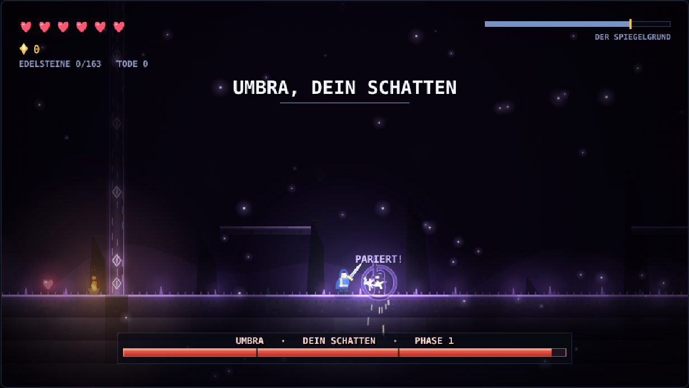

### Gemessen: lesen lohnt sich

`verify:bosses` stellt für jeden der fünf Arenabosse, die nicht der Held selbst
sind, einen Helden hin, der nur dasteht, und einen, der die Ankündigungen liest —
aus dem Schatten tritt, über die Hand und die Zunge springt, zwischen die Münzen
und die Netzballen tritt, an der offenen Truhe vorbeiläuft, statt sich von ihr in
die Ecke treiben zu lassen, die Glut unter sich verlässt, unter den speienden
Kopf geht, von der Sturzlinie geht und Fledermäuse wie Spinnenjunge abwehrt.
Beide werden am Leben gehalten; gezählt wird, was durchkommt, über mehrere Läufe:

| | Ankündigung (kürzeste gemessene) | stehen bleiben | lesen |
| --- | --- | --- | --- |
| Gierschlund, 45 s | Biss 0,75 s, Münzen 0,6 s, Zunge 0,57 s, Schlucken 0,6 s | 14–19 Herzen | 0–1 |
| Ankhor, 60 s | Faust 0,95 s, Wischer 0,78 s, Sonne 0,55 s | 26–27 Herzen | 1–2 |
| Arachna, 40 s | Sturz 0,7 s (Ring steht 0,25 s still), Netz 0,57 s, Brut 0,6 s, Pendel 0,75 s | 19–27 Herzen | 0–1 |
| Ignivor, 45 s | Durchbruch 0,55 s Stillstand | 7–12 Herzen | 0–5 |
| Vesperon, 40 s | Sturzflug 0,57 s | 29–32 Herzen | 9–12 |

Jeder Zug, der wehtut, ist mindestens eine halbe Sekunde vorher zu sehen — mit
einer bewussten Ausnahme: Umbras Kombo (0,3 bis 0,38 s) ist die Kombo des Helden
selbst. Sein Ladeschlag war lange eine zweite, die niemand bemerkt hatte; er
holt jetzt 0,5 s sichtbar aus. Die Fledermäuse waren eine dritte — sie stießen
ohne jedes Zeichen herab — und ziehen jetzt 0,42 s hoch. Gierschlunds Schnapper war die zweite (0,42 s); er hat jetzt 0,52 s und
kommt nur noch nach knapp einer Sekunde Klammern. Die
Regeln halten: Gierschlunds Deckel nimmt 0 und ihr Maul 1, Ankhors Gesicht 2
statt 1 und sein gesackter Kopf reicht bis 18 px über den Boden herab, Arachna
ist vom Boden aus unerreichbar und vom hohen Absatz aus nicht, Ignivors Platten
nehmen 0 und sein Kopf 1 — steckend wie hängend vom Boden aus erreichbar. Die
Bildzeit bleibt in allen sechs Kämpfen im 99. Perzentil unter 11 ms.

Wer einen von ihnen schlägt, bekommt alle Herzen zurück und sein Relikt, und die
Bannwände fallen.

### Die Klinge: zwei Stufen

Jeder Hieb wirft eine Sichel voraus. Das ist eine Reichweitenverlängerung, keine
Kanone: eine je Hieb, und sie ist nach einem knappen halben Herzschlag weg.

| | woher | Reichweite | Schaden |
| --- | --- | --- | --- |
| Schwert allein | von Anfang an | 40 px | 1 / 2 in der Kombo / 3 geladen |
| **Flutklinge** | Thalassa fällt — bei knapp der Hälfte des Levels | 145 px | 1, geladen 2 |
| **Klingenwelle** | Prismarch fällt — hinter allen 163 Edelsteinen | 273 px | 1 / 2 / 3 wie der Hieb |


Vorher hing das ganze Upgrade am Prismarchen. Das heißt: man musste alle 163
Edelsteine finden, um es überhaupt zu sehen — und hatte dann nur noch den letzten
Rest der Welt, um damit zu spielen. Die Hälfte kommt jetzt zur Halbzeit, der
Prismarch schärft, was schon da ist. Die zwei Stufen sehen auch verschieden aus:
die Flutklinge wirft Wasser, die Klingenwelle Licht, und im HUD steht, was man
hat.

Dass die erste Stufe das Spiel dahinter nicht kaputt macht, ist gemessen — ein
Bot, der auf 150 px Abstand bleibt und nur die Sichel schickt:

| gegen | nur Schwert | Flutklinge | Klingenwelle |
| --- | --- | --- | --- |
| Schattenritter (64 TP) | verliert, 7 Tode | 47 s, 10 Treffer, 1 Tod | 21 s, 2 Treffer |
| Splitterwächter (16 TP) | 5 s, 0 Treffer | 8,3 s, 1 Treffer | 3,8 s, 0 Treffer |

Der Ritter bleibt der härteste Kampf im Spiel, auch mit der Flutklinge in der
Hand; beim Splitterwächter ändert sie nichts, den erledigt der Nahkampf ohnehin
in fünf Sekunden. Die volle Klingenwelle ist stark — das ist der Punkt einer
Belohnung, für die man die ganze Welt abgesucht hat.

### Der Bonusboss: Prismarch, Herz des Kristalls

Wer alle 163 Edelsteine findet, hält an Ort und Stelle an: eine Stimme aus dem
Stein meldet sich, fünf Zeilen lang, und wer sie zu Ende gelesen hat, steht im
Kristallhort. Es gibt zwei Türen dorthin — der volle Zähler öffnet sie sofort,
und wer trotzdem am Tor im Riss ankommt, wird dort hinübergeschickt statt den
Lauf zu beenden. Eine Belohnung, die man sich erarbeitet hat, darf nicht an
einem einzigen Auslöser hängen. Solange der Dialog liegt, steht die Welt still — sonst liest man
und läuft dabei von der Kante.

70 Trefferpunkte, zwei Phasen, drei Züge nach Entfernung: aus der Nähe ein
Sturmangriff quer durch die Halle, auf mittlere Distanz Splitter, die von der
Decke fallen und dorthin zielen, wo man gleich sein wird, von weitem ein Fächer
aus drei Splittern — in der zweiten Phase fünf, und alle Pausen um ein Fünftel
kürzer. Denselben Zug zweimal hintereinander macht er nie.

Er ließ sich lange in Dauertaumel prügeln: Ein Taumel sperrte zwei Sekunden lang
den nächsten, aber seine Standfestigkeit lief in der Zeit weiter leer, und der
erste Hieb danach warf ihn wieder um, jedes Mal mitten in die nächste
Ankündigung. Wer nur draufhielt, legte ihn in 20 Sekunden um, ohne einen Treffer
zu nehmen. Jetzt hält die Sperre 3,2 s, länger als einer seiner Züge, und
währenddessen sinkt seine Standfestigkeit nicht; derselbe Draufhauer nimmt
sechs, sieben Treffer.

Fällt er, ist der Lauf **nicht** vorbei: die Splitter seines Herzens gehen in die
Klinge, und der Held wird genau dorthin zurückgesetzt, wo er weggeholt wurde —
mitsamt seinem alten Kontrollpunkt. Aus der Flutklinge wird damit die
**Klingenwelle**: doppelte Reichweite und der volle Schaden des Hiebs dahinter,
1 in der Kombo, 2 beim Abschluss, 3 beim Ladeschlag. Wer Thalassa vorbeigelaufen
ist und die erste Stufe nicht hat, bekommt sie hier — das Herz sagt dann auch
einen anderen Satz.

Das Tor im Riss beendet den Lauf wie immer — der Siegbildschirm nennt dann das
wahre Ende, wenn das Herz gefallen ist.

### Der Endboss: Die Fünfkronige

Am Ende des Risses, in ihrem eigenen Saal vor dem Tor. Sie ist **keine Reihe aus
fünf Bossen**: Alle fünf Köpfe sind wach, alle fünf lassen sich abschlagen — und
einen abzuschlagen heißt nicht, ihn zu töten. Der Stumpf zuckt neun Sekunden
lang, dann ist der Kopf wieder da. Stahl allein bringt eine Hydra nie um.

Was es tut, ist ihr eigenes Feuer. Der Flammenkopf wirft Glut; eine Glut, die
man pariert, **fliegt schnurgerade** und brennt einen Stumpf für immer zu. Die
Schleife lautet also:

> Kopf abschlagen → auf die Höhe steigen, auf die der Stumpf herunterhängt →
> Glut ködern → sie in den Stumpf parieren.

Und weil eine gewendete Glut waagerecht fliegt, ist **die Höhe, auf der man
steht, die Höhe, auf die man zielt**. Die vier Stümpfe hängen an vier
verschiedenen Absätzen: einer am Boden, die anderen drei auf der 3., der 7. und
der 13. Kachel Höhe — also auf drei verschiedenen Stufen ihres Turms. Der
Aufstieg ist damit nicht mehr *eine Phase* des Kampfes, sondern der Kampf.

| Kopf | Wo man ihn abschlägt | Wo sein Stumpf hängt |
| --- | --- | --- |
| **GIFT** | Boden, ein Sprung | Boden |
| **FLAMME** | Boden, ein Sprung | — er *ist* das Feuer |
| **STEIN** | Boden, Doppelsprung | 1. Stufe (96 px) |
| **KRONE** | 4. Stufe | 4. Stufe (224 px) |
| **STURM** | oberste Stufe | oberste Stufe (416 px) |

Der fünfte Hals ist das Feuer selbst. Er lässt sich abschlagen wie jeder andere,
aber nichts kann seinen Stumpf ausbrennen — er wächst einfach nach. Es sei denn,
die anderen vier sind schon zu: dann macht ihn auszulöschen sie fertig. Wer den
Flammenkopf zuerst abschlägt, verliert nichts als Zeit und lernt die
Reihenfolge. Eine Sackgasse gibt es nicht.

Die Klinge schlägt eine Glut übrigens genauso aus der Luft wie die Parade — es
ist dieselbe Regel, die Gallert im Moor mit seiner Spucke beibringt. Die Parade
ist nur der sichere Weg, weil man dafür nicht in Kopfreichweite stehen muss.

Gemessen statt behauptet, alles in `verify:hydra`:

* **Stahl allein reicht nicht.** Hundert Sekunden Dauerhauen mit der schärfsten
  Klinge des Spiels: zwanzig nachgewachsene Köpfe, **null** ausgebrannte Hälse,
  sie steht noch.
* **Feuer reicht.** Jeder der vier Stümpfe brennt in 1,8 bis 3,2 Sekunden zu,
  von seinem eigenen Absatz aus — und die vier Absätze liegen messbar auf vier
  verschiedenen Höhen.
* **Zu bleibt zu.** Fünfzehn Sekunden später ist ein ausgebrannter Hals immer
  noch aus.
* **Offen bleibt nicht offen.** Wer einen Stumpf in Ruhe lässt, hat den Kopf
  nach 9,6 Sekunden wieder — mit 7 von 12 Trefferpunkten.
* **Nur Köpfe sind Ziele.** Ihr Leib, ihre Hälse und die Stümpfe nicht, in beide
  Richtungen: In sie hineinzulaufen kostet nichts, und Stahl tut einem
  abgeschlagenen Hals gar nichts.
* Dazu wie gehabt: Der Sturmkopf ist vom Boden aus unerreichbar, die sechs
  Stufen werden mit echter Physik und sieben Herzen erklommen, jede Ankündigung
  dauert mindestens 0,6 s, eine Parade bricht sie, nichts von ihr fliegt quer
  durch den Saal, ihr Tor fällt beim Aufwachen zu und geht bei ihrem Fall auf,
  und gefallen bleibt sie gefallen.

Ein Fehler, den das Messen aufgedeckt hat: Eine gewendete Glut behielt ihre
eigene Flughöhe. Wer genau auf Stumpfhöhe stand, verfehlte ihn trotzdem — der
Bot zwölf Gluten hintereinander —, weil man die Kohle im exakt richtigen Moment
ihres Bogens erwischen musste. Jetzt verlässt sie die Klinge auf **Heldenhöhe**.
Und sie warf zwei Gluten links und rechts am Helden vorbei, je 34 px: Ein
Paradefenster ist 52 px breit, zwei Gluten daneben sind zwei, die man nicht
wenden kann. Jetzt kommt eine auf ihn und die zweite weit daneben.

Drei weitere hat der einheitliche Prüfstand gefunden:

* **Ein Taumel mitten im Steinatem ließ den Atem liegen** — 340 px auf dem Boden,
  durch ihre Erholung und die nächsten Züge hindurch, für zwei Herzen bei jedem,
  der hineintrat, sobald der nächste Zug begann. Jetzt endet der Atem (und die
  Böe des Sturmkopfs) mit dem Taumel.
* **Die Giftklumpen landeten nicht auf ihren Pfützen.** Der Bogen wurde von ihrer
  Mitte aus berechnet, geworfen aber vom Kopf: Jeder Klumpen kam gut 100 px neben
  der Pfütze herunter, die sich dann bildete, wo nichts gefallen war. Wer den
  Bogen las, las falsch. Jetzt landet jeder dort, wo seine Pfütze entsteht.
* **Ihre Glut brannte schon im Steigen.** Auf den Stufen neben dem Flammenkopf
  kreuzte die geworfene Kohle die Höhe des Helden 0,2 bis 0,4 s nach dem Wurf —
  bevor ein Auge sie hätte sehen können. Jetzt brennt sie erst im Fallen, dort,
  wohin sie gezielt war.

Ihr Fall öffnet das Tor — und lässt das **Hydrablut** zurück: Was der Held
verliert, wächst jetzt nach, ein Herz alle achtzehn Sekunden. Für den Weg zum Tor
ist das wenig; wer danach noch in den Kristallhort will, nimmt es mit.

#### Ihr Saal

Sie bekommt denselben Handel wie der Ritter: Wände, eine Decke und ein Rippentor
an jedem Ende, das zufällt, sobald sie wach wird, und wieder hochgeht, wenn der
letzte Hals ausgeht. Es ist **ihr** Tor, nicht das des Ritters — zwei Bosse in
einem Level brauchen zwei Türen, sonst schließt das Aufwecken des einen den Raum
des anderen. Wer darin stirbt, findet es offen: Der Kontrollpunkt liegt davor,
und eine Tür, die einen aussperrt, ist ein Sackgassen-Spielstand.

#### Ihr Arm reicht nicht über den Saal

Sie hat die Giftgalle vorher auf den Helden gelöst, egal wo er stand — also auch
quer durch den ganzen Raum. Das ist vorbei: Ihr längster Zug ist der Steinatem
mit 340 px, der Giftbogen ist auf 300 px gedeckelt, und jenseits ihrer Reichweite
wartet sie. Gemessen wird beides, damit „sie kommt nicht heran" nicht heimlich
„sie tut gar nichts mehr" bedeutet: zwanzig Sekunden an der Gegenwand (18
Kacheln) kosten null Herzen und es landet nichts in seiner Nähe — dieselben
zwanzig Sekunden in ihrer Reichweite kosten ihn Blut.

| | |
| --- | --- |
|  |  |

### Der Miniboss: Splitterwächter

56 Trefferpunkte, drei Züge, die er nach Entfernung wählt: aus der Nähe ein
Sprungschlag, auf mittlere Distanz ein Sturmangriff, von weitem eine Salve aus
drei Splittern. Jeder Zug wird angekündigt — sein Kern glüht auf —, und danach
steht er lange genug offen für eine Antwort.

Er lässt sich nicht mit gehaltener Angriffstaste erledigen: einen begonnenen Zug
zieht er durch. Erst fünf Schadenspunkte am Stück oder eine Parade bringen ihn
aus dem Gleichgewicht — und danach 3,4 s lang nicht noch einmal, in denen seine
Standfestigkeit auch nicht sinkt. Mit zwei Sekunden Sperre und weiter
sinkender Standfestigkeit warf ihn der erste Hieb danach wieder um, jedes Mal
mitten in die nächste Ankündigung: Mit der Klinge des späten Weges zerlegte ihn
ein Draufhauer in 4,6 Sekunden, ohne dass einer seiner Züge je ankam. Vom
Ritter, an dessen Stelle er gewachsen ist, hat er dazu die Regel **gereizt**:
Wer in seine Ausholbewegung hineinhaut, bekommt den Schlag früher, einmal pro
Zug. Gelesen wird er in seinen Fenstern geschlagen, nicht beim Herumgehen — der
Leser braucht so rund 40 Sekunden und verliert nichts, wer nur draufhaut, nimmt
fünf Treffer in 18. Mit seinen ersten 16 Trefferpunkten lag er nach acht
Sekunden, bevor er jeden seiner drei Züge einmal gezeigt hatte.

Sein Sprungschlag blieb lange hängen: die Landung fragte nach einer
Abwärtsgeschwindigkeit, die die Kollision im Landebild schon auf null gesetzt
hatte. Er kam also auf und stand dann in diesem Zustand, bis ihn eine Parade
oder genug Schaden herausriss. `verify:warden` zeigte es die ganze Zeit, wenn
man genau hinsah — der Nahkampflauf ging *stalk, slamWind, slam* und kam nie
zurück. Beides ist gerichtet, und beides wird jetzt geprüft.

Wer ihn zerspringen lässt, sammelt seine Splitter an der Klinge: die
**Splitterparade**. Das Paradefenster wird länger, 0,26 statt 0,18 Sekunden, und
jede Parade wirft drei Splitter nach vorn.

Die Vorwarnung ist auch die Einladung zur Parade: Wer im richtigen Moment `E`
drückt, fängt den Schlag ab, statt ihn zu kassieren — der Ritter taumelt und
steht offen. Geschosse fliegen dabei zurück. Die Parade wirkt nur nach vorn und
nur gegen Angriffe; Stacheln und Lava lassen sich nicht wegparieren.

| | |
| --- | --- |
|  |  |
|  |  |
|  |  |

## Ton und Musik

Früher waren es siebzehn Piepser aus je einem Oszillator. Jetzt läuft alles über
ein kleines Mischpult: Effekte und Musik auf eigenen Kanälen, ein gemeinsamer
Hall, dessen Größe der Zone folgt — eine Höhle hallt, ein Wald nicht, die
Ertrunkene Halle am meisten —, und ein Kompressor am Ende, damit ein sterbender
Boss auf einer Parade nicht übersteuert.

**Effekte** (`src/core/audio.ts`) sind Rezepte aus Schichten: ein Körper, der die
Tonhöhe gibt, ein Stoß gefiltertes Rauschen für die Textur, und etwas Kurzes
obendrauf für den Anschlag. Dazu FM-Stimmen für alles, was klingt — die Parade
ist Klinge auf Klinge und hallt nach, ein Treffer auf Ignivors Panzer klirrt —,
und eine Verzerrerstufe für Einschläge. Jeder Effekt schwankt um ein paar
Prozent in der Tonhöhe, damit zehn Hiebe hintereinander nicht zehnmal derselbe
Hieb sind. Es gibt jetzt 42: Landung, Doppelsprung, Abwehr, das Schließen und
Öffnen einer Bannwand, Explosion und Zündschnur des Zunders, Wasser, Grollen,
Durchbruch, Feuerball, Fledermausschrei, Flügelschlag, zerberstender Stein,
Sonnenstrahl, Magie, Dialogtippen, Tod, Bossfall, Upgrade, Phasenwechsel — und
vor jedem Bosszug ein eigenes Aufziehen, das „gleich kommt etwas" sagt.

**Musik** (`src/core/music.ts`) ist als Daten geschrieben und wird von einem
Step-Sequencer gespielt: Tonart, Tempo, ein Akkord pro Takt und ein paar
Sechzehntel-Muster für Bass, Arpeggio, Melodie und Schlagzeug. Er plant die
Noten einen Sekundenbruchteil voraus auf der Uhr des AudioContext; ein
Stückwechsel blendet über, statt abzuschneiden. Jede Zone hat ihr Stück — der
Wald dorisch, die Ruinen phrygisch, die Höhlen mit Tropfen aus Glocken, die Burg
im Marschtritt —, und jeder Boss seinen Kampf: Grimmzahn als Stampede aus
Tomtoms unter einer sturen, stampfenden Linie, Gierschlund hüpfend, mit
klimpernden Glocken über einem treibenden Bass, Ankhor mit Tomtoms, Arachna mit
einem langsamen Puls und einem Arpeggio, das sich einen Faden entlangtastet,
Ignivor schnell in harmonisch Moll, Sol und Luna in zwei Stimmen, einer hellen
und einer kalten, die einander antworten, Tickmar in seinem eigenen Takt — 120
Schläge, ein Tick jede halbe Sekunde —, Vesperon mit einem Cembalo-Arpeggio über einer
Orgel, Umbra noch schneller, mit einer Melodie, die rückwärts läuft, der Ritter,
die Fünfkronige und der Prismarch jeder mit eigenem. Die Musik
wechselt, sobald die Bannwand fällt, und gibt nach dem Kampf an die Zone zurück;
in der Pause, im Dialog und nach einem Tod wird sie gedämpft.

`M` schaltet die Musik, `N` den ganzen Ton; beides bleibt über Sitzungen
erhalten. Vor dem ersten Tastendruck läuft nichts — so wollen es die Browser.

`verify:audio` hört so, wie ein Testlauf hören kann: Es rendert jeden Effekt und
jedes Stück offline und misst Spitze und Mittel. Ein Rezept, das nichts baut,
käme als Null heraus, eines, das übersteuert, über eins. Danach spielt es mit
echten Tastendrücken: Titelmusik, Übergabe an den Wald, in jeder Bossarena der
richtige Kampf und danach wieder die Zone, fünfzehn Bosse mit fünfzehn
verschiedenen Stücken (Gallert und der Splitterwächter teilen sich das kurze
Lehrstück), `M`
und `N` samt Neuladen.

## Aufbau des Codes

```
src/
  core/      Spielschleife (fester Zeitschritt), Eingabe, Kamera, Mathe,
             WebAudio: synth.ts (Bausteine), audio.ts (Effekte, Mischpult),
             music.ts (Stücke und Sequencer)
  world/     Level-ASCII, Parser, Kachel-Kollision, World-Interface
  entities/  Physikkörper, Spieler, Gegner, Boss, Projektile, Pickups, Plattformen;
             boar.ts, mimic.ts, jester.ts, colossus.ts, gloom.ts, spider.ts,
             wyrm.ts, twins.ts, gargoyle.ts, clockwork.ts, vesper.ts und
             shadow.ts für die Arenabosse,
             relics.ts für die Relikte und wie die Monster
             sie verrechnen, skills.ts für die Angriffe, die die Bosse dem
             Helden beibringen, und roster.ts, das alle Gegner aus ihrer Art baut
  render/    Parallax-Hintergrund, Kachel-Renderer, Deko, Sprite-Helfer, Palette
  fx/        Partikel und Schadenszahlen
  ui/        HUD-Bausteine (Herzen, Bossleiste, Panels)
  game.ts    Zustandsautomat, der alles zusammenhält
```

Das Level steht als ASCII-Kunst in `src/world/levelData.ts`. Jeder Abschnitt ist
40 (die Arena 50) Zeichen breit und 22 Zeilen hoch; die Abschnitte werden
horizontal aneinandergehängt:

```
.  leer          #  Stein        =  Erde         -  Holzplattform
^  Stacheln      L/l Lava        G  Fallgitter   P  Startpunkt
S  Siegel (öffnet sich, wenn der Ritter fällt)     O  Tor nach Hause (Ziel)
g  Rippentor (schließt den Saal der Fünfkronigen, solange sie lebt)
s  Schleim       b  Fledermaus   k  Skelett      m  Dunkler Magier
z  Zunder        w  Schildwache  r  Klingenläufer   Q  Gallert (Boss)
$  Edelstein     H  Herz         C  Kontrollpunkt
T  Fackel        X  Kristall     M/V bewegliche Plattform    B  Boss
W  Splitterwächter (Miniboss)   Y  Thalassa (Boss)   K  Prismarch (Bonusboss)
Z  Die Fünfkronige (Endboss)
|  Bannwand (an beiden Enden jeder Bossarena, siehe warded() in levelData.ts)
A  Ankhor (Boss)   I  Ignivor (Boss)   D  Vesperon (Boss)
U  Gierschlund (Boss)   N  Arachna (Boss)   E  Umbra (Boss)
R  Grimmzahn (Boss)   J  Sol und Luna (Boss)   F  Tickmar (Boss)
j  Maskarill (Boss)   n  Nyktos (Boss)   y  Grauwacht (Boss)
```

Damit das Level begehbar bleibt, gilt beim Bauen: Bodenlücken höchstens vier
Kacheln breit, Plattformen höchstens drei Reihen über der Fläche darunter und
waagerecht mit der Stufe darunter überlappend, Stacheln in der Bodenreihe statt
darauf.

Die Prüfwerkzeuge leiten ihre Startpunkte inzwischen aus den Spawns ab statt aus
Kachelzahlen. Ein Abschnitt, der mitten im Level eingeschoben wird, verschob
sonst jedes Werkzeug auf einmal.

## Werkzeuge

Alle Skripte fahren das gebaute Spiel in einem echten Chromium hoch:

```bash
npm run verify:level   # Erreichbarkeitsanalyse: kommt man vom Start zum Boss?
npm run verify:arena   # kommt man nach einem Tod am Tor zurück in die Bossarena?
npm run verify:combat  # Parade, Ladeschlag, und was der Ritter gegen die Sichel tut
npm run verify:gallert # Züge, Spucke zum Abschlagen, Herzkern — und bleibt er tot?
npm run verify:thalassa # ihre Züge, die Springflut, ihr Fall und die Flutklinge danach
npm run verify:enemies # zündet der Zunder, hält der Schild, zahlt sich die Wand aus?
npm run verify:ending  # führt der Riss zum Tor, und zählt der Lauf am Tor auch dann?
npm run verify:warden  # wählt der Splitterwächter seinen Zug, und wehrt er sich?
npm run verify:hydra   # wächst ein Hals nach, brennt ihr Feuer ihn zu, reicht Stahl allein nicht?
npm run verify:wards   # hält jede Bannwand, bis ihr Boss fällt - und fällt sie dann für immer?
npm run verify:bosses  # die sechs Arenabosse: Züge, Ankündigungen, Regeln, Ende, Relikt
npm run verify:audio   # klingt jeder Effekt, spielt jedes Stück, folgt die Musik dem Kampf?
npm run verify:bonus   # letzter Edelstein, Prismarch, und die geschärfte Klinge
npm run verify:chain   # die ganze Belohnungskette in einem Lauf, ohne Neustart
npm run verify:motion  # schwingt das Bild bei Treffern, oder rüttelt es?
npm run verify:relics  # gibt jeder Boss sein Relikt her, und tut jedes, was es sagt?
npm run verify:skills  # bringt jeder Boss seinen Angriff bei, und trifft jeder, wie er soll?
npm run verify:boar    # Grimmzahn: Ansturm gegen die Wand, benommen doppelt, Sprung, Parade, Ende
npm run verify:twins   # Sol und Luna: einer ruft den anderen zurück, und nie greifen beide an
npm run verify:clock   # Tickmar: alles im Takt, Aufziehen, Zahnrad zurück, Pendel klemmt
npm run verify:jester  # Maskarill: nur einer wirft einen Schatten, entlarvt nimmt er doppelt
npm run verify:gloom   # Nyktos: im Dunkeln nicht zu treffen, im Licht schon - und er kommt fressen
npm run verify:gargoyle # Grauwacht: angesehen Stein, im Rücken lebendig, im Fall zersprungen
npm run verify:balance # jeder Boss, gemessen wie ein Mensch: herausfordernd, aber keine Mauer
npm run suite          # breite Reihe: Zustände, Eingabe, Pickups, Bildzeit je Zone
npm run playtest       # Bot spielt das Level mit echter Physik und meldet Hänger
npm run screenshots    # erzeugt die Bilder in screenshots/
```

`verify:level` baut einen Graphen aus allen begehbaren Kacheln und prüft mit
einem bewusst konservativen Sprungmodell, ob Boss **und** Tor vom Startpunkt
aus erreichbar sind — nützlich, sobald man am Level schraubt. Es meldet Gegner,
die auf nichts oder neben Stacheln stehen (gefunden: fünf Skelette, die sich
binnen neun Sekunden selbst erledigten), und außerdem
begehbare Stellen, die von nirgendwo aus zu erreichen sind, und getrennt davon
Plattformen, auf die niemand kommt: die reine Spaltenprüfung übersieht sie, weil
eine unerreichbare Plattform über festem Boden hängt und die Spalte dadurch als
erreichbar zählt. Für den Kristallhort gilt die Prüfung andersherum — er *muss*
unerreichbar sein, sonst wäre der Erwerb umsonst.

`verify:arena` spielt einen Softlock nach: den Schattenritter ans Fallgitter
locken, sterben, zurücklaufen. Das Gitter muss offen bleiben, bis der Spieler
wieder drin ist.

`verify:combat` prüft Parade, Ladeschlag, was der Ritter gegen die Sichel tut,
und das Durchfallen durch Holzplattformen. Die Parade hängt an einem
Fenster von einer Sechstelsekunde — geht auf dem Weg dorthin ein Tastendruck
verloren, fühlt sich das nicht schwer an, sondern kaputt.

`verify:gallert` prüft den ersten Boss: Zugwahl nach Entfernung; dass ein
blinder Hieb seine Spucke **abschlägt** und dass Dastehen ein Herz kostet; dass
sein Sprung dort trifft, wo er landet, und 420 px weiter eben nicht; dass die
Teilung genau zwei Schleime bringt und nur zweimal; dass eine Parade ihn
losschüttelt; dass ein Draufhauer zahlt und trotzdem gewinnt; dass sein Fall
die sechs Herzen auf sieben setzt und die Leiste füllt; dass er nach einem Tod
des Helden **nicht wieder aufsteht**; und — umgedreht, seit das Moor gebannt
ist — dass man an ihm **nicht** mehr vorbeikommt.

`verify:thalassa` prüft ihren Kampf Eigenschaft für Eigenschaft: die Zugwahl auf
zwei Entfernungen; zwei Wellen in Phase eins und vier in Phase zwei, ein Anker
und dann zwei; dass ein blinder Hieb ihre Welle **nicht** abschlägt und sie
trotzdem trifft; dass die Springflut jemandem ein Herz nimmt, der auf der Marke
stehen bleibt, und **keines** dem, der herausläuft; dass sie von selbst danach
greift, wenn einer in ihrer Reichweite parkt; dass die Krone genau einmal ruft,
mit fünf Säulen; dass sie erst im letzten Drittel zwei Züge aneinanderhängt;
dass eine Parade sie bricht; und zum Schluss vierzig Sekunden gegen jemanden,
der nur die Angriffstaste hält, mit aufgefüllter Lebensleiste — sonst ist der
Kampf vorher vorbei und es hängt vom Zufall ab, ob sie überhaupt zum Zug kam.
Aus dieser Messung ist die Aufprall-Sperre entstanden, und später der ganze
Umbau oben: Poise allein reicht nicht, weil ein Dauerangreifer schneller Schaden
macht als jede Ankündigung dauert. Danach, dass ihr Fall die Flutklinge hergibt:
eine Sichel je Hieb, die auf 120 px trifft und auf 250 px eben nicht — das ist
die andere Hälfte, und die gehört dem Prismarchen. Und der Held versucht einmal,
an ihr vorbeizulaufen, ohne zu kämpfen — früher musste das gehen, jetzt darf es
nicht mehr: die ferne Bannwand hält, und die hinter ihm ist zu.

`verify:chain` läuft die ganze Belohnungskette in **einem** Lauf durch, ohne
Neustart dazwischen: Gallert → Herzkern → Thalassa → Flutklinge → alle 163
Edelsteine → Kristallhort → Prismarch → Klingenwelle → zurück in die Welt →
der Ritter (98 TP, pariert die Sicheln) → Schattenschritt und Siegel →
Fünfkronige und Hydrablut → Tor → Sieg. Jedes Glied
prüft ein anderes Werkzeug für sich; dieses prüft die **Gelenke**, und die sieht
sonst niemand an: dass das siebte Herz einen Tod und einen Teleport übersteht,
dass die Klinge ihre Stufe dabei behält, dass ein gefallener Boss liegen bleibt
während der Lauf weitergeht, dass der Held den Hort dort verlässt, wo er
weggeholt wurde, und dass der Lauf danach noch zu beenden ist. Gelaufen wird
darin nicht — dafür sind `verify:level` und `verify:ending` da —, gekämpft
schon, denn die Belohnungen hängen an den Kämpfen.

`verify:enemies` stellt die drei neuen Typen einzeln auf ebenen Boden und prüft
je die Sache, für die sie da sind: der Zunder zündet von selbst **und** beim
Erschlagen aus einem Meter (2 Herzen), aus der Ferne erschlagen kostet nichts,
und Nachbarn nimmt er mit (3 Schaden). Am Schild von vorn kommt 0 an, von hinten
4, nach einer Parade wieder etwas. Und der Klingenläufer läuft, trifft, und wird
an der Wand benommen — wo zwei Schaden zu vier werden. Die Wandprobe steht in der
Kristallhalle, weil das die einzige Stelle mit einer Wand vom Boden bis zur
Decke ist; die Arenen sind offener Boden, und ein Sturm über offenen Boden
landet nie. Und der Schleim muss auf der Kante einer echten Grube stehen bleiben
können, statt hineinzuhüpfen.

Zuletzt: eine Explosion darf kein Bild kosten. Der Treffer-Blitz ist ein
Canvas-Filter, jeder Gegner in der Druckwelle trägt einen, und jeder gefilterte
Zug lässt den Browser eine Ebene in voller Bildgröße anlegen — gemessen 97 ms je
Bild, sechs hintereinander, bei jeder Explosion.

Diese Messung war selbst falsch gebaut und ist nachgebessert: das **schlechteste**
Bild eines Lauf über sechstausend Bilder ist eine Speicherbereinigung, keine
Explosion. Der Ausschlag von 60–90 ms tauchte in der ruhigen Strecke genauso auf
wie in der lauten, und drei identische Explosionen nach einem Warmlauf lagen bei
9 bis 15 ms mit einem Median unter 7. Genommen wird jetzt das **zweitschlechteste**
Bild, verglichen mit derselben Zahl aus der ruhigen Strecke: erlaubt sind
16,67 ms und höchstens der doppelte Ruhewert, gemessen werden 8–14 ms und Faktor
0,7 bis 1,3. Mit wieder eingebautem Fehler sind es 24 ms und Faktor 2,7 — das
Werkzeug fällt also weiter durch, wenn der Fehler zurückkommt.

`verify:ending` fährt den letzten Abschnitt ab: ein Bot reist mit echter Physik
durch den Riss bis zum Tor, und danach berührt der Held das Tor und läuft
weiter. Beides muss im Sieg enden. Der Riss stand vorher nur im statischen
Modell von `verify:level`, das keine Sprungbögen kennt. Und davor die
Gegenprobe: Solange die Fünfkronige lebt, muss das Tor den Helden abweisen und
ihm auch sagen, warum — eine Tür, die einen ignoriert, liest sich als kaputt.

`verify:warden` stellt den Splitterwächter auf drei Entfernungen und prüft, dass
er jeweils den passenden Zug wählt — und dass er gegen jemanden, der nur die
Angriffstaste hält, überhaupt zum Zug kommt.

`verify:hydra` ist das Werkzeug für den letzten Kampf, und die Prüfung, an der
der ganze Entwurf hängt, ist ein Paar Messungen gegeneinander: Hundert Sekunden
Dauerhauen dürfen sie **nicht** umbringen, und dieselben Stümpfe müssen mit ihrem
eigenen Feuer in Sekunden zugehen — jeder von seinem eigenen Absatz aus. Dazu
klettert derselbe Bot die sechs Stufen mit echter Physik hoch, nicht als
Sichtprüfung der ASCII-Kunst, sondern als Landung auf jeder einzelnen.

`verify:wards` geht alle fünfzehn gebannten Arenen der Reihe nach ab, jede mit
echter Physik: vorher (Weg weiter zu, Weg zurück offen), dreißig Sekunden gegen
die ferne Wand, acht Sekunden zurück, ein Tod darin, der Fall des Bosses und noch
ein Tod danach. Der Kampf wird für die Tür übersprungen, nicht gekämpft — ob die
Bosse fair sind, prüfen ihre eigenen Werkzeuge. Weil der Held dabei einsammelt,
was die Bosse hinterlassen, fing ab der fünften Arena Arachnas Seidenmantel den
Schlag ab, der ihn für die Probe sterben lassen sollte; einen echten Tod muss das
Werkzeug sich jetzt erst einmal verschaffen.

`verify:bosses` bekommt für jeden der sechs Arenabosse eine frische Seite, damit
kein Kampf in den nächsten hineinleckt, und prüft 63 Dinge: dass jeder Zug
auftaucht, von mehreren Stellen im Raum aus; dass jede Ankündigung lang genug
dauert — gemessen vom *ersten* Bild des Aufziehens an, denn ein Zug, der beim
Start der Messung schon lief, maß zu kurz und ließ die Prüfung einmal grundlos
durchfallen —; dass Lesen weniger als halb so viel kostet wie Stehenbleiben; die
Regel jedes Bosses; die Bildzeit; und das Ende mit Heilung, Banner, offenen
Wänden, Worten und Relikt. Bei Ignivor prüft es inzwischen das Gegenteil von
früher: Sein Kopf muss nach jedem Durchbruch über eine Sekunde auf dem Boden
stecken, sein Speien darf nie zwischen Held und Kopf landen, und ein Hieb vom
Boden muss den Kopf finden — steckend wie hängend. Bei Umbra spielen zwei Bots
gegeneinander: einer, der nur draufhaut, und einer, der pariert und wartet.

`verify:relics` fällt jeden der achtzehn Bosse in seiner eigenen Welt und liest
mit: dass er spricht, sein Relikt hergibt, dass es einen echten Tod übersteht
(der Mantel und der zweite Atem werden dafür abgelegt — sie fingen sonst genau
den Schlag ab, um den es geht) und dass ein Neustart alles wieder nimmt. Dann
jedes Relikt für sich, am Helden gemessen: sieben Herzen; zehn Edelsteine sind
ein Herz, bei voller Leiste gespart; die Glut macht aus 1, 1, 2 die Folge 1, 1, 3;
der Ladeschlag lädt schneller, und seine Schockwelle trifft das Ziel dahinter,
aber nicht das, das die Klinge schon hatte (1 und 3 vorn, 2 hinten); der Mantel
wächst nach 12 Sekunden nach, nicht früher; sechzehn Schaden sind ein Herz; zwei
Rollen in der Luft statt einer, und am Boden keine endlose Kette; ein tödlicher
Schlag pro Leben, nicht zwei; drei Splitter aus einer Parade und keiner ohne das
Relikt; ein Herz alle 18 Sekunden. Und dass die Monster mitrechnen: ein Skelett
mit 8 statt 5 Leben vor einem bewaffneten Helden, Ankhor mit 95 statt 54 vor
elf Relikten.

`npm run playtest` fällt an den gebannten Arenen jetzt nicht mehr durch die Wände
— er kämpft fünf Sekunden, meldet, dass er dort war und eingeschlossen wurde, und
dann wird der Boss für ihn gefällt: Der Bot kann laufen und hauen, nicht lesen.
Wie weit er kommt, schwankt stark von Lauf zu Lauf. Gegen den Verdacht, die
Monster seien mit den Relikten zu zäh geworden, liefen je drei Läufe vorher und
nachher: Beide Stände bleiben manchmal am selben Paar aus Skelett und
Schildwache kurz hinter dem Moor hängen (vorher zwei von drei Läufen, jetzt einer),
und der weiteste Lauf kam vorher bis Kachel 861, jetzt bis in den Thronsaal. An
der Stelle selbst trägt der Held nur den Herzkern, und der zählt bei den Monstern
nichts — sie sind dort genau so stark wie früher.

`npm run screenshots` leitet jetzt auch die frühen Bilder aus den Zonen ab statt
aus Kachelzahlen. „Kristallhöhlen" zeigte seit dem Einbau des Moors die Ruinen,
„Ruinen" das Moor — beides sah im Raster richtig genug aus, dass es niemand
bemerkt hat.

`npm run suite` ist die breite Reihe daneben: Zustandsautomat, Tastenbelegung,
Pickups, Gefahren, Bildzeit in jeder Zone (inzwischen auch im Schacht der
Fünfkronigen) und zwei Minuten Dauerkampf, in denen weder die Gegnerliste noch
die Partikel noch die Projektile wachsen dürfen.

`verify:bonus` fährt den ganzen Bonusweg ab: den letzten Edelstein wirklich
aufsammeln, den Dialog lesen (und prüfen, dass die Welt dabei steht), im Hort
landen, den Prismarchen auf zwei Entfernungen zu seinen Zügen bringen und ihn
erlegen. Dazu beide Türen: mit vollem Zähler muss das Tor im Riss in den Hort
führen, ohne ihn weiterhin den Lauf beenden. Es ist der einzige Inhalt, an dem niemand aus Versehen vorbeikommt —
also auch der, der am leichtesten unbemerkt kaputtgeht.

`verify:motion` misst, wie weit das Bild bei einem Treffer je Einzelbild springt
und wie oft es dabei die Richtung wechselt. Bildwackeln war einmal ein neuer
Zufallsversatz pro Bild — 18 px Sprung und 69 Richtungswechsel je Sekunde, also
kein Aufschlag, sondern ein Stroboskop. Erlaubt sind jetzt 5 px und 22 Wechsel;
gemessen werden 2 px und 14.

Dieselbe Prüfung misst außerdem, was sich im Himmel einer ruhigen Zone noch
bewegt, nachdem das reine Vorbeiziehen herausgerechnet ist. Das Sporenfeld zog
mit halbem Kameratempo über den Himmel, auf gebrochenen Pixelpositionen: fünfzig
helle Punkte, die vor fast schwarzem Grund in jedem Bild neu gemischt wurden.
Das waren zwei Drittel der Restbewegung dort oben — der Hintergrund, der bebte.
In ruhigen Zonen hängt das Feld jetzt am Bildschirm und atmet nur noch; die
Punkte sitzen auf ganzen Pixeln. Erlaubt sind 0,15, gemessen werden 0,077.

Und sie prüft die Stelle, an der es am meisten wehtat: den Sturz des Ritters und
den Siegelbruch. Der Todeskampf warf eine Zufallserschütterung auf jedem sechsten
Bild — zehn je Sekunde, anderthalb Sekunden lang —, und jede davon richtete das
Bild neu aus. Ein Aufschlag darf das, ein Strom von Nachschlägen nicht: er reitet
jetzt auf der laufenden Schwingung mit, und das Grollen kommt im Takt statt per
Los. Über sechs Sekunden gemessen: 203 zitternde Bilder und 8,8 Richtungswechsel
je Sekunde vorher, 56 und 2,2 jetzt.

Und `B` schaltet alles davon ganz ab — das Bildwackeln und die ziehenden Sporen,
in jeder Zone.

## Welcher Stand läuft gerade?

Unten im Titelbild steht `Stand <Datum> · <Commit>`. Das Spiel wird als eine
einzige `index.html` ohne Dateinamens-Hash ausgeliefert, und ein Browser, der
die festhält, zeigt ein altes Spiel, das genauso aussieht wie ein neues. Wenn
etwas Neues fehlt, sagt diese Zeile zuerst, ob es überhaupt ankommen ist — sonst
hilft ein hartes Neuladen (Strg+Umschalt+R bzw. Cmd+Umschalt+R).

## Veröffentlichen

[](https://github.com/JosWrf/2D-Platformer/actions/workflows/pages.yml)

`.github/workflows/pages.yml` baut das Spiel bei jedem Push auf `main` und
veröffentlicht `dist/` auf <https://joswrf.github.io/2D-Platformer/>. Es gibt
nichts weiter zu tun: pushen genügt.

Wer das Repo forkt, muss die Pages-Site einmal selbst anlegen — das Token des
Workflows darf das nicht: *Settings → Pages → Build and deployment → Source:*
**GitHub Actions**.
