# Shadowblade — Die Klinge von Nachtfall

## ▶ [Jetzt spielen](https://joswrf.github.io/2D-Platformer/)

Läuft direkt im Browser, ohne Installation: **joswrf.github.io/2D-Platformer**

Ein 2D-Jump-'n'-Run in TypeScript: ein schwertschwingender Held kämpft sich
durch ein großes, zusammenhängendes Level über acht Zonen bis in den Thronsaal
des Schattenritters Morvain — und darüber hinaus. Acht Bosse stehen auf dem Weg,
und an keinem führt er vorbei.

Kein Spiel-Framework, keine Bild- oder Audiodateien — alles wird zur Laufzeit
auf ein `<canvas>` gezeichnet, und alles, was man hört, wird per WebAudio
synthetisiert: gut vierzig Soundeffekte und achtzehn Musikstücke, keines davon
aufgenommen.

[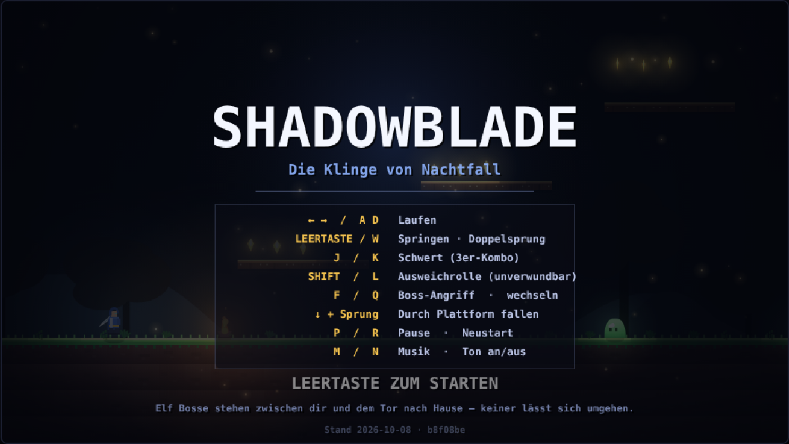](https://joswrf.github.io/2D-Platformer/)

## Starten

```bash
npm install
npm run dev      # http://127.0.0.1:5173
npm run build    # Typecheck + Produktions-Build nach dist/
```

Der Build legt genau eine Datei ab: `dist/index.html`, rund 300 kB, mit dem
gesamten Spiel darin. Sie braucht keinen Server — ein Doppelklick auf die
Datei genügt, und weitergeben lässt sie sich als einzelner Anhang.

## Steuerung

| Taste | Aktion |
| --- | --- |
| `←` `→` / `A` `D` | Laufen |
| `Leertaste` / `W` | Springen (in der Luft nochmal für den Doppelsprung) |
| `J` / `K` / `X` | Schwertschlag — dreiteilige Kombo, der dritte Schlag trifft doppelt |
| `J` / `K` / `X` halten | Ladeschlag — nach kurzem Aufladen ein schwerer Hieb mit dreifachem Schaden; Laufen, Springen und Rollen gehen dabei weiter |
| `E` / `I` | Parade — fängt einen Schlag ab, wenn sie im richtigen Moment kommt |
| `Shift` / `L` | Ausweichrolle, während der Rolle unverwundbar |
| `↓` + Sprung | Durch eine Holzplattform nach unten fallen (auf festem Boden springt er normal) |
| `P` / `Esc` | Pause |
| `R` | Neustart |
| `B` | Bildwackeln aus/an |
| `M` | Musik aus/an |
| `N` | Ton aus/an (alles) |

Die Belegung wird mit **echten Tastendrücken** geprüft, nicht über die
Eingabeschicht: `verify:combat` fährt Parade, Ladeschlag und das Durchfallen
über dieselbe Kette, die ein Spieler benutzt. Dabei kam heraus, dass `↓` +
Sprung nicht funktionierte — die Plattform wurde korrekt ignoriert, aber der
Sprung feuerte im selben Bild und trug den Helden 107 px in die falsche
Richtung. Jetzt fällt er drei Kacheln tief durch, und auf Stein springt er
weiter.

Das Bild passt sich dem Fenster an und wird dabei **kleiner statt
abgeschnitten**. Vorher stand eine Untergrenze von 0,4 in der Skalierung: in
einem Fenster unter 416 px Breite — ein Handy im Hochformat — hing die Leinwand
32 px über jeden Rand hinaus, mitsamt der Herzen links und der Fortschrittsleiste
rechts. Geprüft von 320×240 bis 2560×1440, dazu Hochformat 500×900.

## Das Level

Ein durchgehendes Level aus 1260 Kacheln (40 320 px) in acht Zonen, plus eine
neunte hinter der Welt, die man sich verdienen muss:

1. **Nebelwald** — Einstieg, Abgründe, Schleime, und am Ende das Moor mit
   Gallert darin
2. **Versunkene Ruinen** — Säulen, Klettertürme, Skelette, und dahinter **das
   Tempelherz**, der Innenhof, um den die Ruinen gebaut sind: Ankhor, der
   Tempelkoloss
3. **Kristallhöhlen** — Lavaseen, wandernde Plattformen, dunkle Magier, und am
   Ende **die Glutkammer**, in deren Boden Ignivor schwimmt
4. **Die Ertrunkene Halle** — was das Wasser geholt hat: Algenkanten, Korallen,
   dunkle Magier im Kirchenschiff, und im Chor Thalassa, die den Boden aufmacht
5. **Burg Nachtfall** — Zinnen, Türme, Stachelfallen, und oben auf dem
   Bergfried **der Blutturm**, über dem Vesperon kreist
6. **Thronsaal** — Bossarena; das Fallgitter schließt sich hinter dir
7. **Der Riss** — was hinter dem Thron aufbricht: 328 Kacheln violettes Gestein
   über dem Abgrund, dunkle Magier, in der Mitte der Splitterwächter — und
   hinter ihm wieder Riss bis zum Tor nach Hause
8. **Der Schlund der Fünfkronigen** — grün statt violett, mit Decke und Wänden:
   der einzige Abschnitt des Risses, der ein Raum ist. Ein Rippentor an jedem
   Ende fällt zu, sobald sie wach wird
9. **Der Kristallhort** — nur per Teleport erreichbar, wenn alle 160 Edelsteine
   eingesammelt sind. Acht leere Spalten trennen ihn vom Riss; kein Sprung
   überbrückt die, das ist Absicht.

Kontrollpunkte sichern den Fortschritt, Edelsteine geben Punkte, Herzen heilen —
bei vollem Leben bleiben sie liegen, statt sich an nichts zu verbrauchen.

Der Fall des Ritters ist nicht das Ende: Er bricht das Siegel hinter dem Thron
auf. Gewonnen ist der Lauf erst am Tor am anderen Ende des Risses — und dazwischen
stehen der Splitterwächter und, unmittelbar davor, die Fünfkronige. Das Tor
bleibt zu, solange sie lebt, und sagt das auch, statt den Helden zu ignorieren.

Wen das Bildwackeln bei Treffern stört, schaltet es mit `B` ab — jederzeit, auch
im Titelbild und in der Pause. Das beruhigt zugleich das Sporenfeld in allen
Zonen. Die Einstellung bleibt über Sitzungen erhalten, genau wie `M` (Musik) und
`N` (der ganze Ton); das Pausenbild zeigt, was gerade an ist.

Die Zonengrenzen stehen nicht mehr als Zahlen in der Palette, sondern werden aus
den Abschnitten abgeleitet. Vorher hätte jeder eingeschobene Abschnitt jede Zone
dahinter um seine Breite verschoben — drei neue Arenen hätten den Thronsaal wie
eine Burgmauer beleuchtet.

Der Riss hält im Übrigen still: kein wehender Bewuchs, keine treibenden
Silhouetten, kaum pulsende Kristalle, und ein Sporenfeld, das am Bildschirm
hängt statt darüberzuziehen. Vor einem fast schwarzen Grund ist jedes
bewegte Glanzlicht ein Flackern, und ein Bildschirm voll davon ermüdet die Augen,
statt Stimmung zu machen.

| | |
| --- | --- |
| 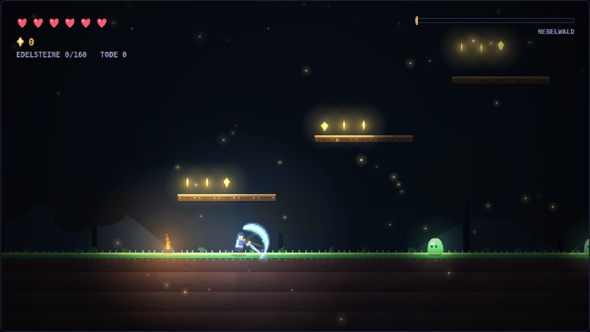 | 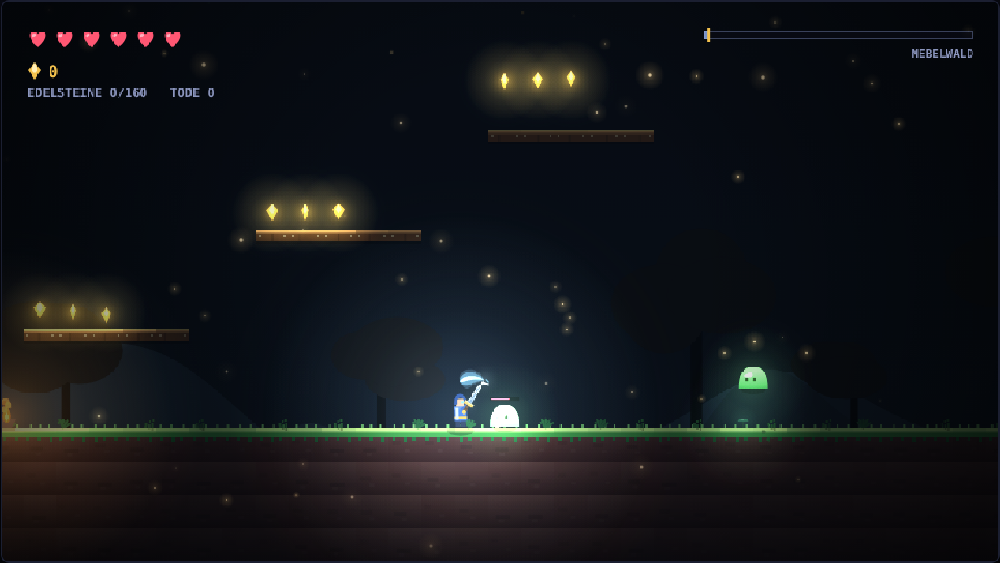 |
| 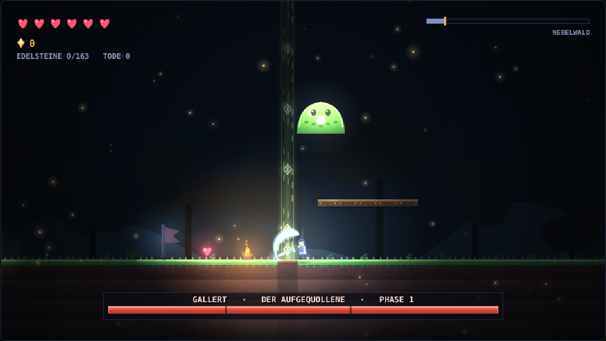 | 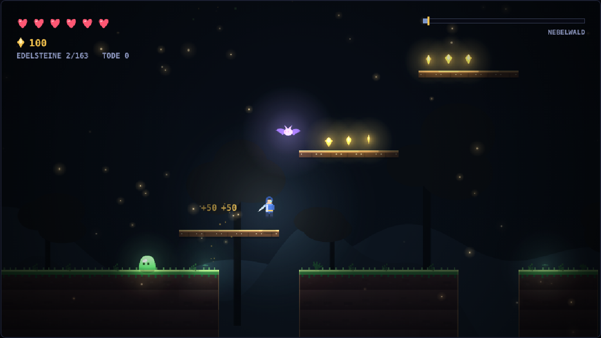 |
| 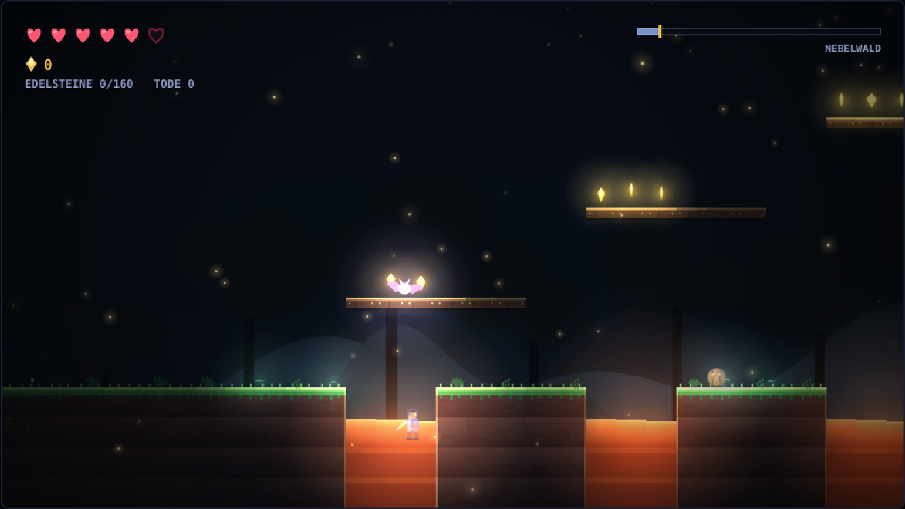 | 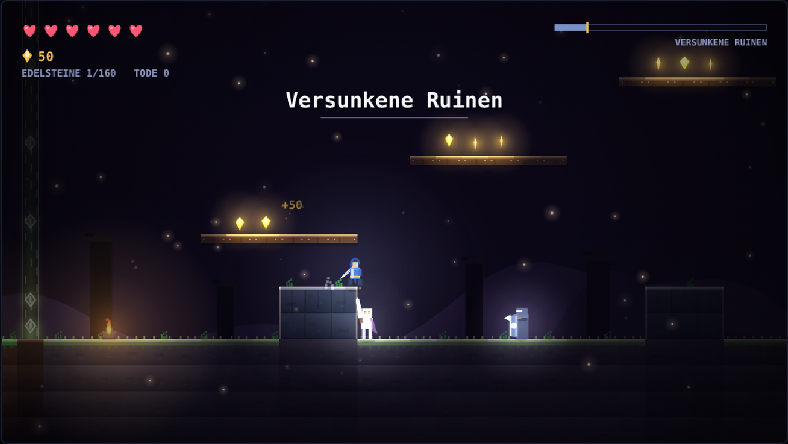 |
| 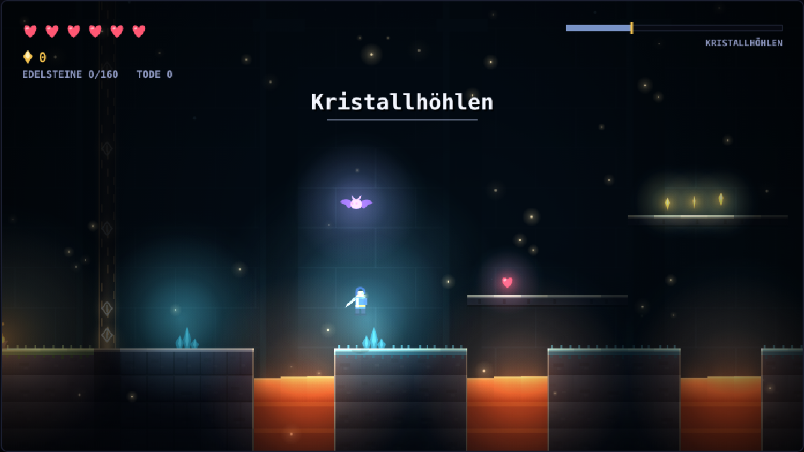 | 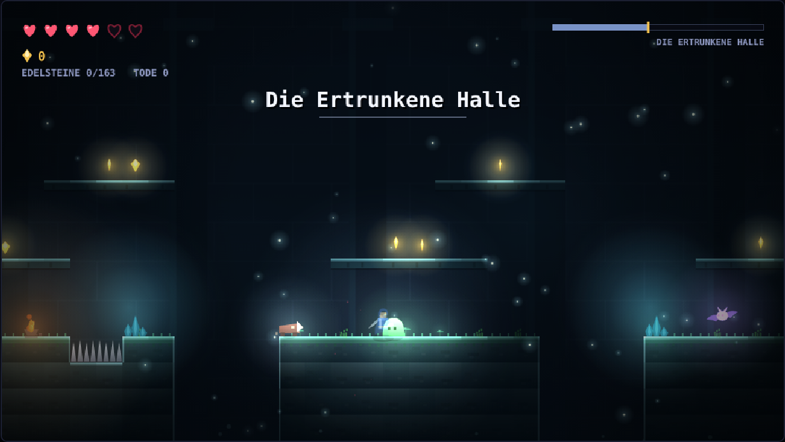 |
| 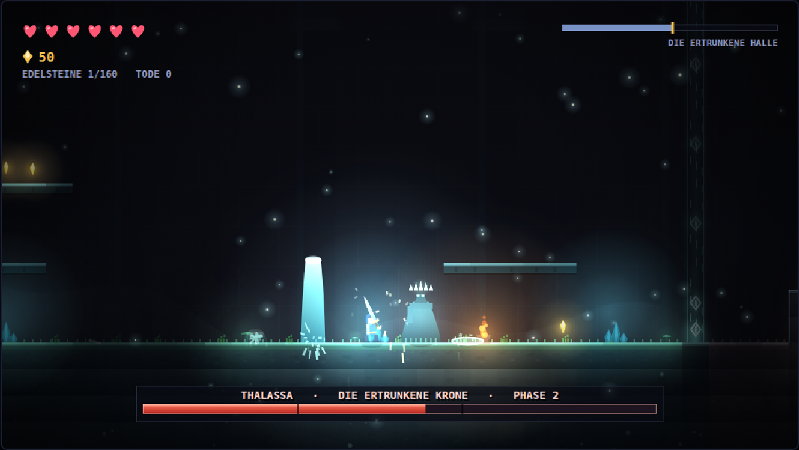 | 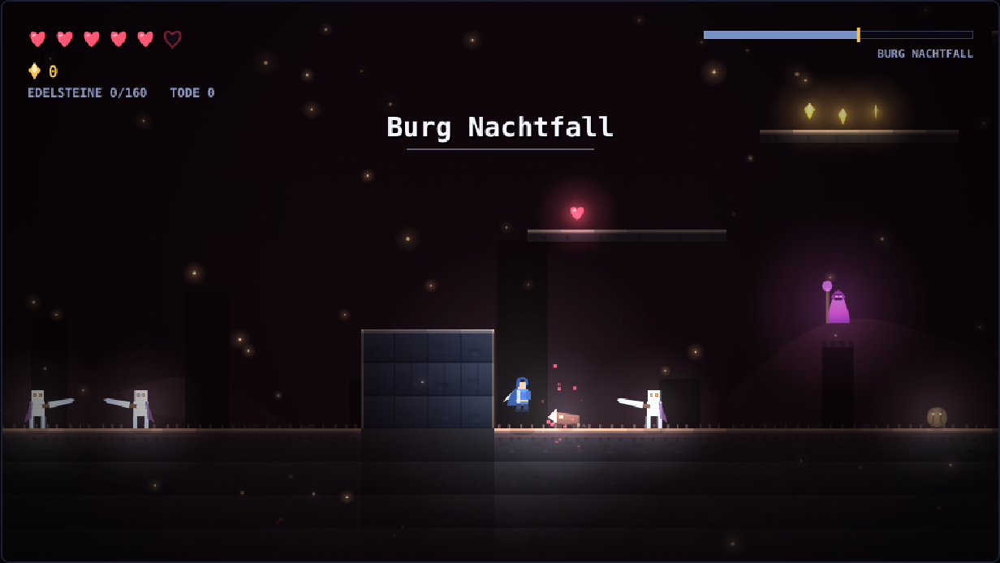 |

## Kein Boss ist optional

Früher standen drei Bosse im offenen Gelände: das Moor, der Chor der Ertrunkenen
Halle und die Mitte des Risses hatten keine Tür. Wer Gallert, Thalassa oder den
Splitterwächter nicht wollte, lief vorbei — gemessen und bis dahin sogar
*geprüft*, für ein Herz. Dem Schleim konnte man schlicht weglaufen.

Jetzt ist jede Bossarena **gebannt**. An beiden Enden steht eine Bannwand, ein
Vorhang aus Licht in der Farbe der Zone, vom Boden bis in den Himmel — eine vier
Kacheln hohe Tür auf freiem Feld wäre eine Tür, über die man springt:

* **Der Weg weiter** steht von Anfang an und fällt erst, wenn der Boss fällt.
* **Der Weg zurück** liegt offen, bis der Boss wach ist *und* der Held ganz
  drin steht; dann kommt er hinter ihm herunter. Offen zeigt er sich als Naht
  aus Runen im Boden — dass er sich schließt, ist ein gehaltenes Versprechen,
  keine Überraschung.
* Wer darin stirbt, findet ihn offen (der Kontrollpunkt liegt davor), und der
  Boss wartet schlafend, der Weg weiter weiterhin zu.
* Der Boss bleibt in seinem Raum. Einer, der dem Helden durch die offene Tür
  folgt, könnte sonst auf der falschen Seite landen.

Die Tür hinter ihm schließt sich nur, wenn er **ganz** drin ist: Ein Boss, der
aufwacht, während der Held noch in der Tür steht, hätte ihn sonst aus seinem
eigenen Kampf ausgesperrt — wach, unerreichbar, und für immer im Weg.

`verify:wards` fährt das für alle sechs gebannten Arenen mit echter Physik ab. Ein
Held, der dreißig Sekunden lang springend auf die ferne Wand zurennt und dabei am
Leben gehalten wird — sodass nur die Wand ihn aufhalten kann —, kommt in keiner
Arena auch nur einen Pixel weiter als bis an die Wand. Die Tür hinter ihm fällt
nach 1,1 bis 1,4 Sekunden, und acht Sekunden Zurückrennen bringen ihn nicht
hinaus. Der Ritter und die Fünfkronige hatten ihre Türen schon; der Prismarch
bleibt, was er ist — ein Bonus hinter allen Edelsteinen, aber wer im Hort steht,
kommt dort auch nur über ihn wieder heraus.

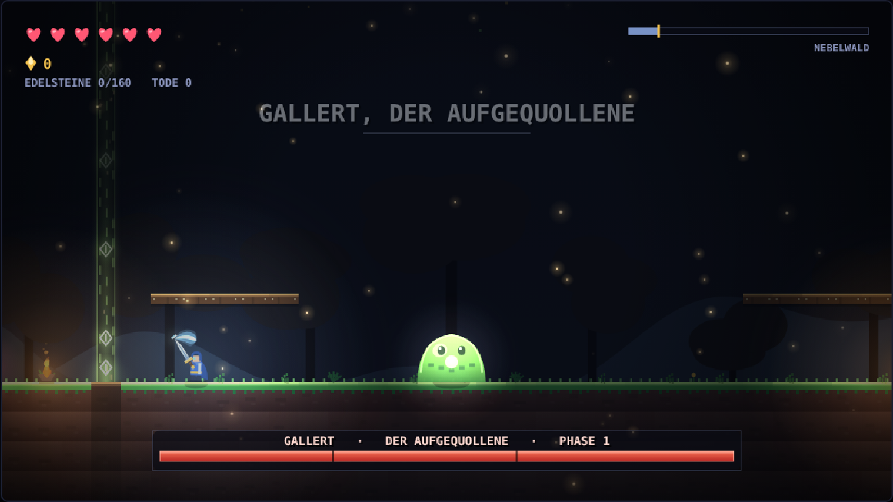

## Der Boss: Schattenritter Morvain

68 Trefferpunkte, drei Phasen mit eigener Bewegungs- und Angriffsauswahl:

* **Phase 1** — Schwertschlag mit Schockwelle, Sturmangriff quer durch die Arena
* **Phase 2** — Schockwellen in beide Richtungen, Schattenkugeln, beschworene Skelette
* **Phase 3** — schneller, kürzere Vorwarnzeiten, Sprungangriff mit Deckeneinsturz

Jeder Angriff wird vorher telegrafiert; nach genug Treffern wird der Ritter
kurz benommen und ist offen für eine volle Kombo. Sein Gefolge bleibt
überschaubar: mehr als zwei Skelette stehen nie gleichzeitig in der Arena.

#### Nicht festhalten lassen

Mit der geworfenen Klinge ließ sich der Ritter **stunlocken**. Gemessen, ein
Bot, der nur die Angriffstaste hält:

| | Anteil benommen | Züge im ganzen Kampf | kassierte Herzen |
| --- | --- | --- | --- |
| ohne Klinge | 15 % | 30 | 52 |
| Flutklinge, **vorher** | **42 %** | **2** | 4 |
| Klingenwelle, **vorher** | **46 %** | **2** | 4 |
| Flutklinge, jetzt | 16–19 % | 9–26 | 11–44 |
| Klingenwelle, jetzt | 14–20 % | 5–26 | 5–44 |

Dauer und Tode stehen nicht in der Tabelle, weil sie über einzelne Läufe wild
schwanken: ein Tod des Helden füllt die Leiste des Ritters wieder, und ob ein
Bot einmal stirbt oder nicht, entscheidet über 13 gegen 120 Sekunden. Belastbar
sind der Anteil benommener Zeit und die Zahl der Züge, die er überhaupt
anfängt — und die sagen dasselbe: **mit der Klinge kam er im ganzen Kampf
zweimal zum Zug und stand fast die Hälfte der Zeit benommen da.**

Der Grund: 14 Schaden mitten im Zug werfen ihn um, und mit der Klinge macht ein
Spieler die 14 schneller, als eine Benommenheit dauert. Jede Erholung lief
direkt in die nächste. Jetzt hält er nach einer Benommenheit **2,6 Sekunden**
die Füße still, was blinden Schaden angeht. Eine **Parade** wirft ihn weiter
jedes Mal um — die kommt nur, wenn er wirklich zuschlägt, also begrenzt sein
eigener Takt sie.

#### Er schlägt die Sichel aus der Luft

Auch mit mehr Leben blieb er nach dem Klingen-Upgrade zu leicht, und das lag
nicht an seinen Zahlen. Gemessen, der Held steht fest und unverwundbar auf
Abstand und schwingt nur:

| Klinge | Abstand | Wellen in 30 s | Schaden | Anteil seiner Leiste |
| --- | --- | --- | --- | --- |
| Klingenwelle, **vorher** | 250 px | 99 | 92 | **100 %** |
| Flutklinge, **vorher** | 130 px | 98 | 78 | **100 %** |
| Klingenwelle, jetzt | 250 px | 100 | 33 | 36 % |
| nur Schwert | 60 px | — | 64 | 100 % |

250 px liegen außerhalb von allem, was er erreichen kann. Dastehen und
schwingen nahm ihm also die ganze Leiste ab, ohne ein einziges Mal in Gefahr
zu sein — mehr Leben macht das nur länger, nicht schwerer.

Er ist ein Ritter mit einem Großschwert. Also **schlägt er die Sichel aus der
Luft**, solange er nicht in einem Zug festhängt. Das ist keine Mauer:

* nur von vorn — was in seinen Rücken fliegt, kommt an;
* **nie**, während er festgelegt ist: Sturmangriff, Sprungschlag, Deckensprung
  und benommen sind alle offen;
* und höchstens dreimal pro Sekunde, damit zwei Sicheln in einem Moment nicht
  zwei Funken werfen.

Etwa ein Viertel des Kampfes sind seine festgelegten Bilder, also kommt aus der
Ferne etwa ein Viertel der Sicheln an. Wer mehr will, muss nah genug heran, um
seine Ansagen zu lesen — dieselbe Regel, nach der der ganze Kampf schon läuft.
Wenn er es tut, leuchtet die Klinge auf ihrer ganzen Länge auf und es sprüht
am Aufprallpunkt: man soll sehen, warum die Sichel weg ist. Ein Bot, der nur
aus der Ferne warf, hat ihn vorher in 41 Sekunden erledigt; jetzt steht er nach
100 Sekunden immer noch bei 64 von 78 Trefferpunkten.

`verify:combat` nagelt beides fest: acht Sicheln auf einen offenen Ritter
machen **0** Schaden, dieselben acht auf einen festgelegten machen **8**.

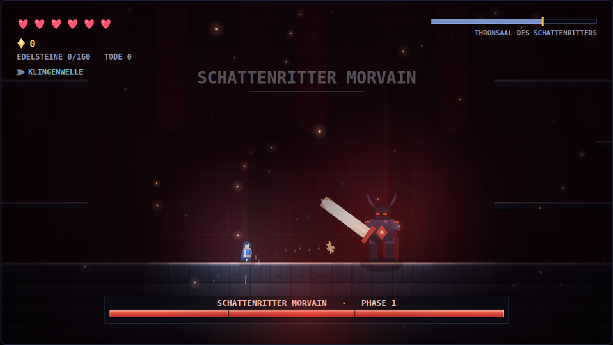

#### Gereizt: wer in die Ankündigung hineinhaut, kriegt sie früher

Gemessen, und der Grund für diese Regel: Ein Held, der sich einfach vor ihn
stellte und die Angriffstaste hielt, nahm ihn in **17,8 Sekunden** von voll auf
null und verlor dabei **sechs** Trefferpunkte — ohne einen einzigen Tod. Sein
Ausholen war ein Gratisfenster, in dem man stehen und ihn austauschen konnte.

Das Ausholen *war* schon die Ankündigung. Jetzt kostet es etwas, sie zu
ignorieren: Ein Treffer, während er ausholt, lässt den Schlag **früher**
kommen statt später — 0,18 s statt 0,62 s, mit eigenem Aufblitzen, eigenem
Ton und „GEREIZT!" über ihm. Wer den Tell liest und zurückgeht, sieht das nie.

Fair bleibt es durch zwei Grenzen: Reizen geht **einmal pro Zug** (sonst hielte
ein schneller Held ihn ewig auf Bruchteilen einer Sekunde), und eine Parade
bricht ihn weiterhin aus jedem Schwung heraus — der Könnerweg ist unberührt.

`verify:combat` nagelt beide Hälften fest: unangetastet läuft sein Slam-Ausholen
38 Bilder, gereizt bricht es auf 15 zusammen, und der zweite Treffer verkürzt
nichts mehr.

Was die Messung nach der Änderung sagt, über fünf Läufe je 100 Sekunden: Der
Draufhauer legt ihn **nicht mehr um** — er kommt im Median auf 50 % seiner
Leiste und stirbt dabei neun Mal. Ohne die geworfene Klinge sind es 83 %.

#### Bosse nehmen die Klinge zur Kenntnis

Wer mit einer geworfenen Klinge ankommt, trifft auf mehr Boss. Das Upgrade ist
etwa zwei Schaden pro Sekunde ohne jedes Risiko, und die Bosse waren gegen ein
Schwert gebaut. Beim Aufwachen sieht sich jeder Boss einmal an, was auf ihn
zukommt — mitten im Kampf verschiebt sich nichts, und wer das Upgrade nie
gefunden hat, trifft genau den Boss, der für ihn eingestellt wurde:

| Klinge | Leben | Schaden bis zur Benommenheit |
| --- | --- | --- |
| nur Schwert | 68 | 18 |
| Flutklinge | 83 | 24 |
| Klingenwelle | 98 | 31 |

Dasselbe gilt für Thalassa, den Splitterwächter, den Prismarchen, Gallert und die
drei neuen — Ankhor, Ignivor und Vesperon (+22 % Leben und +35 % Poise je Stufe). Auf Distanz stehen bleiben hilft
seitdem auch nicht mehr: der Ritter wählt weit draußen zweimal so oft den
Sturmangriff wie das Hinterherlaufen, und ein Bot, der auf 150 px kampierte und
die Klinge schickte, verliert jetzt statt in 30 s zu gewinnen.

#### Und sie bleiben tot

Ein gefallener Boss kam bisher mit dem nächsten Kontrollpunkt zurück: der
Kontrollpunkt baut die Gegnerliste neu auf, und Thalassa, der Splitterwächter
und der Prismarch stehen in dieser Liste. Ein Tod irgendwo in der Welt stellte
sie wieder hin, mit voller Leiste. Gemessen und behoben — nur der komplette
Neustart (`R`) bringt sie zurück, und der nimmt einem auch die Klinge und den
Herzkern wieder ab.

## Die Gegner

| | | Antwort |
| --- | --- | --- |
| **Schleim** | hüpft stur geradeaus | drüber oder drauf |
| **Fledermaus** | fliegt in Wellen an | Timing |
| **Skelett** | patrouliert, schlägt telegrafiert | parieren oder ausweichen |
| **Dunkler Magier** | schwebt, wirft Kugeln | Kugeln zurückparieren |
| **Zunder** | läuft heran und zündet sich | **auf Abstand erledigen** |
| **Schildwache** | alles in den Schild hinein bleibt dort | **von hinten, oder parieren** |
| **Klingenläufer** | gräbt sich ein und stürmt durch den Raum | **in eine Wand locken** |

Der **Zunder** ist eine Falle, keine Wache: er wartet, bis man nah ist, und
zündet dann eine gute Sekunde lang sichtbar und hörbar auf. Ihn zu erschlagen
löst dieselbe Explosion aus — wer ihn aus einem Meter Entfernung umhaut, kassiert
sie. Aus der Ferne erledigt kostet er nichts, und genau dafür ist die
Klingenwelle da — beziehungsweise ab der Halbzeit die Flutklinge, deren 145 px
weit außerhalb seiner Druckwelle von 66 px liegen. Was neben ihm steht, nimmt er
mit: ein Skelett in seiner Reichweite ist ein Skelett, das man nicht selbst
bekämpfen muss.

Die **Schildwache** ist der einzige Gegner im Spiel, den man mit gehaltener
Angriffstaste nicht schafft. Von vorn stirbt jeder Hieb im Schild, die
Klingenwelle inbegriffen. Hinten herum trifft alles — und ein parierter
Lanzenstoß reißt ihm den Schild für knapp zwei Sekunden herunter.

Der **Schleim** hüpft stur geradeaus, dreht aber an Kanten um. Diese zweite
Hälfte fehlte lange: sein Kommentar behauptete sie, geprüft wurde nur auf
Wände, und ein Kantencheck auf den nächsten Schritt ist für einen Springer die
falsche Frage — er besteht ihn am Rand stehend und landet in der Grube dahinter.
Gemessen an seinem echten Platz in den Ruinen (drei Kacheln Boden fehlen,
Stacheln darunter) war einer neun Sekunden nach Laufbeginn weg, bevor der
Spieler ihn je gesehen hätte. Jetzt wird der **Landeplatz** geprüft, und wenn es
in beide Richtungen schlecht aussieht, hüpft er auf der Stelle.

Der **Klingenläufer** ist der einzige, den das Level selbst erledigt: er gräbt
sich ein, stürmt los, und wer sich vor einer Wand wegdreht, sieht ihn dagegen
laufen. Danach steht er anderthalb Sekunden benommen da und nimmt doppelten
Schaden.

### Der erste Boss: Gallert, der Aufgequollene

22 Trefferpunkte, zwei Phasen, drei Züge — und der Lehrer des Spiels. Jeder
seiner Züge ist die einfache Form von etwas, das ein späterer Kampf härter
macht:

* **Klatschsprung** (aus der Nähe) — er flacht sich gegen den Boden, springt,
  und landet mit einem Ring: 2 Schaden, aber nur dort, wo er aufkommt (74 px).
  Derselbe Zug wie der Sprungschlag des Splitterwächters, nur langsamer
  angekündigt. Er trägt bis zu 230 px, ist also auch sein Weg zu einem, der
  Abstand hält.
* **Spucke** (auf Distanz) — drei Klumpen auf kurzer Bahn, einer auf den Helden
  und zwei daneben. **Ein Hieb schlägt sie aus der Luft**, und das ist der Sinn
  des Kampfes: die Regel, die Thalassas Flutwelle später verweigert, muss man
  vorher gelernt haben, sonst ist die Ausnahme keine.
* **Teilung** (zweite Hälfte, höchstens zweimal) — er kneift zwei gewöhnliche
  Schleime von sich ab. Erst die wegräumen, dann weiter.

Angekündigt wird alles über den Kern, der vor jedem Zug aufleuchtet; die
Silhouette sagt den Rest, weil er sich vor dem Sprung platt macht und in der
Luft streckt. Sein Schatten bleibt dabei unten am Boden und schrumpft — daran
sieht man, wie hoch er ist.

Poise 14, gemessen und nicht geraten: bei 8 warf ihn ein Dauerangreifer aus
jedem Zug, den er anfing, und kassierte im ganzen Kampf **keinen einzigen
Treffer**. Jetzt kostet derselbe Bot 5 von 6 Herzen und braucht 9 Sekunden; mit
aufgefüllter Bossleiste gemessen — sonst ist der Kampf vorbei, bevor er dreimal
zum Zug kam — landet Gallert 7 bis 18 Treffer in 25 Sekunden. Eine Parade
schüttelt ihn immer los. Vorbeilaufen geht **nicht mehr**: das Moor ist gebannt,
und `verify:gallert` prüft jetzt das Gegenteil dessen, was es früher prüfte.

Wer ihn schlägt, bekommt den **Herzkern**: sechs Herzen werden sieben, für den
ganzen Rest des Laufs, und die Leiste ist sofort wieder voll. Das ist die
einzige Belohnung im Spiel, die nicht die Klinge betrifft — nach der ersten
Stunde soll etwas anderes dastehen als eine größere Zahl auf einem Hieb.

### Der zweite Boss: Ankhor, der Tempelkoloss

Im Innenhof der Ruinen, bis zur Brust im eigenen Pflaster vergraben: ein Wächter
aus Sandstein mit Nemes-Kopftuch in Lapis und Gold, einem Halskragen aus
Perlenreihen, einer Sonnenscheibe auf der Brust und Rissen, durch die das Licht
in ihm scheint. Er geht nicht — dafür hat er zwei Hände, die keine Arme brauchen.
Solange niemand den Hof betritt, liegen sie auf dem Boden, und er ist eine Statue.

54 Trefferpunkte, zwei Phasen, vier Züge:

* **Faustschlag** — eine Faust steigt über den Helden und folgt ihm, ihr
  Schatten wird auf dem Boden größer; dann hält sie für einen Atemzug *still* und
  kommt herunter. Aus dem Schatten treten. Danach liegt sie so lange am Boden,
  dass man hineinschlagen kann.
* **Wischer** — eine Hand geht an die Wand gegenüber, legt sich auf den Boden
  und fegt über den ganzen Hof. Drüberspringen, oder auf einem Absatz stehen.
  Sie kommt immer von der fernen Seite, quer an ihm vorbei: der längste Blick
  auf einen Angriff, den man verlangen kann.
* **Sonnenblick** — er sieht nach oben, zwei dünne Strahlen aus seinen Augen in
  den Himmel, und der Himmel antwortet: eine Säule aus Sonnenlicht kommt auf den
  Helden herunter und folgt ihm — langsamer, als er läuft. Ein Grund, sich zu
  bewegen, kein Urteil.
* **Doppelschlag** — ab der Hälfte beide Fäuste nacheinander, und jeder Schlag
  schickt Schockwellen über den Boden.

Jeder Teil von ihm, den man trifft, zählt — aber **sein Gesicht nimmt doppelt**,
und eine Faust, die genug abbekommen hat oder deren Schlag pariert wurde,
**zerspringt**. Ohne sie sackt er nach vorn, der ganze Leib sinkt ins Pflaster,
und sein Kopf kommt dorthin, wo ein Schwert vom Boden aus hinkommt. Das ist die
Öffnung, um die der Kampf gebaut ist. Sechs Sekunden später fliegen die Splitter
zurück und die Faust ist wieder da.

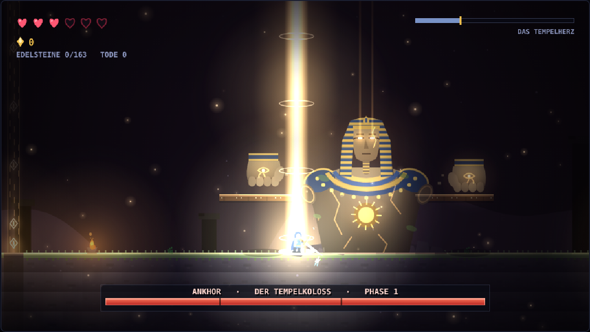

### Der dritte Boss: Ignivor, der Glutwurm

Fünfzehn Platten aus Obsidian, zwischen denen das Feuer des Berges läuft, ein
langer Schädel mit zurückgeschwungenen Hörnern und einem Kiefer, der fällt, wenn
er speit. Der Boden seiner Kammer ist Fels, weil Fels das ist, wodurch er
schwimmt — und wer hereinkommt, sieht zuerst gar nichts. Dann grollt es.

58 Trefferpunkte, zwei Phasen, und eine Regel, die jeder Wurm hat: **Die Panzerung
ist Panzerung.** Eine Klinge auf seinen Platten klingt und tut nichts. Nur der Kopf
zählt, und der Kopf ist nur draußen, wenn er etwas will:

* **Durchbruch** — der Boden unter dem Helden glüht und folgt ihm, hält dann
  **0,4 Sekunden** still und bricht auf. In Bewegung bleiben; wenn es stehen
  bleibt, gehen. Der Wurm fährt gerade nach oben, nicht dorthin, wohin der Held
  inzwischen gelaufen ist — sonst bestrafte er genau das, wozu ihn die
  Ankündigung aufgefordert hat. (Gemessen: vorher zielte der Bogen nach und
  kostete einen Ausweichenden fast so viel wie einen, der stehen blieb.)
* **Glutspeien** — er steigt ein Stück weiter aus dem Boden, wirft den Kopf
  zurück und speit Klumpen aus Magma, die dort weiterbrennen, wo sie landen.
  Danach bleibt er oben, den Kopf tief und pendelnd — das ist die Zeit, ihn zu
  treffen.
* **Feuerwelle** — er geht an die ferne Wand und schwimmt die ganze Kammer
  entlang knapp unter dem Boden, und hinter ihm schlägt der Boden als Feuer
  hoch, den ganzen Weg. Der Boden ist kein Ort, an dem man dann sein will; die
  vier Absätze sind es.

Wer den Kopf oben genug trifft, holt ihn herunter: Er schlägt betäubt auf den
Boden, liegt dort zwei Sekunden, und das ist das lange Fenster. Ab der Hälfte
bricht er zweimal hintereinander durch, und das Feuer, das er oben am Scheitel
aufwirft, kommt als Regen wieder herunter.

| | |
| --- | --- |
| 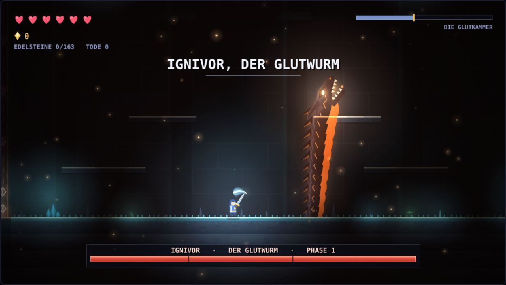 | 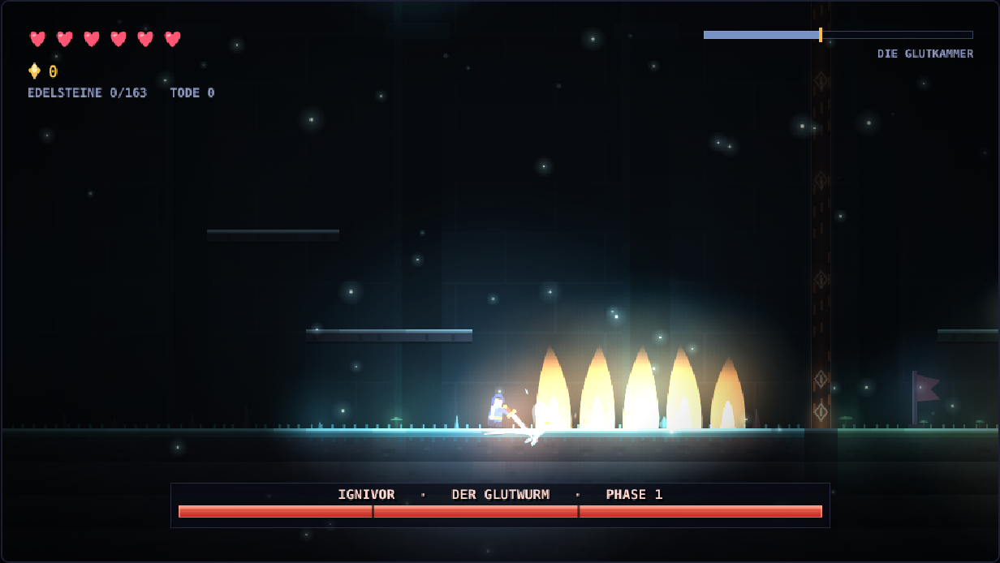 |

### Der Boss der Halle: Thalassa, die Ertrunkene Krone

60 Trefferpunkte, drei Phasen, vier Züge. Ihre Züge nach Entfernung: aus der
Nähe ein **Flutstoß**, zwei Wellen über den Boden in beide Richtungen — die
Antwort ist Höhe, nicht Abstand. Auf Distanz ein **Ankerwurf** auf einer Bahn,
die dort landet, wo man gerade hinläuft. Der **Sog**, der einen für gut eine
Sekunde zu ihr hinzieht und dann Kugeln schickt: weglaufen kostet Boden, der
Kampf wird in ihrer Reichweite entschieden. Und die **Springflut**, die den
Boden selbst aufmacht.

Jeder Zug wird angekündigt — die Krone füllt sich, und woran man erkennt,
*welcher* kommt, steht ihr an: zwei Bögen am Saum für den Flutstoß, das Gewicht
über der Schulter für den Anker, ein Wirbel um die Füße für den Sog, beide Arme
hoch für die Flut.

#### Warum der Kampf neu gebaut wurde

Er war zu leicht, und zwar messbar: wer nur die Angriffstaste hielt, erledigte
sie in **elf Sekunden** und verlor dabei zwischen null und vier Herzen. Drei
Gründe, in der Reihenfolge, in der sie zählten:

1. **Die Klinge wischte alles weg.** Jeder Hieb pariert Geschosse in Reichweite
   — und schickt sie mit doppeltem Schaden zurück. Wer draufhielt, schlug damit
   jede Welle ab, die sie machte, *und* traf sie damit selbst.
2. **Ihr Poise war zu niedrig.** Sechs Schaden mitten im Zug warfen sie heraus;
   ein Dauerangreifer macht 3,6 Schaden pro Sekunde. Sie kam in einem ganzen
   Kampf viermal zum Zug.
3. **Was übrig blieb, stand herum.** Über die Hälfte des Kampfes verbrachte sie
   in der Erholung.

Dagegen, der Reihe nach:

**Ihre Flutwelle lässt sich nicht wegwischen.** Eine Wand aus Wasser ist nichts,
was ein blinder Hieb zur Seite schlägt — die springt man, oder man pariert sie.
Sie kommt seitdem auch in den Farben der ertrunkenen Halle statt in denen des
Ritters, denn ein Geschoss, das man abschlagen kann, und eines, das man springen
muss, dürfen nicht gleich aussehen.

**Die Springflut macht den Boden auf.** Marken auf dem Boden — eine unter den
Füßen des Helden, die anderen im Raum verteilt — blubbern zwei Drittel einer
Sekunde, dann kommt das Wasser durch sie hoch. Das ist der eine Zug, den die
Klinge nicht beantworten kann, also ist es der Zug, der Stehenbleiben
beantwortet: wer sich in ihre Reichweite stellt und draufhaut, bekommt ihn.
Trotzdem fair — man läuft aus der Marke heraus, oder man kommt mit dem
Doppelsprung über die Säule (eine Säule ist 118 px hoch, ein einfacher Sprung
trägt 103). Und weil man nach einem Treffer einen Moment unverwundbar ist, käme
ein Schwung Säulen auf einmal nur ein Herz teuer: die Flut fragt darum ab der
zweiten Phase zweimal, die zweite Welle dort, wo man inzwischen steht.

**Poise 13 statt 6, und die Parade bricht sie immer.** Draufhauen kauft jetzt
gelegentlich eine Unterbrechung statt immer. Was zuverlässig wirkt, ist die
Parade: die reißt sie aus jedem Zug, egal wie viel Poise sie noch hat. Wer schon
taumelt, taumelt nicht doppelt — sonst hielte man die Taste einfach gedrückt.

**Drei Phasen statt zwei**, geschnitten dort, wo die Bossleiste ihre Kerben
zeichnet. In der zweiten antwortet die Flut doppelt: der Flutstoß in zwei
Salven, weit genug auseinander, dass ein Sprung nicht beide nimmt; der Anker als
Paar, einer dorthin, wo man steht, einer dorthin, wo man hinläuft; der Sog
greift auch in der Luft. Ihr letztes Drittel eröffnet der **Ruf der Krone** —
einmal im Kampf, ein Ring aus fünf Säulen und die ganze Halle antwortet —, und
danach hängt sie zwei Züge aneinander, bevor sie durchatmet.

Gemessen, mit echten Lebenspunkten auf beiden Seiten, drei Läufe je Spielweise:

| Spielweise | vorher | jetzt |
| --- | --- | --- |
| nur Angriffstaste halten | 11–12 s, 0–4 Treffer, kein Tod | 21–24 s, 9–13 Treffer, 1–2 Tode |
| ausweichen, Kugeln parieren | 17–28 s, 0–4 Treffer, kein Tod | 40–58 s, 8–17 Treffer, 1–2 Tode |
| stehen bleiben und hauen | 0–2 Treffer | 4–5 Treffer |
| in ihrer Reichweite parieren | — | 18 s, 3–4 Treffer, kein Tod |
| einfach vorbeilaufen | 1 Treffer | geht nicht mehr — der Chor ist gebannt |

Ein Treffer ist ein kassiertes Herz von sechs; ein Tod füllt die Leiste wieder
auf, darum stehen in der zweiten Spalte auch Zahlen über sechs.

Die letzte Zeile hat sich umgedreht und wird weiter geprüft: früher hatte ihr
Chor kein Fallgitter und wer den Kampf nicht wollte, kam vorbei — jetzt steht an
jedem Ende eine Bannwand, und der Kampf in der Mitte des Spiels lässt sich nicht
mehr auslassen.
Die vorletzte gilt wie gehabt: die beste Antwort auf sie ist die Parade, nicht
das Ausdauerhalten.

Wer sie schlägt, nimmt mit, was sie gehalten hat: die **Flutklinge**, die erste
Hälfte des Klingen-Upgrades.

### Der Herr des Bergfrieds: Vesperon, der Blutfürst

Über dem Dach des Bergfrieds, unter einem Mond, der seine Farbe angenommen hat.
Ein hoher Kragen, ein bleiches Gesicht mit spitzen Ohren und rotem Blick, und
Fledermausflügel mit Armknochen, vier Fingern und einer gewellten Hinterkante,
die bei jedem Schlag im Mondlicht aufglüht. Er ist ein Flieger — ein Problem für
jemanden mit einem Schwert. Also ist der Kampf um die Momente gebaut, in denen
er herunterkommt. 56 Trefferpunkte, zwei Phasen, vier Züge:

* **Sturzflug** — er steigt, breitet die Flügel, schreit und zeichnet eine rote
  Linie dorthin, wo er hinwill; eine Viertelsekunde vorher rastet sie ein, dann
  kommt er. Durchrollen oder von der Linie gehen. Wo er landet, muss er Atem
  holen: auf dem Dach, in Reichweite, gut eine Sekunde lang. Wer den Sturz
  **pariert**, legt ihn aufs Gesicht; wer ihn gegen eine Zinne lockt, auch.
* **Blutsicheln** — ein Fächer aus Sicheln aus dem Umhang. Ein Hieb schickt sie
  zu ihm zurück.
* **Schwarm** — Fledermäuse aus dem Mantel, nie mehr als vier, und sie jagen,
  statt zurück ins Gebälk zu fliegen.
* **Blutmond** — ab der Hälfte steigt er ganz nach oben, der Mond hinter ihm
  färbt sich, und wo es auf dem Dach rot markiert ist, regnet es.

Und man kann ihn herunterholen: die Planken und die Zinnen stellen den Helden
auf seine Höhe, und genug Schaden in der Luft wirft ihn aufs Dach.

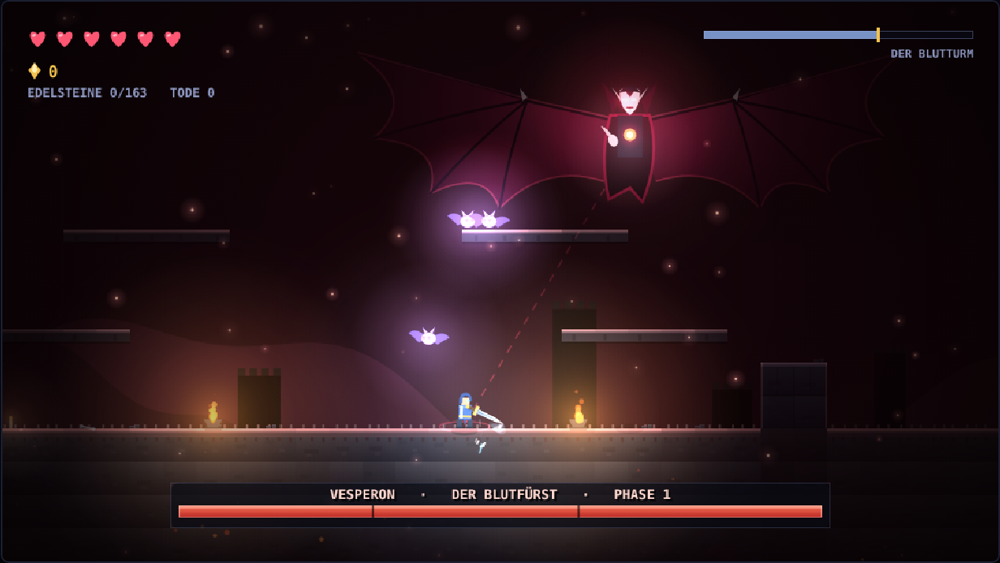

#### Gemessen: lesen lohnt sich

`verify:bosses` stellt für jeden der drei einen Helden hin, der nur dasteht, und
einen, der die Ankündigungen liest — aus dem Schatten tritt, über die Hand
springt, die Glut unter sich verlässt, von der Sturzlinie geht und die
Fledermäuse abwehrt. Beide werden am Leben gehalten; gezählt wird, was durchkommt:

| | Ankündigung (kürzeste gemessene) | stehen bleiben | lesen |
| --- | --- | --- | --- |
| Ankhor, 60 s | Faust 0,95 s + 0,35 s Aufstieg, Wischer 0,78 s, Sonne 0,55 s | 28 Herzen | 2 |
| Ignivor, 45 s | Durchbruch 0,4 s Stillstand | 13 Herzen | 0 |
| Vesperon, 40 s | Sturzflug 0,57 s | 31 Herzen | 9 |

Jeder Zug, der wehtut, ist mindestens eine halbe Sekunde vorher zu sehen. Und die
Regeln halten: Ankhors Gesicht nimmt 2 statt 1, sein gesackter Kopf reicht bis
18 px über den Boden herab; Ignivors Platten nehmen 0, sein Kopf 1, und die
Feuerwelle kostet auf dem Boden 9 Herzen und auf dem Absatz keines. Die Bildzeit
bleibt in allen drei Kämpfen im 99. Perzentil unter 15 ms.

Wer einen der drei schlägt, bekommt alle Herzen zurück, und die Bannwände fallen.

### Die Klinge: zwei Stufen

Jeder Hieb wirft eine Sichel voraus. Das ist eine Reichweitenverlängerung, keine
Kanone: eine je Hieb, und sie ist nach einem knappen halben Herzschlag weg.

| | woher | Reichweite | Schaden |
| --- | --- | --- | --- |
| Schwert allein | von Anfang an | 40 px | 1 / 2 in der Kombo / 3 geladen |
| **Flutklinge** | Thalassa fällt — bei knapp der Hälfte des Levels | 145 px | 1, geladen 2 |
| **Klingenwelle** | Prismarch fällt — hinter allen 160 Edelsteinen | 273 px | 1 / 2 / 3 wie der Hieb |

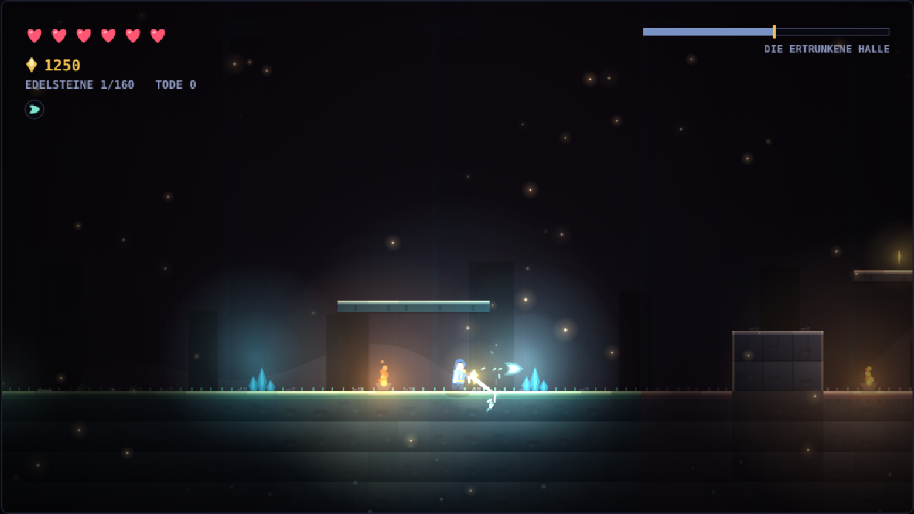

Vorher hing das ganze Upgrade am Prismarchen. Das heißt: man musste alle 160
Edelsteine finden, um es überhaupt zu sehen — und hatte dann nur noch den letzten
Rest der Welt, um damit zu spielen. Die Hälfte kommt jetzt zur Halbzeit, der
Prismarch schärft, was schon da ist. Die zwei Stufen sehen auch verschieden aus:
die Flutklinge wirft Wasser, die Klingenwelle Licht, und im HUD steht, was man
hat.

Dass die erste Stufe das Spiel dahinter nicht kaputt macht, ist gemessen — ein
Bot, der auf 150 px Abstand bleibt und nur die Sichel schickt:

| gegen | nur Schwert | Flutklinge | Klingenwelle |
| --- | --- | --- | --- |
| Schattenritter (64 TP) | verliert, 7 Tode | 47 s, 10 Treffer, 1 Tod | 21 s, 2 Treffer |
| Splitterwächter (16 TP) | 5 s, 0 Treffer | 8,3 s, 1 Treffer | 3,8 s, 0 Treffer |

Der Ritter bleibt der härteste Kampf im Spiel, auch mit der Flutklinge in der
Hand; beim Splitterwächter ändert sie nichts, den erledigt der Nahkampf ohnehin
in fünf Sekunden. Die volle Klingenwelle ist stark — das ist der Punkt einer
Belohnung, für die man die ganze Welt abgesucht hat.

### Der Bonusboss: Prismarch, Herz des Kristalls

Wer alle 160 Edelsteine findet, hält an Ort und Stelle an: eine Stimme aus dem
Stein meldet sich, fünf Zeilen lang, und wer sie zu Ende gelesen hat, steht im
Kristallhort. Es gibt zwei Türen dorthin — der volle Zähler öffnet sie sofort,
und wer trotzdem am Tor im Riss ankommt, wird dort hinübergeschickt statt den
Lauf zu beenden. Eine Belohnung, die man sich erarbeitet hat, darf nicht an
einem einzigen Auslöser hängen. Solange der Dialog liegt, steht die Welt still — sonst liest man
und läuft dabei von der Kante.

70 Trefferpunkte, zwei Phasen, drei Züge nach Entfernung: aus der Nähe ein
Sturmangriff quer durch die Halle, auf mittlere Distanz Splitter, die von der
Decke fallen und dorthin zielen, wo man gleich sein wird, von weitem ein Fächer
aus drei Splittern — in der zweiten Phase fünf, und alle Pausen um ein Fünftel
kürzer. Denselben Zug zweimal hintereinander macht er nie.

Fällt er, ist der Lauf **nicht** vorbei: die Splitter seines Herzens gehen in die
Klinge, und der Held wird genau dorthin zurückgesetzt, wo er weggeholt wurde —
mitsamt seinem alten Kontrollpunkt. Aus der Flutklinge wird damit die
**Klingenwelle**: doppelte Reichweite und der volle Schaden des Hiebs dahinter,
1 in der Kombo, 2 beim Abschluss, 3 beim Ladeschlag. Wer Thalassa vorbeigelaufen
ist und die erste Stufe nicht hat, bekommt sie hier — das Herz sagt dann auch
einen anderen Satz.

Das Tor im Riss beendet den Lauf wie immer — der Siegbildschirm nennt dann das
wahre Ende, wenn das Herz gefallen ist.

### Der Endboss: Die Fünfkronige

Am Ende des Risses, in ihrem eigenen Saal vor dem Tor. Sie ist **keine Reihe aus
fünf Bossen**: Alle fünf Köpfe sind wach, alle fünf lassen sich abschlagen — und
einen abzuschlagen heißt nicht, ihn zu töten. Der Stumpf zuckt neun Sekunden
lang, dann ist der Kopf wieder da. Stahl allein bringt eine Hydra nie um.

Was es tut, ist ihr eigenes Feuer. Der Flammenkopf wirft Glut; eine Glut, die
man pariert, **fliegt schnurgerade** und brennt einen Stumpf für immer zu. Die
Schleife lautet also:

> Kopf abschlagen → auf die Höhe steigen, auf die der Stumpf herunterhängt →
> Glut ködern → sie in den Stumpf parieren.

Und weil eine gewendete Glut waagerecht fliegt, ist **die Höhe, auf der man
steht, die Höhe, auf die man zielt**. Die vier Stümpfe hängen an vier
verschiedenen Absätzen: einer am Boden, die anderen drei auf der 3., der 7. und
der 13. Kachel Höhe — also auf drei verschiedenen Stufen ihres Turms. Der
Aufstieg ist damit nicht mehr *eine Phase* des Kampfes, sondern der Kampf.

| Kopf | Wo man ihn abschlägt | Wo sein Stumpf hängt |
| --- | --- | --- |
| **GIFT** | Boden, ein Sprung | Boden |
| **FLAMME** | Boden, ein Sprung | — er *ist* das Feuer |
| **STEIN** | Boden, Doppelsprung | 1. Stufe (96 px) |
| **KRONE** | 4. Stufe | 4. Stufe (224 px) |
| **STURM** | oberste Stufe | oberste Stufe (416 px) |

Der fünfte Hals ist das Feuer selbst. Er lässt sich abschlagen wie jeder andere,
aber nichts kann seinen Stumpf ausbrennen — er wächst einfach nach. Es sei denn,
die anderen vier sind schon zu: dann macht ihn auszulöschen sie fertig. Wer den
Flammenkopf zuerst abschlägt, verliert nichts als Zeit und lernt die
Reihenfolge. Eine Sackgasse gibt es nicht.

Die Klinge schlägt eine Glut übrigens genauso aus der Luft wie die Parade — es
ist dieselbe Regel, die Gallert im Moor mit seiner Spucke beibringt. Die Parade
ist nur der sichere Weg, weil man dafür nicht in Kopfreichweite stehen muss.

Gemessen statt behauptet, alles in `verify:hydra`:

* **Stahl allein reicht nicht.** Hundert Sekunden Dauerhauen mit der schärfsten
  Klinge des Spiels: zwanzig nachgewachsene Köpfe, **null** ausgebrannte Hälse,
  sie steht noch.
* **Feuer reicht.** Jeder der vier Stümpfe brennt in 1,8 bis 3,2 Sekunden zu,
  von seinem eigenen Absatz aus — und die vier Absätze liegen messbar auf vier
  verschiedenen Höhen.
* **Zu bleibt zu.** Fünfzehn Sekunden später ist ein ausgebrannter Hals immer
  noch aus.
* **Offen bleibt nicht offen.** Wer einen Stumpf in Ruhe lässt, hat den Kopf
  nach 9,6 Sekunden wieder — mit 7 von 12 Trefferpunkten.
* **Nur Köpfe sind Ziele.** Ihr Leib, ihre Hälse und die Stümpfe nicht, in beide
  Richtungen: In sie hineinzulaufen kostet nichts, und Stahl tut einem
  abgeschlagenen Hals gar nichts.
* Dazu wie gehabt: Der Sturmkopf ist vom Boden aus unerreichbar, die sechs
  Stufen werden mit echter Physik und sieben Herzen erklommen, jede Ankündigung
  dauert mindestens 0,6 s, eine Parade bricht sie, nichts von ihr fliegt quer
  durch den Saal, ihr Tor fällt beim Aufwachen zu und geht bei ihrem Fall auf,
  und gefallen bleibt sie gefallen.

Ein Fehler, den das Messen aufgedeckt hat: Eine gewendete Glut behielt ihre
eigene Flughöhe. Wer genau auf Stumpfhöhe stand, verfehlte ihn trotzdem — der
Bot zwölf Gluten hintereinander —, weil man die Kohle im exakt richtigen Moment
ihres Bogens erwischen musste. Jetzt verlässt sie die Klinge auf **Heldenhöhe**.
Und sie warf zwei Gluten links und rechts am Helden vorbei, je 34 px: Ein
Paradefenster ist 52 px breit, zwei Gluten daneben sind zwei, die man nicht
wenden kann. Jetzt kommt eine auf ihn und die zweite weit daneben.

#### Ihr Saal

Sie bekommt denselben Handel wie der Ritter: Wände, eine Decke und ein Rippentor
an jedem Ende, das zufällt, sobald sie wach wird, und wieder hochgeht, wenn der
letzte Hals ausgeht. Es ist **ihr** Tor, nicht das des Ritters — zwei Bosse in
einem Level brauchen zwei Türen, sonst schließt das Aufwecken des einen den Raum
des anderen. Wer darin stirbt, findet es offen: Der Kontrollpunkt liegt davor,
und eine Tür, die einen aussperrt, ist ein Sackgassen-Spielstand.

#### Ihr Arm reicht nicht über den Saal

Sie hat die Giftgalle vorher auf den Helden gelöst, egal wo er stand — also auch
quer durch den ganzen Raum. Das ist vorbei: Ihr längster Zug ist der Steinatem
mit 340 px, der Giftbogen ist auf 300 px gedeckelt, und jenseits ihrer Reichweite
wartet sie. Gemessen wird beides, damit „sie kommt nicht heran" nicht heimlich
„sie tut gar nichts mehr" bedeutet: zwanzig Sekunden an der Gegenwand (18
Kacheln) kosten null Herzen und es landet nichts in seiner Nähe — dieselben
zwanzig Sekunden in ihrer Reichweite kosten ihn Blut.

| | |
| --- | --- |
| 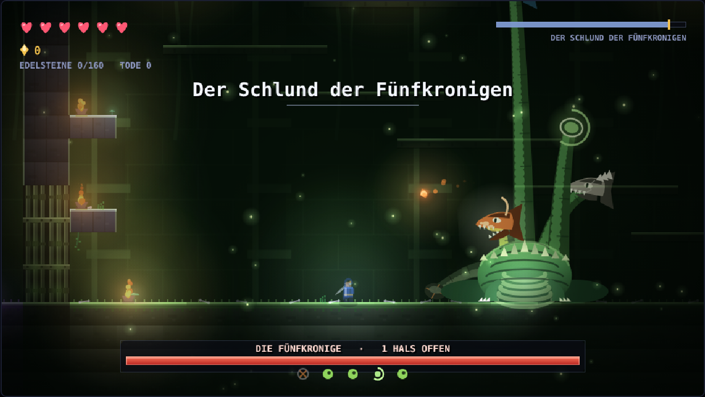 | 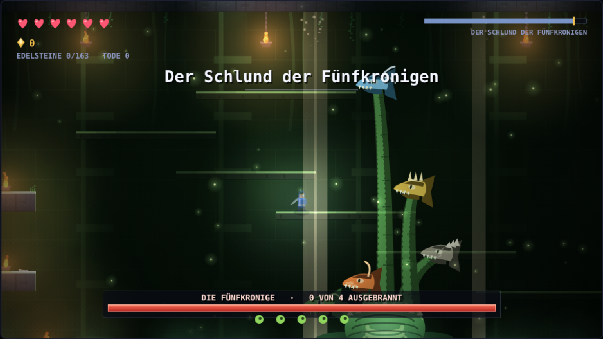 |

### Der Miniboss: Splitterwächter

16 Trefferpunkte, drei Züge, die er nach Entfernung wählt: aus der Nähe ein
Sprungschlag, auf mittlere Distanz ein Sturmangriff, von weitem eine Salve aus
drei Splittern. Jeder Zug wird angekündigt — sein Kern glüht auf —, und danach
steht er lange genug offen für eine Antwort.

Er lässt sich nicht mit gehaltener Angriffstaste erledigen: einen begonnenen Zug
zieht er durch. Erst fünf Schadenspunkte am Stück oder eine Parade bringen ihn
aus dem Gleichgewicht.

Sein Sprungschlag blieb lange hängen: die Landung fragte nach einer
Abwärtsgeschwindigkeit, die die Kollision im Landebild schon auf null gesetzt
hatte. Er kam also auf und stand dann in diesem Zustand, bis ihn eine Parade
oder genug Schaden herausriss. `verify:warden` zeigte es die ganze Zeit, wenn
man genau hinsah — der Nahkampflauf ging *stalk, slamWind, slam* und kam nie
zurück. Beides ist gerichtet, und beides wird jetzt geprüft.

Die Vorwarnung ist auch die Einladung zur Parade: Wer im richtigen Moment `E`
drückt, fängt den Schlag ab, statt ihn zu kassieren — der Ritter taumelt und
steht offen. Geschosse fliegen dabei zurück. Die Parade wirkt nur nach vorn und
nur gegen Angriffe; Stacheln und Lava lassen sich nicht wegparieren.

| | |
| --- | --- |
| 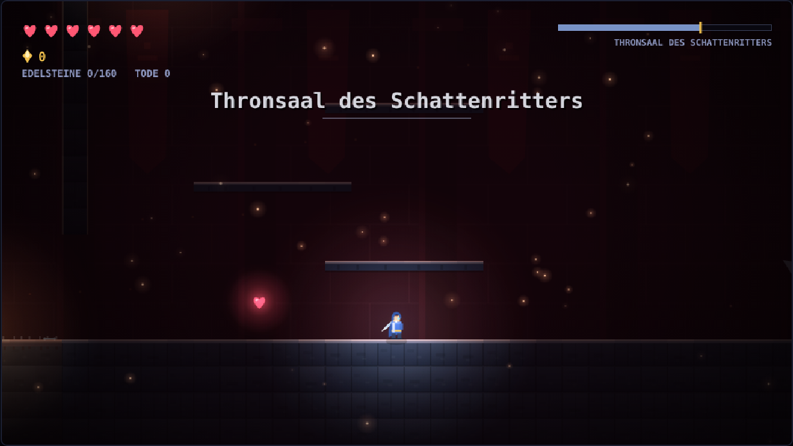 | 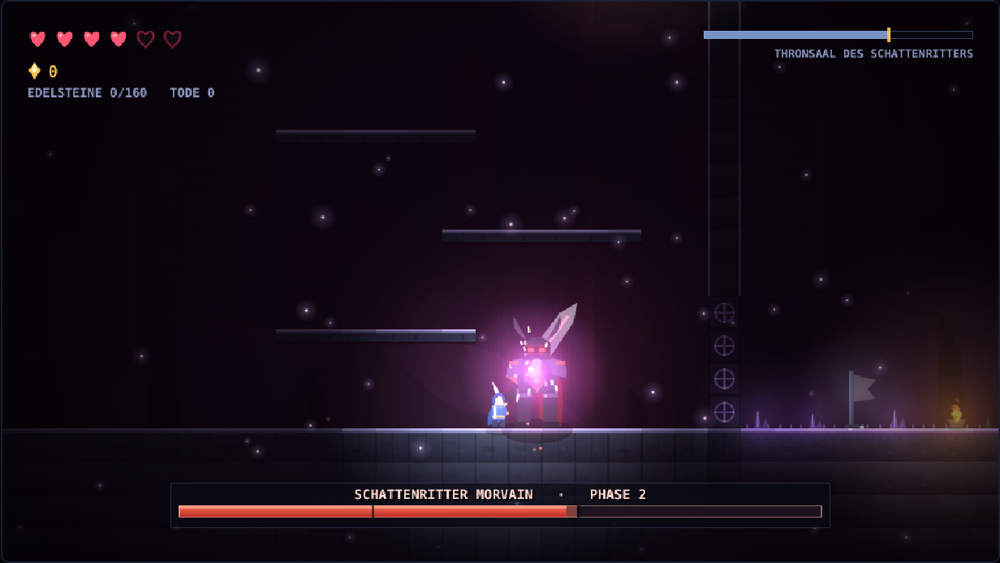 |
| 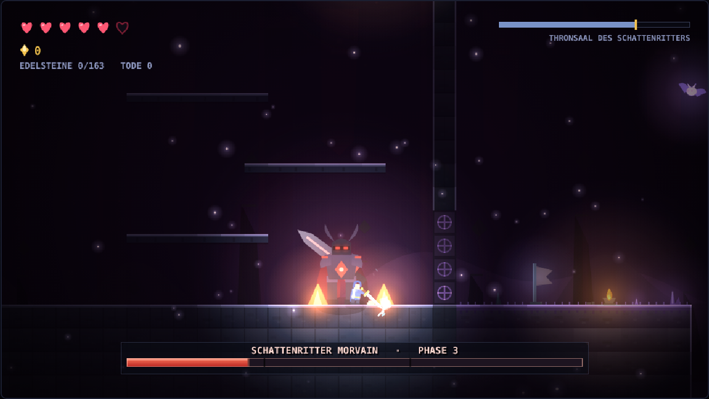 | 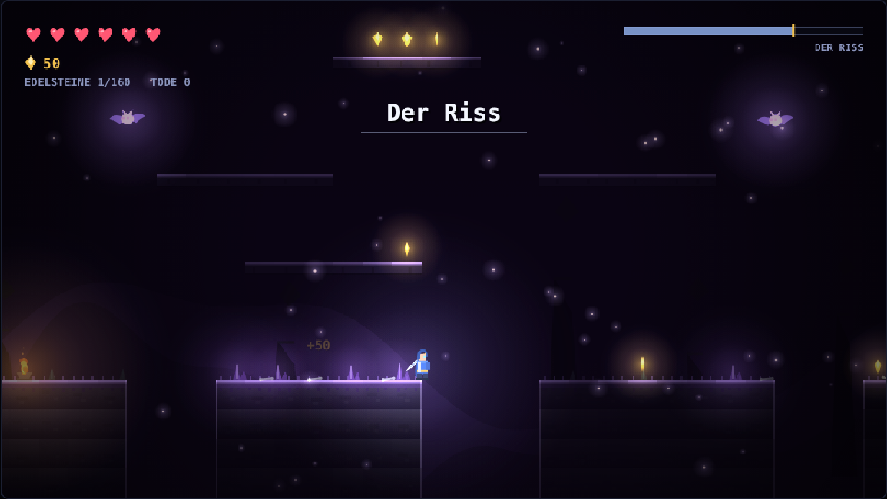 |
| 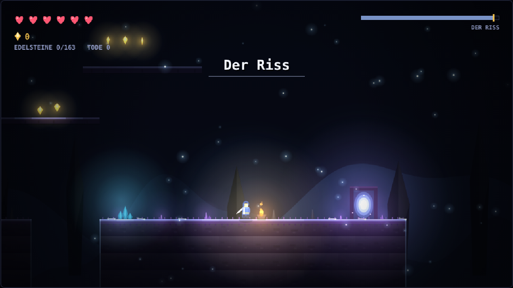 | 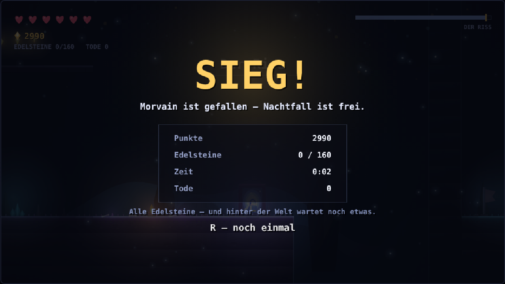 |

## Ton und Musik

Früher waren es siebzehn Piepser aus je einem Oszillator. Jetzt läuft alles über
ein kleines Mischpult: Effekte und Musik auf eigenen Kanälen, ein gemeinsamer
Hall, dessen Größe der Zone folgt — eine Höhle hallt, ein Wald nicht, die
Ertrunkene Halle am meisten —, und ein Kompressor am Ende, damit ein sterbender
Boss auf einer Parade nicht übersteuert.

**Effekte** (`src/core/audio.ts`) sind Rezepte aus Schichten: ein Körper, der die
Tonhöhe gibt, ein Stoß gefiltertes Rauschen für die Textur, und etwas Kurzes
obendrauf für den Anschlag. Dazu FM-Stimmen für alles, was klingt — die Parade
ist Klinge auf Klinge und hallt nach, ein Treffer auf Ignivors Panzer klirrt —,
und eine Verzerrerstufe für Einschläge. Jeder Effekt schwankt um ein paar
Prozent in der Tonhöhe, damit zehn Hiebe hintereinander nicht zehnmal derselbe
Hieb sind. Es gibt jetzt 42: Landung, Doppelsprung, Abwehr, das Schließen und
Öffnen einer Bannwand, Explosion und Zündschnur des Zunders, Wasser, Grollen,
Durchbruch, Feuerball, Fledermausschrei, Flügelschlag, zerberstender Stein,
Sonnenstrahl, Magie, Dialogtippen, Tod, Bossfall, Upgrade, Phasenwechsel — und
vor jedem Bosszug ein eigenes Aufziehen, das „gleich kommt etwas" sagt.

**Musik** (`src/core/music.ts`) ist als Daten geschrieben und wird von einem
Step-Sequencer gespielt: Tonart, Tempo, ein Akkord pro Takt und ein paar
Sechzehntel-Muster für Bass, Arpeggio, Melodie und Schlagzeug. Er plant die
Noten einen Sekundenbruchteil voraus auf der Uhr des AudioContext; ein
Stückwechsel blendet über, statt abzuschneiden. Jede Zone hat ihr Stück — der
Wald dorisch, die Ruinen phrygisch, die Höhlen mit Tropfen aus Glocken, die Burg
im Marschtritt —, und jeder Boss seinen Kampf: Ankhor mit Tomtoms, Ignivor
schnell in harmonisch Moll, Vesperon mit einem Cembalo-Arpeggio über einer Orgel,
der Ritter, die Fünfkronige und der Prismarch jeder mit eigenem. Die Musik
wechselt, sobald die Bannwand fällt, und gibt nach dem Kampf an die Zone zurück;
in der Pause, im Dialog und nach einem Tod wird sie gedämpft.

`M` schaltet die Musik, `N` den ganzen Ton; beides bleibt über Sitzungen
erhalten. Vor dem ersten Tastendruck läuft nichts — so wollen es die Browser.

`verify:audio` hört so, wie ein Testlauf hören kann: Es rendert jeden Effekt und
jedes Stück offline und misst Spitze und Mittel. Ein Rezept, das nichts baut,
käme als Null heraus, eines, das übersteuert, über eins. Danach spielt es mit
echten Tastendrücken: Titelmusik, Übergabe an den Wald, in jeder Bossarena der
richtige Kampf und danach wieder die Zone, sechs Bosse mit sechs verschiedenen
Stücken, `M` und `N` samt Neuladen.

## Aufbau des Codes

```
src/
  core/      Spielschleife (fester Zeitschritt), Eingabe, Kamera, Mathe,
             WebAudio: synth.ts (Bausteine), audio.ts (Effekte, Mischpult),
             music.ts (Stücke und Sequencer)
  world/     Level-ASCII, Parser, Kachel-Kollision, World-Interface
  entities/  Physikkörper, Spieler, Gegner, Boss, Projektile, Pickups, Plattformen;
             colossus.ts, wyrm.ts, vesper.ts für die drei neuen Bosse, und
             roster.ts, das alle Gegner aus ihrer Art baut
  render/    Parallax-Hintergrund, Kachel-Renderer, Deko, Sprite-Helfer, Palette
  fx/        Partikel und Schadenszahlen
  ui/        HUD-Bausteine (Herzen, Bossleiste, Panels)
  game.ts    Zustandsautomat, der alles zusammenhält
```

Das Level steht als ASCII-Kunst in `src/world/levelData.ts`. Jeder Abschnitt ist
40 (die Arena 50) Zeichen breit und 22 Zeilen hoch; die Abschnitte werden
horizontal aneinandergehängt:

```
.  leer          #  Stein        =  Erde         -  Holzplattform
^  Stacheln      L/l Lava        G  Fallgitter   P  Startpunkt
S  Siegel (öffnet sich, wenn der Ritter fällt)     O  Tor nach Hause (Ziel)
g  Rippentor (schließt den Saal der Fünfkronigen, solange sie lebt)
s  Schleim       b  Fledermaus   k  Skelett      m  Dunkler Magier
z  Zunder        w  Schildwache  r  Klingenläufer   Q  Gallert (Boss)
$  Edelstein     H  Herz         C  Kontrollpunkt
T  Fackel        X  Kristall     M/V bewegliche Plattform    B  Boss
W  Splitterwächter (Miniboss)   Y  Thalassa (Boss)   K  Prismarch (Bonusboss)
Z  Die Fünfkronige (Endboss)
|  Bannwand (an beiden Enden jeder Bossarena, siehe warded() in levelData.ts)
A  Ankhor (Boss)   I  Ignivor (Boss)   D  Vesperon (Boss)
```

Damit das Level begehbar bleibt, gilt beim Bauen: Bodenlücken höchstens vier
Kacheln breit, Plattformen höchstens drei Reihen über der Fläche darunter und
waagerecht mit der Stufe darunter überlappend, Stacheln in der Bodenreihe statt
darauf.

Die Prüfwerkzeuge leiten ihre Startpunkte inzwischen aus den Spawns ab statt aus
Kachelzahlen. Ein Abschnitt, der mitten im Level eingeschoben wird, verschob
sonst jedes Werkzeug auf einmal.

## Werkzeuge

Alle Skripte fahren das gebaute Spiel in einem echten Chromium hoch:

```bash
npm run verify:level   # Erreichbarkeitsanalyse: kommt man vom Start zum Boss?
npm run verify:arena   # kommt man nach einem Tod am Tor zurück in die Bossarena?
npm run verify:combat  # Parade, Ladeschlag, und was der Ritter gegen die Sichel tut
npm run verify:gallert # Züge, Spucke zum Abschlagen, Herzkern — und bleibt er tot?
npm run verify:thalassa # ihre Züge, die Springflut, ihr Fall und die Flutklinge danach
npm run verify:enemies # zündet der Zunder, hält der Schild, zahlt sich die Wand aus?
npm run verify:ending  # führt der Riss zum Tor, und zählt der Lauf am Tor auch dann?
npm run verify:warden  # wählt der Splitterwächter seinen Zug, und wehrt er sich?
npm run verify:hydra   # wächst ein Hals nach, brennt ihr Feuer ihn zu, reicht Stahl allein nicht?
npm run verify:wards   # hält jede Bannwand, bis ihr Boss fällt - und fällt sie dann für immer?
npm run verify:bosses  # Ankhor, Ignivor, Vesperon: Züge, Ankündigungen, Regeln, Ende
npm run verify:audio   # klingt jeder Effekt, spielt jedes Stück, folgt die Musik dem Kampf?
npm run verify:bonus   # letzter Edelstein, Prismarch, und die geschärfte Klinge
npm run verify:chain   # die ganze Belohnungskette in einem Lauf, ohne Neustart
npm run verify:motion  # schwingt das Bild bei Treffern, oder rüttelt es?
npm run suite          # breite Reihe: Zustände, Eingabe, Pickups, Bildzeit je Zone
npm run playtest       # Bot spielt das Level mit echter Physik und meldet Hänger
npm run screenshots    # erzeugt die Bilder in screenshots/
```

`verify:level` baut einen Graphen aus allen begehbaren Kacheln und prüft mit
einem bewusst konservativen Sprungmodell, ob Boss **und** Tor vom Startpunkt
aus erreichbar sind — nützlich, sobald man am Level schraubt. Es meldet Gegner,
die auf nichts oder neben Stacheln stehen (gefunden: fünf Skelette, die sich
binnen neun Sekunden selbst erledigten), und außerdem
begehbare Stellen, die von nirgendwo aus zu erreichen sind, und getrennt davon
Plattformen, auf die niemand kommt: die reine Spaltenprüfung übersieht sie, weil
eine unerreichbare Plattform über festem Boden hängt und die Spalte dadurch als
erreichbar zählt. Für den Kristallhort gilt die Prüfung andersherum — er *muss*
unerreichbar sein, sonst wäre der Erwerb umsonst.

`verify:arena` spielt einen Softlock nach: den Schattenritter ans Fallgitter
locken, sterben, zurücklaufen. Das Gitter muss offen bleiben, bis der Spieler
wieder drin ist.

`verify:combat` prüft Parade, Ladeschlag, was der Ritter gegen die Sichel tut,
und das Durchfallen durch Holzplattformen. Die Parade hängt an einem
Fenster von einer Sechstelsekunde — geht auf dem Weg dorthin ein Tastendruck
verloren, fühlt sich das nicht schwer an, sondern kaputt.

`verify:gallert` prüft den ersten Boss: Zugwahl nach Entfernung; dass ein
blinder Hieb seine Spucke **abschlägt** und dass Dastehen ein Herz kostet; dass
sein Sprung dort trifft, wo er landet, und 420 px weiter eben nicht; dass die
Teilung genau zwei Schleime bringt und nur zweimal; dass eine Parade ihn
losschüttelt; dass ein Draufhauer zahlt und trotzdem gewinnt; dass sein Fall
die sechs Herzen auf sieben setzt und die Leiste füllt; dass er nach einem Tod
des Helden **nicht wieder aufsteht**; und — umgedreht, seit das Moor gebannt
ist — dass man an ihm **nicht** mehr vorbeikommt.

`verify:thalassa` prüft ihren Kampf Eigenschaft für Eigenschaft: die Zugwahl auf
zwei Entfernungen; zwei Wellen in Phase eins und vier in Phase zwei, ein Anker
und dann zwei; dass ein blinder Hieb ihre Welle **nicht** abschlägt und sie
trotzdem trifft; dass die Springflut jemandem ein Herz nimmt, der auf der Marke
stehen bleibt, und **keines** dem, der herausläuft; dass sie von selbst danach
greift, wenn einer in ihrer Reichweite parkt; dass die Krone genau einmal ruft,
mit fünf Säulen; dass sie erst im letzten Drittel zwei Züge aneinanderhängt;
dass eine Parade sie bricht; und zum Schluss vierzig Sekunden gegen jemanden,
der nur die Angriffstaste hält, mit aufgefüllter Lebensleiste — sonst ist der
Kampf vorher vorbei und es hängt vom Zufall ab, ob sie überhaupt zum Zug kam.
Aus dieser Messung ist die Aufprall-Sperre entstanden, und später der ganze
Umbau oben: Poise allein reicht nicht, weil ein Dauerangreifer schneller Schaden
macht als jede Ankündigung dauert. Danach, dass ihr Fall die Flutklinge hergibt:
eine Sichel je Hieb, die auf 120 px trifft und auf 250 px eben nicht — das ist
die andere Hälfte, und die gehört dem Prismarchen. Und der Held versucht einmal,
an ihr vorbeizulaufen, ohne zu kämpfen — früher musste das gehen, jetzt darf es
nicht mehr: die ferne Bannwand hält, und die hinter ihm ist zu.

`verify:chain` läuft die ganze Belohnungskette in **einem** Lauf durch, ohne
Neustart dazwischen: Gallert → Herzkern → Thalassa → Flutklinge → alle 160
Edelsteine → Kristallhort → Prismarch → Klingenwelle → zurück in die Welt →
der Ritter (98 TP, pariert die Sicheln) → Siegel → Tor → Sieg. Jedes Glied
prüft ein anderes Werkzeug für sich; dieses prüft die **Gelenke**, und die sieht
sonst niemand an: dass das siebte Herz einen Tod und einen Teleport übersteht,
dass die Klinge ihre Stufe dabei behält, dass ein gefallener Boss liegen bleibt
während der Lauf weitergeht, dass der Held den Hort dort verlässt, wo er
weggeholt wurde, und dass der Lauf danach noch zu beenden ist. Gelaufen wird
darin nicht — dafür sind `verify:level` und `verify:ending` da —, gekämpft
schon, denn die Belohnungen hängen an den Kämpfen.

`verify:enemies` stellt die drei neuen Typen einzeln auf ebenen Boden und prüft
je die Sache, für die sie da sind: der Zunder zündet von selbst **und** beim
Erschlagen aus einem Meter (2 Herzen), aus der Ferne erschlagen kostet nichts,
und Nachbarn nimmt er mit (3 Schaden). Am Schild von vorn kommt 0 an, von hinten
4, nach einer Parade wieder etwas. Und der Klingenläufer läuft, trifft, und wird
an der Wand benommen — wo zwei Schaden zu vier werden. Die Wandprobe steht in der
Kristallhalle, weil das die einzige Stelle mit einer Wand vom Boden bis zur
Decke ist; die Arenen sind offener Boden, und ein Sturm über offenen Boden
landet nie. Und der Schleim muss auf der Kante einer echten Grube stehen bleiben
können, statt hineinzuhüpfen.

Zuletzt: eine Explosion darf kein Bild kosten. Der Treffer-Blitz ist ein
Canvas-Filter, jeder Gegner in der Druckwelle trägt einen, und jeder gefilterte
Zug lässt den Browser eine Ebene in voller Bildgröße anlegen — gemessen 97 ms je
Bild, sechs hintereinander, bei jeder Explosion.

Diese Messung war selbst falsch gebaut und ist nachgebessert: das **schlechteste**
Bild eines Lauf über sechstausend Bilder ist eine Speicherbereinigung, keine
Explosion. Der Ausschlag von 60–90 ms tauchte in der ruhigen Strecke genauso auf
wie in der lauten, und drei identische Explosionen nach einem Warmlauf lagen bei
9 bis 15 ms mit einem Median unter 7. Genommen wird jetzt das **zweitschlechteste**
Bild, verglichen mit derselben Zahl aus der ruhigen Strecke: erlaubt sind
16,67 ms und höchstens der doppelte Ruhewert, gemessen werden 8–14 ms und Faktor
0,7 bis 1,3. Mit wieder eingebautem Fehler sind es 24 ms und Faktor 2,7 — das
Werkzeug fällt also weiter durch, wenn der Fehler zurückkommt.

`verify:ending` fährt den letzten Abschnitt ab: ein Bot reist mit echter Physik
durch den Riss bis zum Tor, und danach berührt der Held das Tor und läuft
weiter. Beides muss im Sieg enden. Der Riss stand vorher nur im statischen
Modell von `verify:level`, das keine Sprungbögen kennt. Und davor die
Gegenprobe: Solange die Fünfkronige lebt, muss das Tor den Helden abweisen und
ihm auch sagen, warum — eine Tür, die einen ignoriert, liest sich als kaputt.

`verify:warden` stellt den Splitterwächter auf drei Entfernungen und prüft, dass
er jeweils den passenden Zug wählt — und dass er gegen jemanden, der nur die
Angriffstaste hält, überhaupt zum Zug kommt.

`verify:hydra` ist das Werkzeug für den letzten Kampf, und die Prüfung, an der
der ganze Entwurf hängt, ist ein Paar Messungen gegeneinander: Hundert Sekunden
Dauerhauen dürfen sie **nicht** umbringen, und dieselben Stümpfe müssen mit ihrem
eigenen Feuer in Sekunden zugehen — jeder von seinem eigenen Absatz aus. Dazu
klettert derselbe Bot die sechs Stufen mit echter Physik hoch, nicht als
Sichtprüfung der ASCII-Kunst, sondern als Landung auf jeder einzelnen.

`verify:wards` geht alle sechs gebannten Arenen der Reihe nach ab, jede mit
echter Physik: vorher (Weg weiter zu, Weg zurück offen), dreißig Sekunden gegen
die ferne Wand, acht Sekunden zurück, ein Tod darin, der Fall des Bosses und noch
ein Tod danach. Der Kampf wird für die Tür übersprungen, nicht gekämpft — ob die
Bosse fair sind, prüfen ihre eigenen Werkzeuge.

`verify:bosses` bekommt für jeden der drei neuen Bosse eine frische Seite, damit
kein Kampf in den nächsten hineinleckt, und prüft 28 Dinge: dass jeder Zug
auftaucht, von drei Stellen im Raum aus; dass jede Ankündigung mindestens eine
halbe Sekunde dauert — gemessen vom *ersten* Bild des Aufziehens an, denn ein
Zug, der beim Start der Messung schon lief, maß zu kurz und ließ die Prüfung
einmal grundlos durchfallen —; dass Lesen weniger als halb so viel kostet wie
Stehenbleiben; die Regel jedes Bosses; die Bildzeit; und das Ende mit Heilung,
Banner und offenen Wänden.

`npm run playtest` fällt an den gebannten Arenen jetzt nicht mehr durch die Wände
— er kämpft fünf Sekunden, meldet, dass er dort war und eingeschlossen wurde, und
dann wird der Boss für ihn gefällt: Der Bot kann laufen und hauen, nicht lesen.

`npm run screenshots` leitet jetzt auch die frühen Bilder aus den Zonen ab statt
aus Kachelzahlen. „Kristallhöhlen" zeigte seit dem Einbau des Moors die Ruinen,
„Ruinen" das Moor — beides sah im Raster richtig genug aus, dass es niemand
bemerkt hat.

`npm run suite` ist die breite Reihe daneben: Zustandsautomat, Tastenbelegung,
Pickups, Gefahren, Bildzeit in jeder Zone (inzwischen auch im Schacht der
Fünfkronigen) und zwei Minuten Dauerkampf, in denen weder die Gegnerliste noch
die Partikel noch die Projektile wachsen dürfen.

`verify:bonus` fährt den ganzen Bonusweg ab: den letzten Edelstein wirklich
aufsammeln, den Dialog lesen (und prüfen, dass die Welt dabei steht), im Hort
landen, den Prismarchen auf zwei Entfernungen zu seinen Zügen bringen und ihn
erlegen. Dazu beide Türen: mit vollem Zähler muss das Tor im Riss in den Hort
führen, ohne ihn weiterhin den Lauf beenden. Es ist der einzige Inhalt, an dem niemand aus Versehen vorbeikommt —
also auch der, der am leichtesten unbemerkt kaputtgeht.

`verify:motion` misst, wie weit das Bild bei einem Treffer je Einzelbild springt
und wie oft es dabei die Richtung wechselt. Bildwackeln war einmal ein neuer
Zufallsversatz pro Bild — 18 px Sprung und 69 Richtungswechsel je Sekunde, also
kein Aufschlag, sondern ein Stroboskop. Erlaubt sind jetzt 5 px und 22 Wechsel;
gemessen werden 2 px und 14.

Dieselbe Prüfung misst außerdem, was sich im Himmel einer ruhigen Zone noch
bewegt, nachdem das reine Vorbeiziehen herausgerechnet ist. Das Sporenfeld zog
mit halbem Kameratempo über den Himmel, auf gebrochenen Pixelpositionen: fünfzig
helle Punkte, die vor fast schwarzem Grund in jedem Bild neu gemischt wurden.
Das waren zwei Drittel der Restbewegung dort oben — der Hintergrund, der bebte.
In ruhigen Zonen hängt das Feld jetzt am Bildschirm und atmet nur noch; die
Punkte sitzen auf ganzen Pixeln. Erlaubt sind 0,15, gemessen werden 0,077.

Und sie prüft die Stelle, an der es am meisten wehtat: den Sturz des Ritters und
den Siegelbruch. Der Todeskampf warf eine Zufallserschütterung auf jedem sechsten
Bild — zehn je Sekunde, anderthalb Sekunden lang —, und jede davon richtete das
Bild neu aus. Ein Aufschlag darf das, ein Strom von Nachschlägen nicht: er reitet
jetzt auf der laufenden Schwingung mit, und das Grollen kommt im Takt statt per
Los. Über sechs Sekunden gemessen: 203 zitternde Bilder und 8,8 Richtungswechsel
je Sekunde vorher, 56 und 2,2 jetzt.

Und `B` schaltet alles davon ganz ab — das Bildwackeln und die ziehenden Sporen,
in jeder Zone.

## Welcher Stand läuft gerade?

Unten im Titelbild steht `Stand <Datum> · <Commit>`. Das Spiel wird als eine
einzige `index.html` ohne Dateinamens-Hash ausgeliefert, und ein Browser, der
die festhält, zeigt ein altes Spiel, das genauso aussieht wie ein neues. Wenn
etwas Neues fehlt, sagt diese Zeile zuerst, ob es überhaupt ankommen ist — sonst
hilft ein hartes Neuladen (Strg+Umschalt+R bzw. Cmd+Umschalt+R).

## Veröffentlichen

[](https://github.com/JosWrf/2D-Platformer/actions/workflows/pages.yml)

`.github/workflows/pages.yml` baut das Spiel bei jedem Push auf `main` und
veröffentlicht `dist/` auf <https://joswrf.github.io/2D-Platformer/>. Es gibt
nichts weiter zu tun: pushen genügt.

Wer das Repo forkt, muss die Pages-Site einmal selbst anlegen — das Token des
Workflows darf das nicht: *Settings → Pages → Build and deployment → Source:*
**GitHub Actions**.
